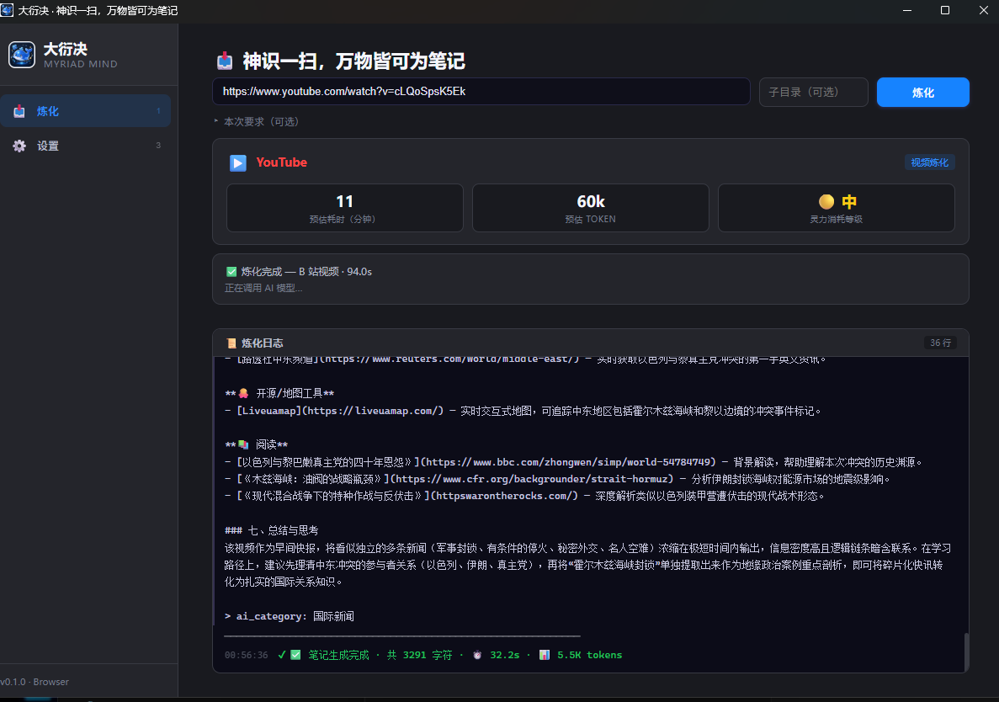

# 大衍决 (Myriad Mind)

> **⚠️ 免责声明：** 本工具仅供个人学习、研究和教育目的。用户需自行承担使用本工具产生的一切法律责任。请遵守您所在地区的法律法规以及相关平台的服务条款。

---

**神识一扫，万物皆可为笔记。**

丢入视频链接、文章 URL 或本地文件，自动炼化为结构化学习笔记 — AI 摘要、Mermaid 图表、术语表、扩展资源、评论区精华，一炉出丹。



## 它能做什么

| 输入 | 输出 |
|------|------|
| B 站 / YouTube / 抖音 / 小红书视频链接 | 视频内容笔记 + 关键帧截图 + ASR 转写 |
| 知乎 / CSDN / 掘金 / 任意网页 URL | 文章精华笔记 + 知识图谱 |
| 本地视频 / 音频 / Markdown / 纯文本 | 内容分析笔记 |
| 本地代码目录 | 架构分析笔记 + 代码阅读指南（GitHub clone 为后续能力） |

**每篇笔记包含：** AI 摘要、Mermaid 流程图/架构图、术语表、扩展学习资源、阅读时长与难度评级。

## 特点

- **🔒 本地运行，无服务器** — 所有处理在你电脑上完成，数据完全由你控制
- **🧠 AI 驱动** — 已接入 DeepSeek V4 Pro / Flash，通过 `mind-stream` 流式生成笔记
- **🛡️ 密钥安全** — API Key 存储在 OS 密钥链（Windows 凭据管理器 / macOS Keychain），绝不明文落盘
- **📦 免费开源** — MIT License，不收费、不加广告、不做 SaaS
- **🎨 修炼主题** — 修为面板、境界进度、成就系统，让学习有游戏感

## 技术栈

| 层 | 技术 |
|----|------|
| 桌面端 | Tauri 2.x (Rust + React 19 + TypeScript) |
| 移动端 | React Native Expo (v2 延后) |
| AI | DeepSeek V4 Pro（v1 主模型，1M 上下文）/ DeepSeek V4 Flash |
| 视频处理 | Python + FFmpeg + yt-dlp + faster-whisper |
| 存储 | 纯 Markdown + `.myriad-mind/` 知识库索引 |

## 快速开始

> 目前处于 **Alpha 阶段**，仅支持 Windows 桌面端。

### 前置条件

- [Node.js](https://nodejs.org/) 24+
- [Rust](https://rustup.rs/) 1.93+
- [Python](https://www.python.org/) 3.9+
- [FFmpeg](https://ffmpeg.org/) 8.x
- [pnpm](https://pnpm.io/)

### 安装

```bash
git clone https://github.com/yuexingqin97/myriad-mind-app.git
cd myriad-mind-app
pnpm install
```

### 开发

```bash
# 推荐方式：在根目录启动桌面端开发模式（热重载）
pnpm dev

# 或在 apps/desktop 目录下启动
cd apps/desktop
pnpm dev:desktop
```

> 详细的启动方式与排错见 [开发启动指南](docs/开发启动指南.md)。

首次启动会显示配置向导，引导你配置 Python 路径、安装 faster-whisper、输入 DeepSeek API Key。

## 许可证

MIT License — 保留上游版权声明。
