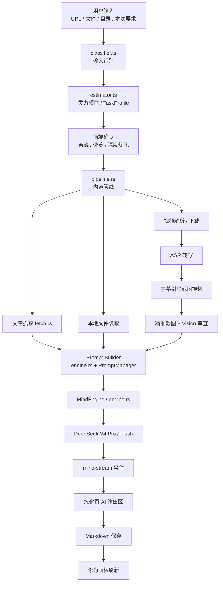

# 项目架构与结构

> 大衍决 App 的 Monorepo 目录结构、模块职责、架构设计与数据流。
> 本文档由原《项目结构.md》与《架构设计.md》合并而成（2026-06-21），并已对照当前代码修正过时内容。
>
> 当前阶段：前端 UI 已完成；DeepSeek V4 Pro / Flash 已接入；核心管线（视频 / 音频 / 文章 / 代码项目）已串通；DeepSeek Vision 视觉关键帧审查已就绪；修为面板前端消费链路待接入。
>
> 🧭 **AI 处理模式演进中**：当前为**管线驱动**（本文 §五/§六/§七 的 10 步管线 + 单轮 AI 生成），未来将演进为**目标驱动的 Agent**（AI 自主选工具）。演进设计见 [`docs/设计文档/AI与模型/Agent架构设计.md`](设计文档/AI与模型/Agent架构设计.md)。

---

## 一、设计原则

1. **本地优先** — 笔记、配置、密钥都由用户本机控制，无服务器，无多用户隔离。
2. **DeepSeek V4 Pro 优先** — v1 先吃透 1M 上下文能力，不急着做模型大全。
3. **Skill 原型产品化** — `D:\Project\MyClaude\myriad-mind` 中已验证的流程迁移为 App 模块。
4. **核心逻辑只写一次** — 纯逻辑放 `packages/core/`（TS），桌面/移动跨平台复用；系统能力与网络调用在 Tauri Rust。
5. **Python 脚本黑盒复用** — 下载 / ASR / 截图脚本不重写，由 Rust 做类型化封装，作为子进程调度。
6. **轻量 AI 架构** — 借鉴 ModelRegistry / Provider 抽象 / 错误分类，但不引入 Agent Loop / MCP / 子智能体。

---

## 二、整体架构

```text
┌─────────────────────────────────────────────────────────────┐
│                     packages/core                            │
│  类型定义 · 配置 Schema · 输入识别 · 灵力预估 · Prompt 模板   │
│  AI 模型元数据 + 路由 · 修为计算 · 笔记解析 · 搜索/对比纯逻辑 │
├─────────────────────────────────────────────────────────────┤
│                     apps/desktop                             │
│  React UI                                                    │
│  - 炼化工作台：输入控制 + AI 输出区                          │
│  - 修为面板：真实笔记统计（前端消费链路待接入）              │
│  - 设置中心：配置健康度 + 主题 + DeepSeek + 依赖检测         │
├─────────────────────────────────────────────────────────────┤
│                     Tauri Rust 后端                           │
│  Pipeline · DeepSeek/MindEngine · Python 脚本调度             │
│  文件系统 · 系统依赖检测 · 进度/AI 流事件                    │
├─────────────────────────────────────────────────────────────┤
│                     外部依赖                                  │
│  DeepSeek V4 Pro · Python/faster-whisper · FFmpeg · yt-dlp    │
│  AI Douyin / TikHub                                          │
└─────────────────────────────────────────────────────────────┘
```

---

## 三、Monorepo 目录结构

```
myriad-mind-app/
├── packages/          # 共享包（跨平台复用）
│   ├── core/          #   纯逻辑 — 类型、Schema、Prompt、AI 路由、计算
│   └── ui/            #   共享 React UI 组件
├── apps/              # 平台应用
│   ├── desktop/       #   Tauri 2.x 桌面端（Rust + React）
│   └── mobile/        #   React Native Expo 移动端（v2 延后）
├── scripts/           # Python 脚本（6 个，作为子进程调度）
├── docs/              # 项目文档
│   ├── 项目管理/      #   进度跟踪、任务清单
│   ├── 学习资料/      #   Tauri_React 入门等学习材料
│   └── 参考资料/      #   法律风险分析等
├── CLAUDE.md          # Claude Code 项目指令
├── README.md          # 项目介绍
├── pnpm-workspace.yaml # pnpm workspace 包定义
└── package.json       # workspace 根配置
```

### 3.1 `packages/core/` — 共享纯逻辑

跨平台 100% 复用的 TypeScript 纯函数，无 React / Node / 平台 API 依赖（仅 zod）。

```
packages/core/src/
├── index.ts           # 统一导出入口
├── types.ts           # 全部类型定义
│                       #   MyriadMindConfig — 配置
│                       #   Note / NoteMetadata — 笔记
│                       #   DashboardData / CultivationInfo — 修为面板
│                       #   InputMode / PipelineStep — 管线
│                       #   TokenEstimate — 灵力预估
├── schema.ts          # Zod 校验 Schema + DEFAULT_CONFIG + 验证函数
├── classifier.ts      # 输入模式识别（8 种：bilibili/youtube/douyin/...）
├── estimator.ts       # 灵力预估算法（Token × 时间 × 费用）→ TaskProfile
├── note-parser.ts     # 笔记解析（front matter / 标签 / 元数据提取）
├── panel-calc.ts      # 修为面板计算（calculateCultivation / checkAchievements / 境界映射）
├── ai/                # ★ AI 模型元数据 + TS 侧路由（详见 §6.2）
│   ├── index.ts       #   统一导出
│   ├── types.ts       #   AiTask / TaskProfile / ModelResolution / MindStreamEvent 等
│   ├── models.ts      #   DEEPSEEK_MODELS 模型注册表 + findModel / getModelsByProvider
│   └── routing.ts     #   resolveModel(task, profile?, override?) — Pro/Flash 路由
└── prompts/           # MindEngine Prompt 模板（TS 侧构建器，区别于 src-tauri/prompts/*.md）
    ├── index.ts       #   统一导出
    ├── note-gen.ts    #   笔记生成（含 article/video 分支）
    ├── summarize.ts   #   AI 摘要
    ├── translate.ts   #   中英翻译
    ├── compare.ts     #   笔记对比
    └── code-analysis.ts # 代码项目分析
```

**被谁依赖：** `packages/ui/`、`apps/desktop/src/`；`apps/mobile/` v2 再接入。

### 3.2 `packages/ui/` — 共享 React 组件

桌面端优先使用的 React 组件库，保留 v2 移动端复用空间，CC Switch 暗色风格。**不依赖 Tailwind**（用原生 CSS + 语义变量）。

```
packages/ui/src/
├── index.ts           # 统一导出（UI_VERSION = "0.3.0"）
├── types.ts           # ★ 共享类型（DepsInfo / HealthStatus / HealthItem / SetupIntent）
├── ConfigWizard.tsx   # 多步骤配置向导（首启引导）
│                       #   接受 KeychainApi 接口注入（见 §9.2，非真密钥链）
├── SettingsPage.tsx   # ★ 常规设置页（非首启场景）
├── Dashboard.tsx      # 修为面板可视化（境界进度 + 成就徽章 + 统计）
├── NoteRenderer.tsx   # Markdown 笔记渲染（react-markdown + Mermaid + 代码高亮）
└── common/            # 基础 UI 组件
    ├── index.ts       #   统一导出
    ├── Button.tsx     #   按钮（primary/secondary/ghost/danger）
    ├── Card.tsx       #   卡片容器（bordered/elevated/flat）
    ├── Input.tsx      #   输入控件（Input / Select / Toggle / Textarea）
    └── Modal.tsx      #   ★ 模态对话框
```

**被谁依赖：** `apps/desktop/src/`（`SettingsView` 同时复用 `ConfigWizard` 首启 + `SettingsPage` 常规）。

### 3.3 `apps/mobile/` — React Native 移动端

> ⚠️ v1 阶段延后，仅保留骨架。

```
apps/mobile/
├── App.tsx            # Expo 入口
├── app.json           # Expo 配置
├── tsconfig.json
├── assets/
└── screens/
    ├── HomeScreen.tsx
    ├── NoteScreen.tsx
    ├── DashboardScreen.tsx
    └── ConfigScreen.tsx
```

---

## 四、桌面端架构（`apps/desktop`）

Tauri 2.x 桌面应用，Rust 后端 + React 前端。

### 4.1 React 前端（`src/`）

```
apps/desktop/src/
├── main.tsx           # React 入口（ReactDOM.createRoot）
├── App.tsx            # 主应用 — 页签布局（炼化 input / 修为 dashboard / 配置 settings）
├── App.css            # 全局样式（CC Switch 暗色风格，CSS 变量主题）
├── api.ts             # Tauri IPC 封装层
│                       #   - 自动检测 Tauri 环境，非 Tauri 降级为 mock（浏览器可调 UI）
│                       #   - 管线进度监听（pipeline-progress event）
│                       #   - mind-stream 流式监听
│                       #   - 配置读写 / Python 脚本命令（6 个）
├── vite-env.d.ts      # Vite 类型声明
├── hooks/             # 业务 Hook
│   ├── useConfig.ts   #   配置加载 / 首启检测 / 视图切换
│   ├── usePipeline.ts #   管线进度事件 + mind-stream 流式监听 + 浏览器 mock
│   └── useTheme.ts    #   主题切换（light / dark / system）
├── lib/               # 平台/工具
│   ├── platform.ts    #   平台检测（isTauri）
│   └── utils.ts       #   通用工具
└── components/
    ├── layout/        #   布局：Sidebar / NavButton
    ├── input/         #   炼化输入：InputView（输入控制 + AI 输出区）
    ├── dashboard/     #   修为面板：DashboardView（当前为硬编码示例数据，待接 library.rs）
    ├── settings/      #   设置：SettingsView（组装 ConfigWizard/SettingsPage）+ DepsPanel
    └── log/           #   日志：LogPanel（管线/AI 日志）
```

> 路径别名：`@/` → `apps/desktop/src/`（见 `vite.config.ts`）。前端不直接调用外部 AI API，统一通过 Tauri 命令。

页面职责：

| 页面 | 职责 |
|------|------|
| 炼化（input） | 输入控制、灵力预估、AI 流式输出、保存结果 |
| 修为（dashboard） | 学习统计、最近笔记、成就、标签、学习建议 |
| 配置（settings） | 配置健康度、DeepSeek Key、依赖检测、主题、提示词偏好 |

### 4.2 Tauri Rust 后端（`src-tauri/src/`）

```
apps/desktop/src-tauri/src/
├── main.rs            # Windows 入口（防止 release 弹控制台窗口）
├── lib.rs             # Tauri Builder — 注册全部 IPC 命令（generate_handler!）
├── error.rs           # 统一错误类型 AppError（thiserror）
│                       #   PythonScript / MissingDependency / Config / Io / Http / AiApi / Stream / Cancelled
└── commands/          # Tauri IPC 命令模块
    ├── mod.rs         #   模块声明（pub mod 声明各模块）
    ├── config.rs      #   配置读写（~/.myriad-mind-app/config.json）
    │                     #   - 原子写入；get/set_config_value 单字段读写
    │                     #   - write_config 对 SECRET_FIELDS（deepseek_api_key/ai_douyin_api_key）保护
    │                     #   - 首启检测、配置重置
    ├── deps.rs        #   系统依赖检测
    │                     #   - detect_python: 校验 >= 3.9；detect_ffmpeg / detect_ytdlp / detect_gpu
    │                     #   - detect_all_deps: 批量；resolve_python_path: 配置 > venv > PATH 三级回退
    ├── python.rs      #   Python 脚本调度（6 个脚本的类型化封装）
    │                     #   - scripts_dir(): 智能 scripts/ 路径解析（dev/venv/exe）
    │                     #   - 6 个 #[tauri::command]: transcribe_audio / extract_keyframes
    │                     #     / download_video / download_youtube_subtitles
    │                     #     / install_faster_whisper / list_ai_douyin_tasks
    ├── fetch.rs       #   文章 URL 抓取（Rust dom_query + reqwest，本地解析，非 WebFetch）
    │                     #   支持知乎/CSDN/掘金/微信公众号/Wiki 等
    ├── code_project.rs #  代码项目扫描（目录树 / 语言识别 / 入口文件分析 → 项目画像）
    ├── notes.rs       #   笔记处理（读取 / 列举 / Q&A 追问）
    ├── library.rs     #   .myriad-mind/ 知识库索引 + 指纹去重
    │                     #   - library.json / notes.jsonl / categories.json / fingerprints.json / memory.md
    │                     #   - source_fingerprint 命中时更新而非新建
    │                     #   - 索引层已就绪，前端修为面板消费链路待接入
    ├── pipeline.rs    #   管线编排器（约 2155 行）
    │                     #   - execute_pipeline: 主入口，按 InputMode 分流
    │                     #   - run_text_pipeline / run_video_pipeline / run_audio_pipeline
    │                     #     / run_code_project_pipeline
    │                     #   - 每步 emit pipeline-progress 事件
    ├── fs.rs          #   文件系统操作（scan_directory / read_text_file / write_note / cleanup_temp / copy_asset）
    └── ai/            #   MindEngine + DeepSeek 客户端（流式）+ 视觉审查 + 提示词渲染
        ├── mod.rs     #     模块声明 + re-export（generate_note / qa_note / run_mind_task / test_deepseek_connection）
        ├── types.rs   #     AI 请求/响应/消息/任务类型（AiTask / MindRequest / MindStreamEvent 等）
        ├── engine.rs  #     MindEngine — run_mind_task 命令 + Rust 侧 Pro/Flash 路由（见 §6.2）
        ├── deepseek.rs #    DeepSeek V4 Pro / Flash 流式客户端（reasoning_content 分流 + mind-stream emit）
        ├── vision.rs  #     DeepSeek Vision 关键帧截图审查（场景评分 / 嵌入位置选择）
        └── prompt_manager.rs # ★ PromptManager — 加载 prompts/*.md + minijinja 渲染（变量/条件/include）
```

> 演进说明：`commands/ai/` 子模块已全部落地（types / engine / deepseek / vision / prompt_manager）。模型路由逻辑同时存在于 TS 侧（`packages/core/src/ai/routing.ts`）和 Rust 侧（`engine.rs`），详见 §6.2。

### 4.3 Tauri 配置与提示词资源

```
apps/desktop/src-tauri/
├── Cargo.toml         # Rust 依赖（见 §15）
├── tauri.conf.json    # Tauri 配置（窗口、打包、resources: scripts/*.py + prompts/**/*.md）
├── prompts/           # AI 提示词模板（.md，PromptManager 运行时渲染，改提示词不重编译）
│   ├── note/          #   笔记生成：system.md 主模板 + mode_{video,code,article,document,short}.md + mode_common.md
│   │                     #   engine.rs::content_mode_key() 把 content_type 映射到对应 mode_*.md
│   ├── vision/        #   视觉管线：subtitle / review_system / review_single / review_batch / review_boundary / tutorial
│   ├── qa.md          #   笔记追问
│   └── ping.md        #   DeepSeek 连接测试
├── capabilities/
│   └── default.json   # 权限声明（Tauri 2.x 默认锁死原生能力，按需授权）
├── icons/             # 应用图标
└── build.rs           # Tauri 构建脚本
```

---

## 五、核心数据流

> ⏳ **演进方向**：本节为当前实现（10 步写死管线）。未来演进为目标驱动 Agent（AI 自主编排阶段），见 [Agent架构设计](设计文档/AI与模型/Agent架构设计.md)。

### 5.1 数据流总览



### 5.2 管线 10 阶段

```text
0.   输入识别            classifier.ts
0.5  配置读取            config.rs
0.7  灵力预估            estimator.ts → TaskProfile
1.   内容获取            按 InputMode 分流
2.   视频/文章/文件      下载 / fetch.rs 抓取 / 本地读取
3.   音频提取            FFmpeg
4.   ASR 转写            faster-whisper
4.5  字幕分析            AI 推荐截图时间点
4.7  精准截图            extract_keyframes.py + DeepSeek Vision 审查
5.   Prompt 构建         engine.rs 4 种内容模式 + PromptManager 渲染 .md
6.   DeepSeek 生成       mind-stream 流式推送
7.   保存 Markdown       fs.rs
8.   清理临时文件        cleanup_temp
9.   更新修为面板        library.rs 索引 / 修为面板.md
```

### 5.3 事件流（双通道）

| 事件 | 方向 | 用途 |
|------|------|------|
| `pipeline-progress` | Rust → React | 管线各步骤进度（百分比 / 状态 / 描述），驱动进度条 |
| `mind-stream` | Rust → React | DeepSeek 流式生成的笔记内容（逐字推送），驱动 AI 输出区 |

两者分开：`pipeline-progress` 表示"当前处理到哪一步"，`mind-stream` 表示"AI 输出什么内容"。前端分别监听，互不耦合。

---

## 六、AI 架构

> ⏳ **演进方向**：本节为当前实现（单轮 MindEngine + 模型路由）。未来演进为 Agent loop（AI 自主选工具），见 [Agent架构设计](设计文档/AI与模型/Agent架构设计.md)。

### 6.1 模型与 API

```text
默认主模型：deepseek-v4-pro      （1M 上下文，重任务）
快速模型：  deepseek-v4-flash    （摘要/翻译/建议等轻任务）

DeepSeek API:
  Base URL : https://api.deepseek.com
  Endpoint : /chat/completions
  Format   : OpenAI Chat Completions
  Auth     : Authorization: Bearer {DEEPSEEK_API_KEY}
```

### 6.2 模型路由（TS + Rust 双层）

路由逻辑存在于**两处**，职责不同：

- **TS 侧 `packages/core/src/ai/routing.ts`** — `resolveModel(task, profile?, modelOverride?)`，供前端预估 / 确认弹窗展示模型选择，纯展示与预算用途。
- **Rust 侧 `commands/ai/engine.rs`** — MindEngine 实际调用 DeepSeek 时做最终路由。

两侧规则一致：

```text
summary / translation / next_step_suggestion / resource_recommend
  → deepseek-v4-flash

code_analysis
  → deepseek-v4-pro + reasoning_effort=max

estimated tokens > 100K
  → deepseek-v4-pro 长上下文模式

default
  → deepseek-v4-pro + reasoning_effort=high
```

`ModelResolution` 输出语义（TS 与 Rust 共用形状）：

```ts
interface ModelResolution {
  requested?: string;
  resolved: "deepseek-v4-pro" | "deepseek-v4-flash";
  provider: "deepseek";
  reason: string;
  fallbackChain: string[];
}
```

> 历史说明：早期路由仅收敛在 Rust `engine.rs` 内；现 TS 侧已抽出独立路由层 `core/src/ai/`，便于 UI 独立展示与未来的成本统计，不必每次都跨 IPC。

### 6.3 IPC 命令（2 个命令 + 内部函数）

`commands/ai/mod.rs` re-export 四个符号，但**只有 2 个是 `#[tauri::command]`**（注册在 `lib.rs::generate_handler!`），另 2 个是供 `pipeline.rs` 内部调用的普通函数：

| 符号 | 类型 | 用途 |
|------|------|------|
| `run_mind_task` | ✅ Tauri 命令 | 前端发起的 AI 任务主入口 |
| `test_deepseek_connection` | ✅ Tauri 命令 | 设置页连接测试（读 `ping.md`） |
| `generate_note` | 内部函数 | pipeline 内部生成笔记（非 IPC） |
| `qa_note` | 内部函数 | pipeline 内部笔记追问（非 IPC） |

MindEngine（`engine.rs`）职责：

1. 接收任务类型、prompt、TaskProfile。
2. 按路由规则选 Pro / Flash。
3. 从 `config.json` 读取 `deepseek_api_key`（见 §9.1）。
4. 调用 `DeepSeekClient`（`deepseek.rs`）。
5. 发送 `mind-stream` 事件。
6. 返回完整 Markdown 和 usage。

Rust 请求结构：

```rust
pub struct MindRequest {
    pub task: AiTask,
    pub messages: Vec<AiMessage>,
    pub system_prompt: String,
    pub model_override: Option<String>,
    pub stream: bool,
    pub max_tokens: Option<u32>,
    pub thinking: Option<ThinkingConfig>,
}
```

### 6.4 DeepSeekClient 流式

请求示例：

```json
{
  "model": "deepseek-v4-pro",
  "messages": [
    { "role": "system", "content": "..." },
    { "role": "user", "content": "..." }
  ],
  "thinking": { "type": "enabled" },
  "reasoning_effort": "high",
  "stream": true,
  "max_tokens": 65536
}
```

流式解析：

```text
choices[0].delta.reasoning_content → reasoning_delta   （不进入正文）
choices[0].delta.content           → delta             （正文）
usage                              → usage
finish_reason                      → done
```

规则：`reasoning_content` 不进入最终 Markdown；默认不在 UI 展示 reasoning；调试模式可折叠展示。

### 6.5 `mind-stream` 事件

```ts
export type MindStreamEvent =
  | { type: "start"; task: AiTask; provider: "deepseek"; model: string }
  | { type: "reasoning_delta"; delta: string }
  | { type: "delta"; delta: string }
  | { type: "usage"; inputTokens?: number; outputTokens?: number; reasoningTokens?: number; totalTokens?: number }
  | { type: "done"; text: string; finishReason?: string }
  | { type: "error"; code: string; message: string; retryable: boolean };
```

前端炼化页 AI 输出区只监听 `mind-stream`，不直接关心 Provider。

### 6.6 1M 上下文策略

DeepSeek V4 Pro 支持 1M 上下文，但仍要保留输出空间。

```text
总上下文：1,000,000 tokens
系统提示：5,000 - 15,000
任务说明：2,000 - 5,000
输入正文：最多 850,000
输出预留：80,000 - 120,000
安全余量：30,000 - 50,000
```

| 输入规模 | 策略 |
|----------|------|
| `< 100K` | 直接炼化 |
| `100K - 500K` | 长上下文模式 |
| `500K - 850K` | 深度炼化，要求确认 |
| `850K - 1M` | 极限模式，强制确认 |
| `> 1M` | 分段压缩后再炼化 |

---

## 七、Pipeline 架构

> ⏳ **演进方向**：本节为当前实现（4 条写死的内容管线分流）。未来由 Agent 取代，重构方案见 [Agent架构设计](设计文档/AI与模型/Agent架构设计.md) §九。

### 7.1 四条内容管线分流

`pipeline.rs` 已是完整编排器（约 2155 行），无 AI TODO 占位，四条管线全部串通：

```text
execute_pipeline（主入口，按 InputMode 分流）
  ├── run_text_pipeline        # 文章 URL / 本地文本 → fetch.rs 抓取 → DeepSeek → Markdown
  ├── run_video_pipeline       # 在线/本地视频 → 下载 → 音频提取 → ASR → 关键帧 → Vision 审查 → AI
  ├── run_audio_pipeline       # 本地音频 → ASR → AI
  └── run_code_project_pipeline # 代码项目（code_project.rs 扫描）→ AI
```

### 7.2 管线阶段

详见 §5.2 的 10 阶段。

### 7.3 后续重构方向

当前编排是函数式分流（`run_*_pipeline` 各自一条主链路），尚未抽象为统一 trait。后续若要支持插件化步骤、断点续跑、并发步骤，可再引入 `PipelineStep` / `Artifact` / `StepRunner` / `PipelineContext`。这是 P1+ 优化，不是 P0 阻塞项。

---

## 八、Python 脚本层

脚本来源：上游 [MyClaude/myriad-mind/scripts](https://github.com/yuexingqin97/MyClaude/tree/main/myriad-mind/scripts)，作为黑盒子子进程被 Rust 调度。统一约定：**stdout 输出 JSON，stderr 输出错误，exit code 0/1**。

```
scripts/
├── README.md                          # 脚本清单 + CLI 接口 + 同步说明
├── transcribe_faster_whisper.py       # 音频转写 ASR（faster-whisper）
├── extract_keyframes.py               # 关键帧截图（FFmpeg）
├── download_video_candidates.py       # 视频下载（多 URL 候选）
├── download_youtube_subtitles.py      # YouTube 字幕下载（yt-dlp）
├── install_faster_whisper.py          # faster-whisper venv 自动安装
└── list_ai_douyin_tasks.py            # AI Douyin 任务查询
```

Rust 封装规则（`commands/python.rs`）：

```text
Command::new(python)
  → 传入明确参数
  → 捕获 stdout/stderr
  → 检查 exit code
  → JSON stdout 解析成结构体
  → 错误语义化（AppError::PythonScript）
```

> 前端不直接调用脚本，一律经 Rust 类型化封装。

---

## 九、配置与密钥

> ⚠️ **重要修正（2026-06）**：API Key **不再存 OS 密钥链**，改为**明文存 `config.json`**。原《架构设计》§9.2「OS 密钥链 / Windows Credential Manager」已废弃。

### 9.1 `config.json`

```text
位置：~/.myriad-mind-app/config.json
```

**包含全部配置，含 API Key 明文**：Python 路径、ASR 后端、视频 Provider、输出目录、功能开关、DeepSeek 模型配置、主题、提示词偏好、`deepseek_api_key`、`ai_douyin_api_key` 等。

- 明文存储，用户自行保管文件安全（个人桌面工具、单用户场景，不做多用户隔离）。
- **不入 git**（`.gitignore` 忽略 `config.json`，含占位示例文件）。
- 配置文件有版本号（`version: 1`）支持迁移。
- `commands/config.rs::write_config` 对 `SECRET_FIELDS`（`deepseek_api_key`/`ai_douyin_api_key`）做保护：全量写入时若新值为空则保留磁盘值，避免前端 config state 未同步把已配置的 key 覆盖成空。

### 9.2 KeychainApi 抽象层（澄清）

UI 组件 `ConfigWizard` / `SettingsPage` 接受一个 `KeychainApi` 接口（`check / read / store`），名字带 "keychain" 是历史命名——**它并不是 OS 密钥链**。实际实现 `apps/desktop/src/components/settings/SettingsView.tsx` 把这三个方法映射到 **config.json 字段读写**：

```ts
// service 名 → config.json 字段名（连字符转下划线：deepseek-api-key → deepseek_api_key）
const keychainAdapter: KeychainApi = {
  async check(service) { return !!(await api.getConfigValue(fieldOf(service))); },
  async read(service)  { return api.getConfigValue(fieldOf(service)); },
  async store(service, secret) {
    await api.setConfigValue(fieldOf(service), secret);
    await reloadConfig(); // 同步 config state，避免后续全量保存覆盖
  },
};
```

> 这样 UI 组件保持"密钥注入"的干净抽象，未来若要切回真密钥链，只需替换这一个 adapter。

### 9.3 DeepSeek 配置

```ts
ai: {
  default_provider: "deepseek";
  default_model: "deepseek-v4-pro";
  fast_model: "deepseek-v4-flash";
  deepseek: {
    enabled: true;
    api_key_id: "deepseek-api-key";
    base_url: "https://api.deepseek.com";
    thinking: { enabled: true; effort: "high"; };
    long_context: {
      enabled: true;
      max_context_tokens: 1000000;
      default_output_tokens: 65536;
      deep_output_tokens: 131072;
    };
  };
}
```

---

## 十、修为面板架构

真实数据来源：

```text
note_dir/**/*.md
```

解析（`core/note-parser.ts`）：front matter / 标题 / 日期 / 类型 / 难度 / 阅读时长 / 标签 / 来源。

计算（`core/panel-calc.ts`）：

```text
calculateCultivation()   # 7 境界映射
checkAchievements()      # 6 成就判定
computeStats()           # 统计
```

输出：React 修为页 + 可选 `修为面板.md`。

输出目录下维护 `.myriad-mind/` 作为知识库索引：

```text
输出目录/
└── .myriad-mind/
    ├── library.json
    ├── notes.jsonl
    ├── categories.json
    ├── fingerprints.json
    └── memory.md
```

用途：

- AI 生成前读取已有分类、摘要、标签，作为目录级记忆。
- 新输入先生成 `PlacementPlan`，决定放入哪个目录和文件。
- `source_fingerprint` 命中时更新已有文档，而不是新建。
- 修为面板优先消费 `.myriad-mind/notes.jsonl`，索引缺失时再扫描 Markdown 重建。

> **当前现状（2026-06）**：后端 `library.rs` 已实现 `.myriad-mind/` 索引读写与指纹去重能力，知识库索引层已就绪。但前端 `components/dashboard/DashboardView.tsx` 目前仍为硬编码示例数据，尚未消费 `library.rs` 的索引命令，"索引 → 前端 DashboardData" 链路待接入。

后续增强：搜索 / 对比 / 知识图谱 / 学习路线。

---

## 十一、Skill v2.1 功能迁移

`myriad-mind` Skill 的核心能力迁移为 App 模块。

### 11.1 字幕引导截图

Skill v2.1 流程：

```text
ASR 转写
→ AI 分析字幕，推荐截图时间点（vision/subtitle.md）
→ extract_keyframes.py 精准截图
→ AI 审查截图，选择嵌入位置（vision/review_*.md）
```

输出：

```json
{
  "file": "frame_0001_00h03m03s.png",
  "timestamp_seconds": 183,
  "timestamp_label": "03:03",
  "trigger": "guided",
  "scene_score": 0.81
}
```

### 11.2 Prompt Hooks

P0 仅支持轻量 Hook：全局写作偏好、炼化页"本次要求"、`note_generation`。暂不实现完整 11 阶段 Hook。

P0 合并顺序：

```text
1. 系统硬约束
2. 内置 note_generation prompt
3. 功能开关约束
4. 全局写作偏好
5. 本次要求
```

P1/P2 再扩展：`keyframe_planning` / `keyframe_review` / `code_analysis` / `next_step_suggestion`。

---

## 十二、主题与资源

```text
主题：light / dark / system（useTheme，localStorage 持久化，data-theme 属性）
主色：CC Switch 风格蓝色
图标：apps/desktop/src/assets/icons/myriad-mind-whale-icon-concept.png
```

主题变量统一定义在 CSS（`App.css`）中，组件使用语义变量。Tauri 正式打包 icon 仍由用户后续手动替换。

---

## 十三、移动端策略

v1 暂缓移动端。移动端 v2 才考虑：阅读已生成笔记、简单文章处理、修为面板查看、与桌面共享 `packages/core` 纯逻辑。v1 架构不为移动端牺牲桌面管线推进速度。

---

## 十四、构建与分发

v1 目标：Windows 桌面 Alpha。产物：`.msi` + `.exe` 便携版。后续：自动更新 / GitHub Releases / macOS & Linux v2。

开发命令：

```bash
pnpm dev              # = pnpm dev:desktop，启动 Tauri + 前端，打开桌面窗口（开发主力）
pnpm dev:desktop:web  # 仅前端 dev server（浏览器调 UI，走 mock，不起 Rust）
pnpm build            # 全量构建（core + ui + desktop）
pnpm typecheck        # TypeScript 类型检查
pnpm tauri build      # 打包出 .msi / .exe
```

> 改 React/CSS 走 HMR 热更新（秒级）；改提示词 `.md` 重启 App 即生效；改 Rust 需全量重编译（最慢）。

---

## 十五、关键依赖

| 依赖 | 用途 |
|------|------|
| React 19 | 桌面 UI |
| Tauri 2 | 桌面壳和 Rust 后端 |
| `tauri-plugin-opener` / `tauri-plugin-dialog` | 打开外链 / 原生对话框 |
| TypeScript 5.9 | 前端和 core 类型 |
| Rust 1.93+（edition 2024） | Tauri commands |
| serde / serde_json | Rust 序列化 |
| reqwest | HTTP（DeepSeek API + 文章抓取） |
| tokio | Rust 异步运行时 |
| minijinja | 提示词模板渲染（`prompts/*.md`） |
| dom_query | 文章 HTML 解析（本地，非 WebFetch） |
| rfd | 原生文件/文件夹选择对话框 |
| thiserror | Rust 错误类型 |
| DeepSeek V4 Pro / Flash | AI 生成模型 |
| Python 3.9+ | Python 脚本运行 |
| faster-whisper | 本地 ASR |
| FFmpeg | 音视频处理 |
| yt-dlp | YouTube 字幕和视频能力 |
| AI Douyin / TikHub | 国内视频解析 |

> Cargo.toml 实际依赖以 `apps/desktop/src-tauri/Cargo.toml` 为准。

---

## 十六、依赖关系图

```text
apps/desktop/src/
  ├── 依赖 packages/ui/        （ConfigWizard, SettingsPage, Dashboard, NoteRenderer, Button, Input, Card, Modal）
  ├── 依赖 packages/core/      （类型、classifier、estimator、panel-calc、ai/routing）
  └── 调用 api.ts ──Tauri IPC──▶ src-tauri/src/commands/
                                      ├── config.rs       （配置 + KeychainApi 后端映射）
                                      ├── deps.rs         （依赖检测）
                                      ├── python.rs       （6 脚本调度）──▶ scripts/*.py
                                      ├── fetch.rs        （文章抓取，dom_query + reqwest）
                                      ├── code_project.rs （代码项目扫描）
                                      ├── notes.rs        （笔记处理 + Q&A 追问）
                                      ├── library.rs      （.myriad-mind/ 知识库索引）
                                      ├── pipeline.rs     （管线编排，4 种内容分流）
                                      ├── fs.rs           （文件操作）
                                      └── ai/             （MindEngine + DeepSeek + Vision + PromptManager）
                                            ├── types.rs / engine.rs / deepseek.rs
                                            ├── vision.rs
                                            └── prompt_manager.rs ──▶ prompts/*.md

packages/ui/
  └── 依赖 packages/core/      （MyriadMindConfig 类型）

packages/core/
  └── 零外部依赖（仅 zod）
```

---

## 十七、架构验收标准

**AI：**

- DeepSeek API Key 从 `config.json` 读取（明文）。
- `deepseek-v4-pro` 可流式输出 Markdown。
- `reasoning_content` 不污染正文。
- 炼化页只监听 `mind-stream`。

**管线：**

- 文章 / 本地文本能生成笔记。
- 本地音视频能 ASR 后生成笔记。
- 在线视频能解析 / 下载 / 转写 / 生成。
- 每步有进度事件和错误提示。

**Skill 迁移：**

- 字幕引导截图发生在 ASR 后。
- `keyframes.json` 有 `trigger` 字段。
- 笔记中有截图审查表。

**修为：**

- 扫描真实笔记目录。
- 生成真实 DashboardData。
- 可更新 `修为面板.md`。
- ⚠️ 前端 DashboardView 接入 `library.rs` 索引（当前待办）。

**配置：**

- API Key 明文存 `config.json`，不入 git。
- 亮色 / 暗色 / 跟随系统可切换。
- 用户可设置全局写作偏好和本次要求。
