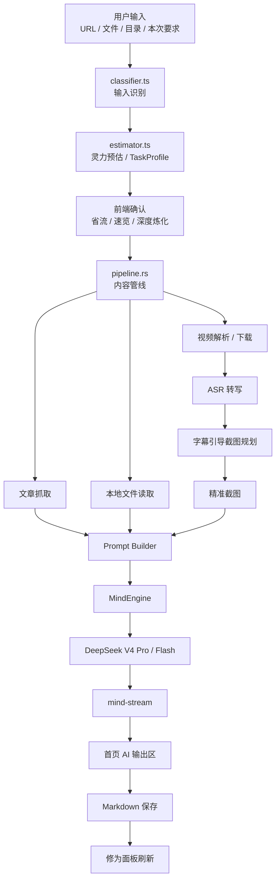

# 架构设计详解

> 大衍决 App 当前架构设计文档
> 最后更新：2026-06-14
> 当前阶段：前端 UI 已完成，DeepSeek V4 Pro / Flash 已接入，核心管线（视频/音频/文章/代码项目）已串通；DeepSeek Vision 视觉关键帧审查已就绪；修为面板前端消费链路待接入。

---

## 一、整体架构

大衍决 v1.0 以 Windows 桌面端为主，移动端延后。

```text
┌─────────────────────────────────────────────────────────────┐
│                     packages/core                            │
│  类型定义 · 配置 Schema · 输入识别 · 灵力预估 · Prompt 模板   │
│  AI 模型元数据 · 修为计算 · 笔记解析 · 搜索/对比纯逻辑       │
├─────────────────────────────────────────────────────────────┤
│                     apps/desktop                             │
│  React UI                                                    │
│  - 炼化工作台：输入控制 + AI 输出区                          │
│  - 修为面板：真实笔记统计                                    │
│  - 设置中心：配置健康度 + 主题 + DeepSeek + 依赖检测         │
├─────────────────────────────────────────────────────────────┤
│                     Tauri Rust 后端                           │
│  Pipeline · DeepSeek/MindEngine · Python 脚本调度             │
│  文件系统 · OS 密钥链 · 系统依赖检测 · 进度/AI 流事件         │
├─────────────────────────────────────────────────────────────┤
│                     外部依赖                                  │
│  DeepSeek V4 Pro · Python/faster-whisper · FFmpeg · yt-dlp    │
│  AI Douyin / TikHub · Windows Credential Manager              │
└─────────────────────────────────────────────────────────────┘
```

### 设计原则

1. **DeepSeek V4 Pro 优先**：v1 先吃透 1M 上下文能力，不急着做模型大全。
2. **Skill 原型产品化**：`D:\Project\MyClaude\myriad-mind` 中已验证的流程迁移为 App 模块。
3. **本地优先**：笔记、配置、缓存和密钥都由用户本机控制。
4. **轻量 AI 架构**：借鉴 CodeWhale 的 ModelRegistry、Provider 抽象、错误分类，但不引入 Agent Loop / MCP / 子智能体。
5. **平台差异隔离**：UI 和纯逻辑在 TS，系统能力和网络调用在 Tauri Rust。
6. **Python 脚本黑盒复用**：下载、ASR、截图脚本尽量不重写，由 Rust 做类型化封装。

---

## 二、核心数据流



---

## 三、职责边界

## 3.1 `classifier.ts`

职责：判断用户输入是什么。

输入：

- URL
- 文件路径
- 目录路径
- 命令式文本

输出：

```ts
type InputMode =
  | "bilibili"
  | "youtube"
  | "douyin"
  | "xiaohongshu"
  | "article_url"
  | "local_video"
  | "local_audio"
  | "local_text"
  | "local_directory"
  | "code_project"
  | "search"
  | "compare"
  | "dashboard";
```

不负责：

- token 估算。
- 模型选择。
- Provider 路由。

## 3.2 `estimator.ts`

职责：判断这次任务有多重。

输出统一的任务画像：

```ts
interface TaskProfile {
  inputMode: InputMode;
  estimatedInputTokens: number;
  estimatedOutputTokens: number;
  totalEstimatedTokens: number;
  estimatedMinutes: number;
  complexity: "small" | "medium" | "large" | "extreme";
  requiresLongContext: boolean;
  requiresUserConfirm: boolean;
  enabledFeatures: string[];
  mainCosts: string[];
}
```

重要边界：

- `estimator.ts` 只产出 `TaskProfile`，不直接选择模型。
- 模型选择（Pro / Flash）发生在 Rust 侧 `ai/engine.rs` 内，由 MindEngine 消费 `TaskProfile` 等效信息。

原因：

```text
classifier → estimator → TaskProfile → (IPC) → MindEngine / engine.rs
```

这样预估逻辑可以独立服务 UI、确认弹窗、批量模式和未来的成本统计。

## 3.3 模型路由（Rust 侧 `ai/engine.rs`）

职责：根据任务画像选择模型。该逻辑实际实现在 Rust 后端 `commands/ai/engine.rs` 内（不存在独立的 `ai/routing.ts` 或 `ai/router.rs` 模块）。

当前只在 DeepSeek V4 Pro / V4 Flash 之间路由：

```text
summary / translation / next_step_suggestion
  → deepseek-v4-flash

code_analysis
  → deepseek-v4-pro + reasoning_effort=max

estimated tokens > 100K
  → deepseek-v4-pro long-context mode

default
  → deepseek-v4-pro + reasoning_effort=high
```

输出语义（`engine.rs` 内部决策）：

```ts
interface ModelResolution {
  requested?: string;
  resolved: "deepseek-v4-pro" | "deepseek-v4-flash";
  provider: "deepseek";
  reason: string;
  fallbackChain: string[];
}
```

## 3.4 Prompt Hooks

P0 只做轻量 Hook：

- 全局写作偏好。
- 炼化页“本次要求”。
- 只接入 `note_generation`。

暂不实现完整 11 阶段 Hook。

P0 合并顺序：

```text
1. 系统硬约束
2. 内置 note_generation prompt
3. 功能开关约束
4. 全局写作偏好
5. 本次要求
```

P1/P2 再扩展：

- `keyframe_planning`
- `keyframe_review`
- `code_analysis`
- `next_step_suggestion`

---

## 四、桌面端架构

## 4.1 React 前端

```text
apps/desktop/src/
├── main.tsx          # React 入口
├── App.tsx           # 主应用（页签布局）
├── App.css           # 全局样式（CC Switch 暗色风格）
├── api.ts            # Tauri IPC 封装 + 事件监听
├── hooks/
│   ├── useConfig.ts  # 配置加载/首启检测
│   ├── usePipeline.ts # 管线进度事件 + mind-stream 流式监听
│   └── useTheme.ts   # 主题切换（light / dark / system）
├── lib/
│   ├── platform.ts   # 平台检测
│   └── utils.ts      # 通用工具
└── components/
    ├── layout/       # Sidebar / NavButton
    ├── input/        # InputView（炼化输入控制 + AI 输出区）
    ├── dashboard/    # DashboardView（修为面板，当前为硬编码示例数据）
    ├── settings/     # SettingsView + DepsPanel
    └── log/          # LogPanel（管线/AI 日志）
```

页面职责：

| 页面 | 职责 |
|------|------|
| 炼化 | 输入控制、灵力预估、AI 流式输出、保存结果 |
| 修为 | 学习统计、最近笔记、成就、标签、学习建议 |
| 设置 | 配置健康度、DeepSeek Key、依赖检测、主题、提示词偏好 |

前端不直接调用外部 AI API，统一通过 Tauri 命令。

## 4.2 Tauri Rust 后端

当前实际结构：

```text
apps/desktop/src-tauri/src/
├── main.rs
├── lib.rs            # Tauri Builder — 注册全部 IPC 命令
├── error.rs          # 统一错误类型 AppError（thiserror）
└── commands/
    ├── mod.rs
    ├── config.rs         # 配置存储（~/.myriad-mind-app/config.json）+ OS 密钥链
    ├── deps.rs           # Python / FFmpeg / yt-dlp / GPU 依赖检测
    ├── python.rs         # 6 个 Python 脚本的类型化封装 + 子进程调度
    ├── fetch.rs          # 文章 URL 抓取（Rust dom_query + reqwest，本地解析，非 WebFetch）
    ├── code_project.rs   # 代码项目扫描（目录树 / 语言识别 / 入口分析）
    ├── notes.rs          # 笔记处理（读取 / 列举 / Q&A 追问）
    ├── library.rs        # .myriad-mind/ 知识库索引 + 指纹去重（library.json / notes.jsonl / fingerprints.json）
    ├── pipeline.rs       # 管线编排器（2155 行）— execute_pipeline 主函数 + 文本/视频/音频/代码全分流
    ├── fs.rs             # 文件读写 / 目录扫描 / 资源拷贝 / 临时清理
    └── ai/
        ├── mod.rs        # 模块声明 + re-export（generate_note / qa_note / run_mind_task / test_deepseek_connection）
        ├── types.rs      # AI 请求/响应/消息/任务类型（AiTask / MindRequest / MindStreamEvent 等）
        ├── engine.rs     # MindEngine — generate_note + run_mind_task + 4 种内容模式提示词编排
        ├── deepseek.rs   # DeepSeek V4 Pro / Flash 流式客户端（reasoning_content 分流 + mind-stream emit）
        └── vision.rs     # DeepSeek Vision 关键帧截图审查（场景评分 / 嵌入位置选择）
```

演进说明：

- `commands/ai/` 子模块已全部落地：types / engine / deepseek / vision 四件套。
- 不存在 `claude.rs` / `ai/router.rs` / `ai/errors.rs` / `ai/routing.rs` —— 模型路由逻辑收敛在 `engine.rs` 内，错误统一走顶层 `error.rs::AppError`。
- `pipeline.rs` 已是完整编排器，不再有 "AI TODO" 占位，详见第六章。

---

## 五、AI 架构

## 5.1 当前目标

默认主模型：

```text
deepseek-v4-pro
```

快速模型：

```text
deepseek-v4-flash
```

DeepSeek API：

```text
Base URL: https://api.deepseek.com
Endpoint: /chat/completions
Format: OpenAI Chat Completions
Auth: Authorization: Bearer {DEEPSEEK_API_KEY}
```

## 5.2 MindEngine

实现在 `commands/ai/engine.rs`，对外暴露 `generate_note` / `run_mind_task` / `qa_note` / `test_deepseek_connection` 四个 Tauri 命令。

职责：

1. 接收任务类型、prompt、TaskProfile。
2. 根据 `engine.rs` 内置路由规则选择 Pro / Flash。
3. 从 OS 密钥链读取 `deepseek-api-key`。
4. 调用 `DeepSeekClient`（`deepseek.rs`）。
5. 发送 `mind-stream` 事件。
6. 返回完整 Markdown 和 usage。

Rust 请求结构：

```rust
pub struct MindRequest {
    pub task: AiTask,
    pub messages: Vec<AiMessage>,
    pub system_prompt: String,
    pub model_override: Option<String>,
    pub stream: bool,
    pub max_tokens: Option<u32>,
    pub thinking: Option<ThinkingConfig>,
}
```

## 5.3 DeepSeekClient

请求示例：

```json
{
  "model": "deepseek-v4-pro",
  "messages": [
    { "role": "system", "content": "..." },
    { "role": "user", "content": "..." }
  ],
  "thinking": { "type": "enabled" },
  "reasoning_effort": "high",
  "stream": true,
  "max_tokens": 65536
}
```

流式解析：

```text
choices[0].delta.reasoning_content → reasoning_delta
choices[0].delta.content           → delta
usage                              → usage
finish_reason                      → done
```

重要规则：

- `reasoning_content` 不进入最终 Markdown。
- 默认不在 UI 展示 reasoning。
- 调试模式可折叠展示 reasoning。

## 5.4 `mind-stream`

统一 AI 流事件：

```ts
export type MindStreamEvent =
  | { type: "start"; task: AiTask; provider: "deepseek"; model: string }
  | { type: "reasoning_delta"; delta: string }
  | { type: "delta"; delta: string }
  | { type: "usage"; inputTokens?: number; outputTokens?: number; reasoningTokens?: number; totalTokens?: number }
  | { type: "done"; text: string; finishReason?: string }
  | { type: "error"; code: string; message: string; retryable: boolean };
```

前端首页 AI 输出区只监听 `mind-stream`，不直接关心 Provider。

## 5.5 1M 上下文策略

DeepSeek V4 Pro 支持 1M 上下文，但仍要保留输出空间。

预算建议：

```text
总上下文：1,000,000 tokens
系统提示：5,000 - 15,000
任务说明：2,000 - 5,000
输入正文：最多 850,000
输出预留：80,000 - 120,000
安全余量：30,000 - 50,000
```

输入规模：

| 输入规模 | 策略 |
|----------|------|
| `< 100K` | 直接炼化 |
| `100K - 500K` | 长上下文模式 |
| `500K - 850K` | 深度炼化，要求确认 |
| `850K - 1M` | 极限模式，强制确认 |
| `> 1M` | 分段压缩后再炼化 |

---

## 六、Pipeline 架构

## 6.1 当前实现状态

`pipeline.rs` 已是完整的管线编排器（约 2155 行），不再有 AI TODO 占位。四条内容管线全部串通：

```text
execute_pipeline(主入口，按 InputMode 分流)
  ├── run_text_pipeline       # 文章 URL / 本地文本 → DeepSeek → Markdown
  │                             #   文章走 fetch.rs（dom_query + reqwest）
  ├── run_video_pipeline      # 在线/本地视频 → 下载 → 音频提取 → ASR → 关键帧 → Vision 审查 → AI
  ├── run_audio_pipeline      # 本地音频 → ASR → AI
  └── run_code_project_pipeline # 代码项目（code_project.rs 扫描）→ AI
```

每步通过 Tauri event `pipeline-progress` 推送进度，AI 流式输出通过 `mind-stream`（详见 5.4）推送。

## 6.2 后续重构方向

当前编排是函数式分流（`run_*_pipeline` 各自一条主链路），尚未抽象为统一trait。后续若要支持插件化步骤、断点续跑、并发步骤，可再引入：

```text
PipelineStep
Artifact
StepRunner
PipelineContext
```

这是 P1+ 优化，不是 P0 阻塞项。

## 6.3 管线阶段

```text
0. 输入识别
0.5 配置读取
0.7 灵力预估
1. 内容获取
2. 视频下载 / 文章抓取 / 文件读取
3. 音频提取
4. ASR 转写
4.5 字幕分析 → 推荐截图时间点
4.7 精准截图（+ DeepSeek Vision 审查）
5. Prompt 构建（engine.rs 4 种内容模式）
6. DeepSeek 生成（mind-stream）
7. 保存 Markdown
8. 清理临时文件
9. 更新修为面板 / 学习建议
```

## 6.4 事件

Pipeline 事件：

```text
pipeline-progress
```

AI 事件：

```text
mind-stream
```

两者分开：

- `pipeline-progress` 展示当前处理步骤。
- `mind-stream` 展示 AI 输出内容。

---

## 七、Python 脚本层

脚本来源：

```text
D:\Project\MyClaude\myriad-mind\scripts
```

当前复用脚本：

```text
transcribe_faster_whisper.py
install_faster_whisper.py
extract_keyframes.py
download_video_candidates.py
download_youtube_subtitles.py
list_ai_douyin_tasks.py
```

Rust 封装规则：

```text
Command::new(python)
  → 传入明确参数
  → 捕获 stdout/stderr
  → 检查 exit code
  → JSON stdout 解析成结构体
  → 错误语义化
```

不要让前端直接调用脚本。

---

## 八、Skill v2.1 功能迁移

`myriad-mind` Skill 的核心能力迁移为 App 模块。

## 8.1 字幕引导截图

Skill v2.1 流程：

```text
ASR 转写
→ AI 分析字幕，推荐截图时间点
→ extract_keyframes.py 精准截图
→ AI 审查截图，选择嵌入位置
```

App 模块：

```text
GuidedKeyframePlanner
KeyframeExtractor
KeyframeReviewer
```

输出：

```json
{
  "file": "frame_0001_00h03m03s.png",
  "timestamp_seconds": 183,
  "timestamp_label": "03:03",
  "trigger": "guided",
  "scene_score": 0.81
}
```

## 8.2 Prompt Hooks

P0 仅支持：

- 全局写作偏好。
- 本次要求。
- note_generation。

后续再扩展截图规划、截图审查、代码分析等阶段 Hook。

## 8.3 修为面板

App 不再由 AI 直接"猜统计"，而是：

```text
扫描 .myriad-mind 索引 / Markdown
→ 解析目录索引与单篇元信息
→ core 计算修为 / 成就 / 标签
→ DeepSeek V4 Flash 生成下一步建议
→ UI 展示
→ 可选写入 修为面板.md
```

> **当前现状（2026-06）**：后端 `library.rs` 已实现 `.myriad-mind/` 索引读写与指纹去重能力，知识库索引层已就绪。但前端 `components/dashboard/DashboardView.tsx` 目前仍为硬编码示例数据（约 15 条 `REAL_NOTES` 假数据），尚未消费 `library.rs` 的索引命令，"索引 → 前端 DashboardData" 链路待接入。下方描述为完整目标架构。

输出目录下维护 `.myriad-mind/` 作为知识库索引：

```text
输出目录/
└── .myriad-mind/
    ├── library.json
    ├── notes.jsonl
    ├── categories.json
    ├── fingerprints.json
    └── memory.md
```

用途：

- AI 生成前读取已有分类、摘要、标签，作为目录级记忆。
- 新输入先生成 `PlacementPlan`，决定放入哪个目录和文件。
- `source_fingerprint` 命中时更新已有文档，而不是新建。
- 修为面板优先消费 `.myriad-mind/notes.jsonl`，索引缺失时再扫描 Markdown 重建。

---

## 九、配置与密钥

## 9.1 配置文件

Windows：

```text
~/.myriad-mind-app/config.json
```

内容：

- Python 路径。
- ASR 后端。
- 视频 Provider。
- 输出目录。
- 功能开关。
- DeepSeek 模型配置。
- 主题。
- 提示词偏好。

不包含：

- API Key。
- Token。
- 用户敏感内容。

## 9.2 OS 密钥链

Windows：

```text
Windows Credential Manager
```

命名：

```text
myriad-mind/deepseek-api-key
myriad-mind/ai-douyin-api-key
myriad-mind/tikhub-token
myriad-mind/volcengine-token
```

## 9.3 DeepSeek 配置

建议配置：

```ts
ai: {
  default_provider: "deepseek";
  default_model: "deepseek-v4-pro";
  fast_model: "deepseek-v4-flash";
  deepseek: {
    enabled: true;
    api_key_id: "deepseek-api-key";
    base_url: "https://api.deepseek.com";
    thinking: {
      enabled: true;
      effort: "high";
    };
    long_context: {
      enabled: true;
      max_context_tokens: 1000000;
      default_output_tokens: 65536;
      deep_output_tokens: 131072;
    };
  };
}
```

---

## 十、修为面板架构

真实数据来源：

```text
note_dir/**/*.md
```

解析：

- front matter。
- 标题。
- 日期。
- 类型。
- 难度。
- 阅读时长。
- 标签。
- 来源。

计算：

```text
calculateCultivation()
checkAchievements()
computeStats()
```

输出：

- React 修为页。
- `修为面板.md`。

后续增强：

- 搜索。
- 对比。
- 知识图谱。
- 学习路线。

---

## 十一、主题与资源

主题：

```text
light / dark / system
```

主题变量统一定义在 CSS 中，组件尽量使用语义变量。

主色：

```text
CC Switch 风格蓝色
```

图标资源：

```text
apps/desktop/src/assets/icons/myriad-mind-whale-icon-concept.png
```

Tauri 正式打包 icon 仍由用户后续手动替换。

---

## 十二、移动端策略

v1 暂缓移动端。

移动端 v2 才考虑：

- 阅读已生成笔记。
- 简单文章处理。
- 修为面板查看。
- 与桌面共享 `packages/core` 纯逻辑。

v1 架构不要为移动端牺牲桌面管线推进速度。

---

## 十三、构建与分发

v1 目标：

```text
Windows 桌面 Alpha
```

产物：

- `.msi`
- `.exe` 便携版

后续：

- 自动更新。
- GitHub Releases。
- macOS / Linux v2。

---

## 十四、关键依赖

| 依赖 | 用途 |
|------|------|
| React 19 | 桌面 UI |
| Tauri 2 | 桌面壳和 Rust 后端 |
| TypeScript 5.9 | 前端和 core 类型 |
| Rust | Tauri commands |
| DeepSeek V4 Pro | 主 AI 生成模型 |
| Python 3.9+ | Python 脚本运行 |
| faster-whisper | 本地 ASR |
| FFmpeg | 音视频处理 |
| yt-dlp | YouTube 字幕和视频能力 |
| AI Douyin / TikHub | 国内视频解析 |

---

## 十五、架构验收标准

AI：

- DeepSeek API Key 从 OS 密钥链读取。
- `deepseek-v4-pro` 可流式输出 Markdown。
- `reasoning_content` 不污染正文。
- 首页只监听 `mind-stream`。

管线：

- 文章 / 本地文本能生成笔记。
- 本地音视频能 ASR 后生成笔记。
- 在线视频能解析 / 下载 / 转写 / 生成。
- 每步有进度事件和错误提示。

Skill 迁移：

- 字幕引导截图发生在 ASR 后。
- `keyframes.json` 有 `trigger` 字段。
- 笔记中有截图审查表。

修为：

- 扫描真实笔记目录。
- 生成真实 DashboardData。
- 可更新 `修为面板.md`。

配置：

- API Key 不进入配置文件。
- 亮色 / 暗色 / 跟随系统可切换。
- 用户可设置全局写作偏好和本次要求。
