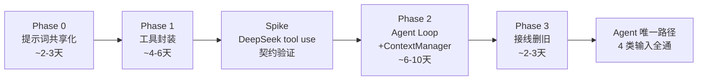

# Agent 开发计划

> 编写日期：2026-06-22
> 状态：**计划已确认，待 Phase 0 开工**
> 架构决策权威：[`Agent架构设计.md`](./Agent架构设计.md)（本文件是其 §十分阶段实施的可执行细化）
> 模型层：[`AI多模型接入架构设计.md`](./AI多模型接入架构设计.md)
> 跟踪：本文档任务 + [`docs/项目管理/开发任务清单.md`](../../项目管理/开发任务清单.md)

---

## 〇、决策记录（2026-06-22 与开发者确认）

| 决策 | 结论 | 依据 |
|------|------|------|
| 推进策略 | **完全重构**（按设计 §九），Phase 0→3 连续推进，不保留经典管线、不新旧并存 | Alpha 阶段无线上用户，不背兼容包袱；终点最干净 |
| 优先级 | **Agent 重构为主线，修为面板真实化延后** | 修为面板不碰管线，如需并行可穿插；agent 是架构主轴 |
| 临时不可用 | Phase 2-3 期间炼化功能可能短暂不可用，开发期可接受 | 设计 §九 明确 |

> ⚠️ 本次重构触及 CLAUDE.md §一.6「架构变更需确认」的多个禁区（`commands/` 模块树、`pipeline.rs` 编排、`ai/engine.rs`+`deepseek.rs` 路由、`packages/core` 公共导出）。各 Phase 落地前，模块结构与关键接口仍以「建议方案 + 优缺点」形式提交开发者确认后再编码（见各 Phase「待确认」标注）。

---

## 一、起点基线（已对照源码核实）

| 项 | 现状 | 对 Agent 重构的影响 |
|----|------|---------------------|
| DeepSeek 客户端 | `deepseek.rs::stream_deepseek` 仅单轮流式；`MindRequest`（`types.rs:77`）**无 `tools` 字段**，`build_body` 只拼 messages+thinking | agent loop 是**从零实现** tool use，不是改造 |
| 管线 | `execute_pipeline`（`pipeline.rs:81`）按 9 种 `InputMode` 分流到 `run_video/audio/text_pipeline`，全部可用 | Phase 3 删除分流，改为调度 agent |
| 下载/音频/截图逻辑 | 散落在 `pipeline.rs:1804-2217` 内部函数（`resolve_via_ai_douyin` / `download_douyin_video` / `download_video_ytdlp` / `extract_audio_ffmpeg` / `extract_keyframes_guided`），非独立 command | Phase 1 必须先提取到共享模块才能封进工具 |
| 提示词 | `src-tauri/prompts/*.md` 现行（`PromptManager` minijinja 渲染）；`packages/core/src/prompts/*.ts` **死代码**（`index.ts:42-64` re-export 但 `apps/desktop/src` 零引用） | Phase 0 共享化 + 删死代码 |
| 提示词路径解析 | `prompt_manager.rs::prompts_dir()` 在 ancestors 找 `prompts/`（哨兵 `note/system.md`），dev 从 CWD、prod 从 exe 同级 / `Resources/` | Phase 0 改解析指向 core |
| 日志脚手架 | `lib.rs` 已接 `tauri-plugin-log`（Stdout+Folder+Webview 三 target）；`deepseek.rs`/`engine.rs` 已埋 `target:"agent"` 日志点 | agent loop 复用，无需重建 |
| 取消 | `AppError::Cancelled` 枚举已存在 | agent loop 复用 |
| 前端进度事件 | `pipeline-progress`（硬编码步骤）+ `mind-stream`（AI 流式，稳定） | Phase 3 重构 progress 事件结构；`mind-stream` 不变 |

---

## 二、总体路线



| 阶段 | 一句话 | 风险 | 是否破坏现有炼化 |
|------|--------|------|------------------|
| **0** | `.md` 提示词搬到 `packages/core/prompts/`，删 core TS 死代码 | 低 | 否（纯重构） |
| **1** | 现有 commands 封装成 `ToolSpec`+`ToolHandler`+注册表，底层不动 | 中（下载逻辑要提取） | 否（工具是增量，pipeline 照旧） |
| **Spike** | 用最小 demo 验证 DeepSeek tool use 的 API 契约（流式/非流式、`tool_calls` 字段、reasoning 共存） | **高（整个 agent 的技术前提）** | 否（独立 demo） |
| **2** | agent loop + ContextManager + 护栏 + artifact 化 + charter | 高（全新实现） | **是（Phase 2-3 期间炼化逐步切到 agent）** |
| **3** | `execute_pipeline` 改调度 agent，删 `run_*_pipeline` 4 分流 + 重构 progress 事件 | 中 | 是（切流期间） |

> 工期为粗估（含调试），非承诺。Spike 是 Phase 2 的前置闸门：tool use 验证不过，Phase 2 方案要回炉。

---

## 三、Phase 0 — 提示词共享化

> 目标：`.md` 成为唯一提示词标准，放 `packages/core/prompts/`，desktop/mobile 共用；删除 core TS 死代码。

### 涉及文件

| 文件 | 动作 |
|------|------|
| `packages/core/prompts/`（新建） | 从 `apps/desktop/src-tauri/prompts/` 搬入 `note/`、`vision/`、`qa.md`、`ping.md` |
| `apps/desktop/src-tauri/prompts/` | 删除（或改为软链/构建时拷贝，二选一，见「待确认」） |
| `apps/desktop/src-tauri/src/commands/ai/prompt_manager.rs` | 改 `prompts_dir()` / `find_prompts_dir_from()` 指向 core |
| `apps/desktop/src-tauri/tauri.conf.json` | `bundle.resources` 的 `prompts/**/*.md` → `../../../packages/core/prompts/**/*.md` |
| `packages/core/src/prompts/*.ts`（5 文件 + index.ts） | **删除** |
| `packages/core/src/index.ts` | 删除 `:42-64` 的 `prompts/index.js` re-export 块 |

### 任务清单

- [ ] P0-1 新建 `packages/core/prompts/`，从 `src-tauri/prompts/` 原样搬入全部 `.md`（保持 `note/system.md` 哨兵文件）
- [ ] P0-2 改 `tauri.conf.json` resources glob 指向 core 新位置
- [ ] P0-3 改 `prompt_manager.rs`：dev 模式 `find_prompts_dir_from` 增加 `packages/core/prompts` 候选；prod 仍走 `resources/prompts`（打包产物路径不变）
- [ ] P0-4 删除 `packages/core/src/prompts/*.ts`（note-gen/summarize/translate/compare/code-analysis + index.ts）
- [ ] P0-5 从 `packages/core/src/index.ts` 移除 prompts re-export 块（`SummarizeContext` 等类型一并清）
- [ ] P0-6 grep 全仓确认无 `buildVideoNotePrompt`/`buildArticleNotePrompt`/`buildCodeAnalysisPrompt` 残留引用
- [ ] P0-7 验收测试（见下）

### 待确认（§一.6）

**core 提示词位置**：是「物理搬到 `packages/core/prompts/`、`src-tauri/prompts` 删除」，还是「`src-tauri/prompts` 保留为构建产物、core 用软链/拷贝脚本同步」？
- 方案 A（搬移，推荐）：单一真源，无同步成本；desktop dev/prod 路径解析适配一次即可。
- 方案 B（软链/拷贝）：保留 src-tauri 自治，但引入双向同步风险，违背「链接而非复制」原则。

### 验收

- `pnpm dev` 起桌面端，视频/文章/代码三类输入各炼化一次，笔记正常生成（prompt 实际从 core 加载）
- `pnpm typecheck` 通过
- `cargo build` 通过（Rust 端无残留路径引用）
- 全仓 grep 无 core TS prompts 残留

---

## 四、Phase 1 — 现有 commands 封装成工具

> 目标：定义 `ToolSpec` + `ToolHandler` trait + `ToolOutput`（artifact 化）+ `ToolRegistry`；把现有能力封成白名单工具。底层 Python/FFmpeg 逻辑不动。设计依据：[`Agent架构设计.md`](./Agent架构设计.md) §五。

### 建议模块结构（§一.6 待确认）

```text
apps/desktop/src-tauri/src/commands/
├── tools/                    # 新增（Phase 1）
│   ├── mod.rs               # ToolSpec / ToolHandler / ToolOutput / ArtifactRef / ArtifactKind / ToolError
│   ├── registry.rs          # ToolRegistry：name→handler，按阶段分组 + 花费开关过滤
│   ├── media/               # 从 pipeline.rs 提取的共享媒体逻辑（Phase 1 提取，Phase 3 pipeline 删除后成为唯一持有者）
│   │   ├── download.rs      # resolve_via_ai_douyin / download_douyin_video / download_video_ytdlp / download_audio_ytdlp
│   │   ├── audio.rs         # extract_audio_ffmpeg
│   │   └── keyframes.rs     # extract_keyframes_guided / get_video_duration
│   └── handlers/
│       ├── acquire.rs       # fetch_url / download_video / extract_audio / transcribe_asr / download_subtitles / scan_code_project / read_file / scan_directory / query_ai_douyin
│       ├── analyze.rs       # extract_keyframes / review_keyframes
│       └── io.rs            # write_note / read_artifact / search_artifact（Phase 2 用）
```

> 提取 `media/` 是 Phase 1 工作量最大的一块：当前这些函数是 `pipeline.rs` 私有函数，需先提取到 `commands/tools/media/`，让 pipeline（临时）和 tool handler 共用，Phase 3 删 pipeline 时无残留。

### 核心类型（`tools/mod.rs`）

```rust
// 给 LLM 看的描述（CodeWhale ToolSpec 风格）
struct ToolSpec { name: String, description: String, input_schema: serde_json::Value }

// 统一执行接口
#[async_trait]
trait ToolHandler: Send + Sync {
    async fn handle(&self, params: serde_json::Value) -> Result<ToolOutput, AppError>;
}

// artifact 优先：大结果落盘，只回摘要+引用（设计 §6.6.2）
struct ToolOutput {
    summary: String,                 // 给 LLM 的短摘要
    artifact_refs: Vec<ArtifactRef>, // 原文落盘后的引用
    metadata: serde_json::Value,     // token 数/耗时/文件类型
}
struct ArtifactRef { id: String, path: PathBuf, kind: ArtifactKind, tokens_estimate: u64, summary: String }
enum ArtifactKind { Transcript, ArticleText, CodeScan, Screenshots, Draft }
```

### 工具映射（对照设计 §五）

| 工具 | 来源 | 阶段 |
|------|------|------|
| `fetch_url` | `fetch.rs` | 获取 |
| `download_video` | `tools/media/download.rs`（内部多 provider：ai_douyin/ytdlp） | 获取 |
| `extract_audio` | `tools/media/audio.rs`（FFmpeg） | 获取 |
| `transcribe_asr` | `python.rs::transcribe_audio` | 获取 |
| `download_subtitles` | `python.rs::download_youtube_subtitles` | 获取 |
| `scan_code_project` | `code_project.rs` | 获取 |
| `read_file` / `scan_directory` | `fs.rs` | 获取 |
| `query_ai_douyin` | `python.rs::list_ai_douyin_tasks` | 获取（花钱，默认关） |
| `extract_keyframes` | `tools/media/keyframes.rs`（按 AI plan 执行） | 理解 |
| `review_keyframes` | `vision.rs` | 理解/生成 |
| `write_note` | `fs.rs::write_note` | 生成/自检 |

### 任务清单

- [ ] P1-1 新建 `commands/tools/mod.rs`：定义 `ToolSpec` / `ToolHandler` / `ToolOutput` / `ArtifactRef` / `ArtifactKind`
- [ ] P1-2 从 `pipeline.rs` 提取媒体逻辑到 `commands/tools/media/{download,audio,keyframes}.rs`，pipeline 改为调用共享模块（行为不变，验证 pipeline 仍跑通）
- [ ] P1-3 封装 `handlers/acquire.rs`：fetch_url / download_video / extract_audio / transcribe_asr / download_subtitles / scan_code_project / read_file / scan_directory / query_ai_douyin
- [ ] P1-4 封装 `handlers/analyze.rs`：extract_keyframes / review_keyframes
- [ ] P1-5 封装 `handlers/io.rs`：write_note（read_artifact/search_artifact 留 Phase 2 实现）
- [ ] P1-6 `registry.rs`：注册全部工具，按阶段分组（Acquire/Analyze/Generate），支持按 config 花费开关过滤（如 `query_ai_douyin`）
- [ ] P1-7 每个工具的 `ToolOutput` 落实 artifact 化：字幕/正文/扫描结果/截图落盘到 `runs/{task_id}/artifacts/`，只回 summary + ref
- [ ] P1-8 工具单测：每个 handler 单独 invoke 一次，断言 `ToolOutput` 结构（不连真实 LLM）

### 验收

- 全部工具可通过 `registry.get(name).handle(params)` 独立调用，返回合法 `ToolOutput`
- 大文本（字幕/正文）绝不进 `ToolOutput.summary`，只给 artifact 引用
- pipeline.rs 提取媒体逻辑后仍正常炼化（回归不破坏）
- 花费开关关闭时，对应工具不进白名单

---

## 五、Spike — DeepSeek tool use 契约验证（Phase 2 前置闸门）

> 目标：在写 agent loop 之前，先用最小 demo 摸清 DeepSeek V4 tool use 的真实 API 行为。这是整个 agent 能不能 work 的技术前提，**设计 §6.1 的伪代码基于 CodeWhale 经验，未在本项目验证**。

### 必须回答的问题

- [ ] S-1 DeepSeek tool use 支持**流式**吗？还是 agent loop 必须用非流式聚合 `choices[0].message.tool_calls`？（影响 `deepseek.rs` 改造方式）
- [ ] S-2 `tool_calls` 在 SSE delta 里的累积格式（`delta.tool_calls[].function.{name,arguments}` 分片）？
- [ ] S-3 `reasoning_content` 与 `tool_calls` 能否共存？（agent 决策时是否还有思考流）
- [ ] S-4 `tool` / `tool_choice` 参数的确切字段名与格式（OpenAI 兼容 vs DeepSeek 差异）
- [ ] S-5 tool_result 回喂的消息格式（`role: "tool"` + `tool_call_id`）DeepSeek 是否正确接受并续推
- [ ] S-6 给一个 3 工具（fetch_url/read_file/write_note）的最小 loop，能否自主跑完一个「抓文章→读→存」任务

### 产出

- 一份 `docs/问题排查/DeepSeek-tool-use-验证.md`（或并入本文档附录），记录字段格式 + 流式结论 + 已知坑
- 据此修正 Phase 2 的 `deepseek.rs` 改造方案（流式聚合 vs 非流式）

> 若 Spike 结论是「tool use 不稳定/不支持流式」，Phase 2 方案需回炉（可能转非流式 loop 或评估备选），届时回到 §一.6 与开发者重新确认。

---

## 六、Phase 2 — Agent Loop + ContextManager

> 目标：实现目标驱动的 agent loop，AI 在六阶段骨架内自主选工具；上下文不随 tool call 暴涨（artifact 化 + 阶段清零）。设计依据：§六（loop）、§6.6（ContextManager）、§四（六阶段骨架 + 输出契约）。

### 涉及文件

```text
commands/
├── ai/
│   ├── types.rs              # MindRequest 加 tools 字段
│   └── deepseek.rs           # build_body 加 tools；流式解析加 tool_calls 聚合（或非流式，依 Spike）
├── agent/                    # 新增（Phase 2）
│   ├── mod.rs
│   ├── loop.rs               # 主循环 + 护栏 + 取消（设计 §6.1/§6.3/§6.4/§6.5）
│   ├── context.rs            # ContextManager（§6.6）：TaskState + ArtifactStore + ShortTerm + Archive
│   ├── phases.rs             # 六阶段骨架推进（§四）：Recall→Acquire→Analyze→Generate→Verify→Memorize
│   └── charter.rs            # 组装 agent system prompt（目标+骨架+契约+约束+工具说明）
└── tools/handlers/io.rs      # 补 read_artifact / search_artifact / read_archive
packages/core/prompts/agent/charter.md   # agent charter 模板（Phase 0 后的共享位置）
```

### 六阶段骨架（设计 §四）

| 阶段 | 谁执行 | 可用工具 | 检查点 |
|------|--------|----------|--------|
| 0 回忆 Recall | 框架 | 加载 `.myriad-mind/memory.md` + 知识库索引 + 用户写作偏好 | 上下文已注入 |
| 1 获取 Acquire | **AI** | acquire 工具组 | 产出可读文本 |
| 2 理解 Analyze | **AI** | extract_keyframes（按 plan）/ review_keyframes | 素材就绪（可跳过） |
| 3 生成 Generate | **AI** | review_keyframes（按需） | 符合契约的 Markdown |
| 4 自检 Verify | **AI** | read_file 回读 | 契约 section 齐全 |
| 5 沉淀 Memorize | 框架（AI 提炼） | 更新 memory.md + 指纹 | 索引已更新 |

> **阶段推进边界**（需在 `phases.rs` 设计清楚，§一.6 待确认）：框架按检查点强制推进阶段（每阶段换 system prompt 工具子集），agent 在阶段内自主选工具/顺序/跳过。截图走 plan-then-execute（AI 产出 plan → `extract_keyframes` 执行，§四）。

### 任务清单

- [ ] P2-1 `types.rs`：`MindRequest` 加 `tools: Vec<ToolSpec>`；新增 `ToolCall` / `ToolResult` 消息类型
- [ ] P2-2 `deepseek.rs`：`build_body` 序列化 tools；按 Spike 结论实现 tool_calls 解析（流式聚合 or 非流式）
- [ ] P2-3 `agent/context.rs`：实现 `TaskState`（代码自动更新，不调 LLM）+ `ArtifactStore`（落盘 + 引用）+ Short-term Window + Archive（JSONL）
- [ ] P2-4 `agent/context.rs`：阶段边界清零策略（§6.6.4）—— `advance_phase()` 清旧 stage messages，保留 TaskState + artifact refs
- [ ] P2-5 `agent/loop.rs`：主循环（发请求→有 tool_calls→dispatch→回喂→continue；无→返回）+ 护栏（最大步数 20 / 超时 / 花费开关）+ 取消（`CancellationToken`，每轮顶部 + 工具内 `select!`）
- [ ] P2-6 `agent/loop.rs`：错误处理（§6.4）—— 工具失败回喂自修（同工具连失 3 次终止）；LLM 失败指数退避 3 次；参数不合规回喂 3 次终止；契约不满足回喂 3 次（交付当前+标记不完整）
- [ ] P2-7 `agent/phases.rs`：六阶段骨架推进 + Recall/Memorize 框架执行（memory.md + library.rs 索引读写）
- [ ] P2-8 `tools/handlers/io.rs`：`read_artifact` / `search_artifact` / `read_archive` —— agent 召回落盘全文
- [ ] P2-9 `agent/charter.rs` + `packages/core/prompts/agent/charter.md`：目标 + 骨架 + 输出契约 + 约束；工具说明由代码从 `ToolSpec` 自动生成
- [ ] P2-10 输出契约校验（§四）：笔记必须含 front matter/摘要/术语表/Mermaid/资源/元信息；缺则回喂补全
- [ ] P2-11 笔记携带 generation trace（§四）：model/tools_used/total_tokens/duration/steps 写入元信息块
- [ ] P2-12 agent loop 全链路埋点：每轮、tool dispatch、phase 推进 `log::debug!(target:"agent",...)`
- [ ] P2-13 冒烟：视频/文章/音频/代码各跑通一次，观察工具选择、上下文增长、阶段推进

### 验收

- agent 对任意输入自主选工具跑通一次（视频自动 download→asr→生成；有字幕跳 ASR）
- `TaskState` 块每轮注入，无 LLM 生成开销
- 大文本不进 messages（artifact 化生效）：多轮后 messages 体量可控
- 护栏有效（构造死循环场景，最大步数/超时能终止）
- 取消按钮可中断长任务（下载/ASR 中途可停）

---

## 七、Phase 3 — 接线删旧

> 目标：agent 成为唯一炼化路径，删除 4 分流管线与死代码。设计依据：§九。

### 任务清单

- [ ] P3-1 `execute_pipeline`（`pipeline.rs:81`）改为调度 agent（取代 `match InputMode → run_*_pipeline` 分流）
- [ ] P3-2 删除 `run_video_pipeline` / `run_audio_pipeline` / `run_text_pipeline` 及已迁移到 `tools/media/` 的辅助函数残留
- [ ] P3-3 重构 `pipeline-progress` 事件：从「硬编码步骤」改为「agent 阶段 + 工具调用」语义；前端 `usePipeline.ts` + 进度条 UI 适配
- [ ] P3-4 `mind-stream` 保持不变（AI 输出区不受影响）
- [ ] P3-5 成本预估接入：agent 启动前用 `estimator.ts` 预估 token，提示用户「预计 X token / Y 分钟」确认后启动（设计 §四，不硬限制）
- [ ] P3-6 grep 确认 `pipeline.rs` 无死代码、无 `run_*_pipeline` 残留引用
- [ ] P3-7 更新 [`docs/架构与结构.md`](../../架构与结构.md) §五/§六/§七：从「当前实现（管线）」改写为「已演进（agent）」，去掉 ⏳ 演进标注

### 验收（= 设计 §十二）

- **agent 为唯一路径**：文章/视频/音频/代码 4 类输入全部由 agent 自主完成
- AI 自主决定工具组合（有字幕自动跳 ASR 等）
- 输出笔记满足输出契约（section 齐全）
- 提示词从 `packages/core/prompts` 加载
- 护栏有效（超步数/超时终止，不卡死）
- 工具白名单生效（危险操作不可达）
- `pipeline.rs` 4 分流已删除，无遗留死代码

---

## 八、跨阶段事项

### 8.1 前端适配

- Phase 3 改 `pipeline-progress` 事件结构 → `usePipeline.ts`（`apps/desktop/src/hooks/`）+ 进度条组件适配
- `mind-stream` 监听不变，AI 输出区零改动
- 成本预估确认弹窗（Phase 3-5）可能需新增 UI

### 8.2 日志与可观测

- 复用现有 `tauri-plugin-log`（三 target）+ `target:"agent"` 埋点
- Phase 2 补 agent loop / tool dispatch / phase 推进埋点
- 笔记内 generation trace（P2-11）+ 日志，双重可追溯

### 8.3 测试

- Phase 1：工具 handler 单测（不连 LLM）
- Phase 2：agent loop 难直接测（依赖 DeepSeek）→ 至少 mock 一个 DeepSeek 响应序列，验证 loop 控制流（护栏/取消/错误回喂）
- Phase 3：4 类输入端到端冒烟

### 8.4 文档同步

- Phase 0 完成 → 更新架构与结构 §4.3（prompts 位置）
- Phase 3 完成 → 重写架构与结构 §五/§六/§七
- 各 Phase 完成更新 [`docs/项目管理/开发任务清单.md`](../../项目管理/开发任务清单.md) 勾选

---

## 九、风险登记

| 风险 | 等级 | 应对 | 关联阶段 |
|------|------|------|----------|
| DeepSeek tool use 不稳定/不支持流式 | **高** | Spike 闸门先行；不稳则转非流式 loop 或评估备选（回 §一.6） | Spike |
| 下载逻辑提取破坏现有 pipeline | 中 | Phase 1 提取后回归测试 pipeline 仍跑通 | Phase 1 |
| agent 多轮 token 成本失控 | 中 | artifact 化（大文本不回喂）+ 阶段边界清零 + 最大步数护栏 | Phase 2 |
| agent 失控绕圈 | 中 | 最大步数 + 超时强制结束（§6.3） | Phase 2 |
| 六阶段「框架推进 vs AI 自主」边界不清 | 中 | `phases.rs` 设计先行，§一.6 确认后再编码 | Phase 2 |
| 删 pipeline 后前端 progress 事件不兼容 | 中 | Phase 3 同步改前端；`mind-stream` 不受影响 | Phase 3 |
| 重构期炼化功能短暂不可用 | 低（已接受） | Alpha 可接受；分阶段降低单次改动面 | Phase 2-3 |
| 提示词跨语言渲染不一致（minijinja vs 未来 nunjucks） | 低 | 统一 Jinja2 兼容语法 | Phase 0 |

---

## 执行状态（2026-06-22 实施）

> 本次按本计划完成 Phase 0–3 代码落地，**`cargo check` 0 错误**。但**未做运行时验证**（无 DeepSeek API key、工作树无 node_modules），agent 能否真正跑通需开发者用真实 key 端到端验证一次。

### 各阶段交付

| 阶段 | 状态 | 验证 | 关键产出 |
|------|------|------|----------|
| Phase 0 提示词共享化 | ✅ | cargo check ✓ | `.md` 迁至 `packages/core/prompts/`；`prompt_manager` 优先认 core；`tauri.conf.json` resources 指向 core；删 core TS 死代码 + 清 `index.ts` |
| Phase 1 工具封装 | ✅ | cargo check ✓ | `commands/tools/`（`ToolSpec`+`ToolHandler`+`ToolOutput` artifact 化+`ToolRegistry`）+ 13 个 handler（acquire 9 / analyze 2 / io 2） |
| Spike tool use 契约 | ⚠️ 未实证 | 仅按官方文档 | 按 DeepSeek 官方 OpenAI 兼容格式实现（非流式）；**未用真实 API 验证** |
| Phase 2 Agent Loop | ✅ | cargo check ✓ | `agent/{runner,charter,context,mod}` + `deepseek::chat_turn` + `agent/charter.md`；六阶段骨架 + TaskState + 护栏(MAX_STEPS) + 分块流式发出 |
| Phase 3 接线删旧 | ✅ | cargo check ✓（0 error） | `execute_pipeline` 改调度 agent；`persist_note` 落盘；删 `run_{video,audio,text}_pipeline` + 专属 helper + `engine::generate_note`；前端兼容性已核查 |

### 对抗审查与修复（2026-06-22）

> find→verify 对抗审查工作流：8 维度并行找 bug → 每条发现独立验证（默认反驳）→ 汇总确认项。**41 条发现，31 条确认**（3 critical / 3 high / 11 medium / 14 low），6 反驳，1 不确定。**已修复全部 critical + high + 8 个 medium**（15 处），`cargo check` 0 错误。

**已修复：**

| 级别 | finding | 修复 |
|------|---------|------|
| 🔴 critical | api_key 经 `download_video` 失败 stderr 泄漏给 DeepSeek | `python.rs::run_python_script` 返回前 `redact_secrets`（源头堵 → AppError Display / 日志 / LLM 回喂全清） |
| 🔴 critical | `read_file`/`write_note`/`read_artifact`/`scan_*` 路径完全由 LLM 控制，可读 `~/.ssh` 写任意路径 | `ToolContext` 加沙箱：`resolve_within`（写锁 note_dir 子树）/ `resolve_readable`（读限 temp/artifacts/note_dir/input_root） |
| 🔴 critical | keyframes PNG/json 实际在 `output_dir/frames/`，handler 找错目录 | `ExtractKeyframes` 改数 `frames/` 子目录、artifact 指向它（ReviewKeyframes 随之对齐） |
| 🟠 high | api_key 经 runner `log::warn!{e}` 写日志 + Webview devtools | 同 redaction 源头修复覆盖 |
| 🟠 high | `query_ai_douyin` 失败日志打印含 key 的 stderr | 同 redaction 源头修复覆盖 |
| 🟠 high | `task_state_yaml` 含反引号会破坏 charter ` ```yaml ` 围栏 | `context.rs::to_yaml` 消毒反引号 |
| 🟡 medium | usage 字段名 `input_tokens` vs `prompt_tokens` | 双兼容（`input_tokens`/`prompt_tokens`、`output_tokens`/`completion_tokens` 都试） |
| 🟡 medium | MAX_STEPS 触顶丢弃 `write_note` 已写的笔记 | 空 `final_content` 时回收 Draft artifact |
| 🟡 medium | `persist_note` 失败短路，泄漏 GB 级 temp | 清理提前到 persist 之前（persist 只读内存 content，不依赖 temp） |
| 🟡 medium | `ai_category` 全角冒号导致分类回落「未分类」 | 兼容半角 `:` / 全角 `：` |
| 🟡 medium | done 事件提前 `finishPipeline`，丢失 save/cleanup 进度并提前结束 processing | done 用 `event.text` 归档、不在 done 收尾；改由 completed progress / invoke resolve 收尾；runner 去掉冗余 completed emit |
| 🟡 medium | assistant `content` 为 null 可能被端点拒收 | push 前归一化 null → "" |
| ⚪ low | args 解析失败 fallback `{}` 浪费一轮 | 失败回喂诊断（含原始参数）+ `continue` 跳过 dispatch |

**暂缓（13 项，low / 特性缺口，均不阻塞）：**

- `cancel` 未接 Tauri 命令（medium 特性，原管线亦无）—— runner 有检查点，外部置位逻辑待补。
- token 统计逐轮累加 `total_tokens`（重复计入历史 input，虚高，low 统计）。
- charter 每轮重渲染 / `TaskState.phase` 恒 `Acquire`（low，phase 仅信息性）。
- `reqwest::Client` 每次新建（low 性能，未复用连接池）。
- `max_tokens=131072` 可能触发 length 错误（low，DeepSeek 单次输出上限更高）。
- `ToolRegistry::get/has` 未用、`AgentResult.note_path` / `TaskState.open_issues` 字段未读（low 死代码/预留 API）。
- `Phase` 用 `{:?}` 输出 `Acquire` 与 serde `snake_case` 不一致（low，仅 LLM 文本）。
- 前端未消费 `PipelineResult.note_path`（low UX，完成后无法一键打开笔记）。
- `write_note` 可能与 `persist_note` 双写（low，charter 已约束 agent 不用 write_note 存最终笔记）。
- `validate_pipeline_deps` 按 InputMode 校验与 agent 目标驱动脱节（low，best-effort 早退）。
- mode 字符串拼接构造 JSON 解析回落 ArticleUrl（low，IPC 来自自家前端）。

**安全修复待验证：** api_key 脱敏 + 路径沙箱建议构造失败场景（错误 douyin URL；agent 被诱导读 note_dir 外路径）跑一次，确认日志/LLM 回喂无明文 key、越界访问被拒。

---

### 实现偏离与简化（均标注于代码注释）

1. **媒体函数 `pub(crate)` 原地共享** —— 未物理搬到 `commands/tools/media/`（降低无运行时验证下的 churn 风险），功能等价；物理搬移留作后续。
2. **DeepSeek tool use 非流式** —— Spike 未实证，按官方 OpenAI 兼容规范实现；流式 + tool_call 分片累积未做。
3. **无阶段边界 context 清零**（设计 §6.6.4，标 P1 延后）—— v1 靠 artifact 化 + 1M 窗口承载；`Cycle Restart` 同延后。
4. **花费开关未接 config** —— `allow_paid=true` 默认；`query_ai_douyin` 标 Paid 但默认可见。
5. **`persist_note` 不更新 `.myriad-mind/` 索引与指纹** —— 已知回归（原 run_* 有），后续补 library 接入。
6. **取消未接线** —— runner 有 `cancel` 检查点但无 Tauri cancel 命令置位（原管线亦无，非回归）。
7. **`download_video` 标 `Cost::Free`** —— 核心工具不应被花费开关隐藏（内部 ai_douyin 仍消耗额度）。

### 验证缺口（开发者需做）

- **🔴 用真实 DeepSeek key 跑一次** —— 4 类输入（视频/文章/音频/代码）各炼化一次，确认 agent 自主选工具、产出符合契约的笔记。这是唯一能证明 agent 可用的验证。
- **🟠 TS typecheck** —— 工作树无 `node_modules`，本次未跑 `pnpm typecheck`；前端零改动（事件结构兼容），风险低，仍建议 `pnpm install && pnpm typecheck`。
- **🟡 旧 `src-tauri/prompts` 清理** —— 迁移时被进程占用未能删除，现为惰性残留（`prompt_manager` 已优先 core），关掉 VS Code/dev 后 `rm -rf apps/desktop/src-tauri/prompts`。

### 后续清理（不阻塞）

- `library.rs` / `notes.rs` / `vision.rs` 中因 run_* 删除而新变死的 helper（~22 个 warning）—— 属未来修为面板/索引复用候选，未删，待评估。
- `commands/tools/media/` 物理搬移媒体函数。
- 接 config 花费开关、cancel Tauri 命令、`persist_note` 接 library 索引。
- `docs/架构与结构.md` §五/六/七 从「管线驱动（当前）」改写为「agent 驱动（已实现）」。

---

## 十、参考

- 架构决策：[`Agent架构设计.md`](./Agent架构设计.md)（§四 阶段骨架 / §五 工具集 / §六 loop / §6.6 ContextManager / §九 重构策略 / §十 分阶段）
- CodeWhale（本地实证）：`D:\Project\Learn\CodeWhale\crates\agent\`（loop）、`crates\tools\src\lib.rs`（ToolSpec+ToolHandler）、`crates\tui\src\prompts\base.md`（charter 风格）
- DeepSeek tool use 文档：https://api-docs.deepseek.com/zh-cn/guides/function_calling
