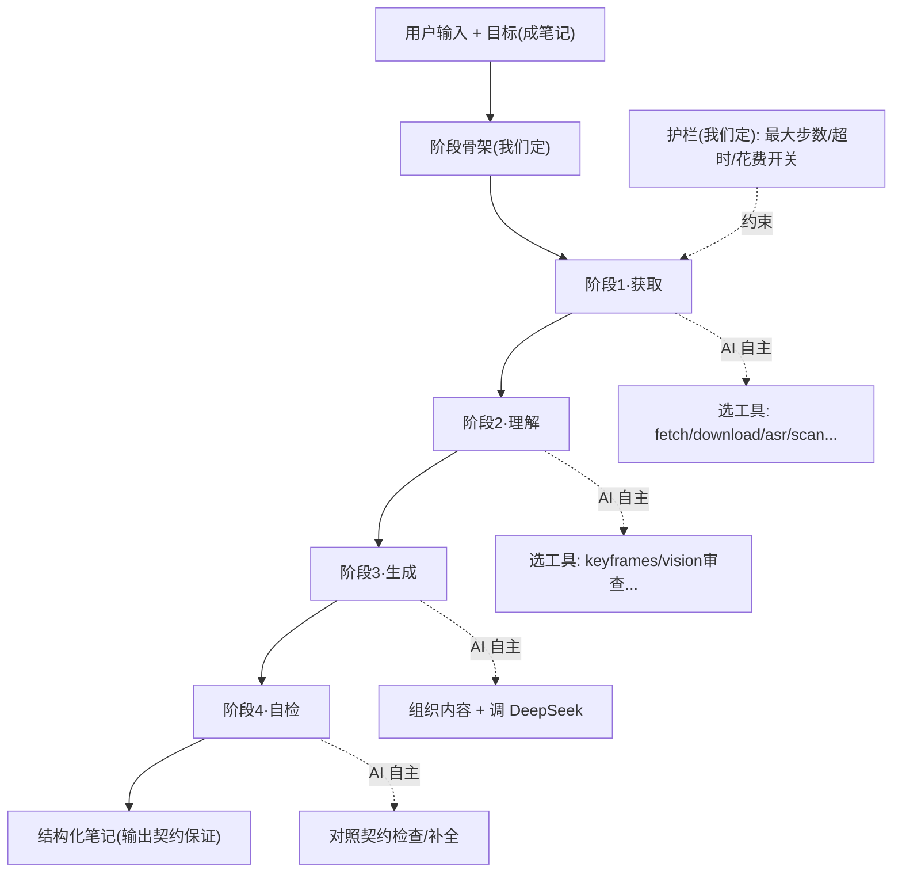

# Agent 架构设计

> 编写日期：2026-06-21
> 状态：**设计阶段，待批准**（批准后按 §十分阶段实施）
> 类型：**架构演进方向**（当前实现仍是管线驱动，见 [`../../架构与结构.md`](../../架构与结构.md) §五/§六/§七）
> 关联：[`../../架构与结构.md`](../../架构与结构.md)（当前架构）、本目录 [`AI多模型接入架构设计.md`](./AI多模型接入架构设计.md)（模型层）
> 参考：`D:\Project\Learn\CodeWhale`（DeepSeek V4 的 coding agent，tool_use loop + ToolHandler trait 实证）

---

## 一、背景与目标

### 1.1 现状：管线驱动

当前桌面端是**写死的 10 步管线**（`pipeline.rs` 4 条内容分流）：

- 流程固定：`输入识别 → 下载 → 音频 → ASR → 关键帧 → AI 生成 → 保存`
- AI 只在"生成笔记"那一步**被动参与**（单轮 system+user prompt → 流式 Markdown）
- 所有"要不要做某步"的判断是代码硬编码（`if 有字幕 skip ASR` 之类）

### 1.2 痛点

- **没用上 AI 的判断力**——输入多样（YouTube/文章/代码/本地文件），写死流程不够灵活，每个特例都要改 Rust
- AI 是"带格式的翻译器"，不是"会自己找资料、自己规划的助手"
- 流程和内容耦合在 `pipeline.rs`（278 行中文 + 大量分支），难扩展

### 1.3 目标

演进为 **「目标驱动 + 阶段骨架内 AI 自主」**：

> **我们给 AI「目标」（产出什么样的笔记）+ 阶段骨架 + 输出契约；为了达成目标，AI 自己决定路径（选哪些工具、什么顺序、是否跳过某步）。**

- 不是纯 agent（AI 完全自由）——笔记 agent 有明确产出，需要可控骨架
- 不是纯管线（写死每步）——阶段内要给 AI 灵活判断权
- 无审批门（笔记工具风险低，见 §七）
- 提示词共享化（`packages/core/prompts`，mobile 也能用，见 §八）

---

## 二、架构定位

三种形态对比，本项目选**结合**：

| | 纯管线（现状） | **结合（目标）** | 纯 agent（CodeWhale） |
|---|---|---|---|
| 流程 | 写死 10 步细粒度 | **粗阶段骨架**（4 阶段） | 无骨架 |
| 每步执行 | 代码 `if/else` | **AI 选工具/参数/跳过** | AI 全自主 |
| 我们定 | 全部 | **目标 + 骨架 + 输出契约 + 工具白名单 + 护栏** | 仅工具集 + 宪法 |
| AI 定 | 几乎没有 | **阶段内路径** | 一切 |
| 适合 | 流程固定的工具 | **产出明确 + 输入多样的 agent** | 开放式探索（coding） |

**选「结合」的理由**：笔记 agent 的产出是明确的（结构化笔记），但**达成路径因输入而异**（视频要先 ASR、文章直接抓、代码要扫描、有字幕可跳过 ASR）。所以——目标和骨架我们定（保证产出可控），阶段内路径 AI 定（适配多样输入）。

> 🎮 **UE 类比**：纯管线 = 写死的蓝图 Macro；纯 agent = 全自主 AI Controller；**结合 = Quest System + AI Ability**——Quest 定义阶段目标（骨架，我们定），每阶段 AI 用可用 Ability 自主完成（AI 定）。骨架保证不跑偏，Ability 给灵活性。

---

## 三、目标驱动架构总览



**职责划分：**

| 层 | 谁定 | 内容 |
|----|------|------|
| 目标层 | 我们 | 把输入炼化成结构化学习笔记 |
| 骨架层 | 我们 | 4 阶段（获取/理解/生成/自检）+ 每阶段检查点 |
| 契约层 | 我们 | 笔记必须有的 section（摘要/术语/图表/资源/元信息） |
| 工具层 | 我们 | 白名单（只暴露允许的工具） |
| 护栏层 | 我们 | 最大步数 / 超时 / 花费开关（非审批） |
| **执行层** | **AI** | **每阶段内：选工具、顺序、参数、跳过、额外步骤** |

---

## 四、阶段骨架

六阶段（**回忆 → 获取 → 理解 → 生成 → 自检 → 沉淀**），每阶段 = **阶段目标 + 可用工具 + 完成检查点 + AI 自主权**：

### 阶段 0 · 回忆（Recall）

- **目标**：加载用户上下文，让 AI 了解偏好与历史（agent 的"记忆"）
- **可用工具**：读 `.myriad-mind/memory.md`（目录级记忆，**已存在**于知识库索引）+ 知识库索引（分类 / 已有笔记摘要 / 指纹）
- **检查点**：用户偏好 / 历史已注入 agent context
- **AI 自主**：无（纯加载，框架执行）

### 阶段 1 · 获取（Acquire）

- **目标**：拿到输入的可读文本内容
- **可用工具**：`fetch_url` / `download_video` / `extract_audio` / `transcribe_asr` / `download_subtitles` / `scan_code_project` / `read_file` / `scan_directory`
- **检查点**：产出了可读的文本（正文 / 字幕 / 转写 / 代码）
- **AI 自主**：判断输入类型 → 选工具组合。例：YouTube 有字幕 → `download_subtitles`（跳过 ASR）；文章 → `fetch_url`；代码仓 → `scan_code_project`

### 阶段 2 · 理解（Analyze）

- **目标**：深入理解内容，准备生成所需的素材
- **可用工具**：`extract_keyframes` / `review_keyframes`（Vision 审查）/ 字幕分析（AI 内部）
- **检查点**：素材就绪（可选，简单文本可跳过本阶段）
- **AI 自主**：判断要不要截图分析（教程类视频多截，纯讲述少截）、要不要 Vision 审查

### 阶段 3 · 生成（Generate）

- **目标**：组织内容，生成结构化笔记
- **可用工具**：主要靠 AI 内部推理（调 DeepSeek 生成）；可按需 `review_keyframes` 嵌入截图
- **检查点**：产出了符合输出契约的 Markdown

### 阶段 4 · 自检（Verify）

- **目标**：对照输出契约检查、补全
- **可用工具**：AI 内部推理；可 `read_file` 回读已写笔记
- **检查点**：契约 section 齐全、元信息完整

### 阶段 5 · 沉淀（Memorize）

- **目标**：把本次笔记的经验沉淀回记忆，供下次回忆（与阶段 0 闭环）
- **可用工具**：更新 `.myriad-mind/memory.md`（新分类 / 术语 / 偏好）+ 知识库索引（指纹去重）
- **检查点**：memory.md 与索引已更新
- **AI 自主**：无（框架执行，可由 AI 提炼摘要写入）

> 注：阶段 0/5 是记忆的两端（回忆 + 沉淀），形成闭环；阶段 3/4 主要是 AI 推理。阶段是 AI 推进的**节奏**，工具是**可选手段**——不是每阶段都必须调工具。

### 上下文注入（回忆阶段加载，agent 的"记忆"）

回忆阶段（阶段 0）向 agent context 注入三类信息，让 AI 了解用户偏好与历史：

| 注入项 | 来源 | 作用 |
|--------|------|------|
| **记忆 md** | `.myriad-mind/memory.md`（已存在于知识库索引） | 用户写作偏好、常用分类、术语习惯、知识库概览 |
| **用户自定义提示词** | 设置页"全局写作偏好"文本框 → config | 用户直接指令（如"笔记偏简洁""多用代码示例"） |
| **知识库索引** | `library.rs`（分类 / 已有笔记摘要 / 指纹） | 避免重复炼化、延续已有分类风格 |

**memory.md 维护**（类似 hermes 记忆）：
- **自动沉淀**：阶段 5 由 agent 更新（从本次笔记提炼新分类 / 术语 / 偏好）
- **手动编辑**：设置页可直接编辑 memory.md
- 首次无记忆时跳过注入，从首篇笔记开始积累

**成本预估（任务前提示，不硬限制）**：agent 启动前，用现有 `estimator.ts`（灵力预估）按输入规模预估 token，提示用户"预计 X token / Y 分钟"，确认后启动。不做预算硬上限——agent 多轮消耗让 AI 自主，用户凭预估决策。

### 输出契约（硬约束，非建议）

笔记产出格式是**骨架的一部分**，由我们硬性约束——**不依赖 AI 输出的稳定性**。契约保证后续功能（修为面板解析、笔记检索、元信息提取）有可靠结构可依。

必须包含的 section：front matter / 元信息、AI 摘要、术语表、Mermaid 知识图、扩展资源（可选：截图审查表 / 评论区精华）。元信息格式见 [Markdown元信息与自动修复设计](../数据与存储/Markdown元信息与自动修复设计.md)。

> **强约束**：阶段 4 自检对照契约校验，缺 section 则要求 AI 补全（不通过不交付）。**格式稳定 > AI 自由发挥**。

### 生成可观测性（分步 + 笔记带调试信息）

**不一气呵成**：四阶段分步推进，每阶段产出**可见的中间结果**（可排查质量），不是黑盒吐最终笔记——阶段 1 原始文本、阶段 2 截图 plan / 审查、阶段 3 草稿、阶段 4 校验终稿，层层可见。

**笔记携带生成 trace**（元信息扩展，便于事后排查质量）：

```yaml
# 笔记末尾元信息块（扩展）
generation:
  model: deepseek-v4-pro
  tools_used: [fetch_url, plan_keyframes, extract_keyframes, review_keyframes]
  total_tokens: 12345
  duration_seconds: 42
  steps: 7
```

> 配合 [日志与调试脚手架](../工程化/日志与调试脚手架设计.md)：过程 `log::debug` + 笔记内 trace，**双重可追溯**。

### 截图：先规划后执行（plan-then-execute）

截图是重操作（FFmpeg 截 N 帧 + Vision 审查，耗资源、需判断），**不让 AI 直接调截图工具**，分两步：

1. **规划**（AI 推理）：基于字幕 / 内容，推荐截图时间点 + 理由 → 产出**可审查的 plan**
2. **执行**（工具）：`extract_keyframes` 按 plan 截图，`review_keyframes` 审查筛选

> plan 是可见中间结果（调试时能看 AI 为什么选这些点），执行按 plan 走，不闷头截。**plan 是 AI 推理产出（非工具）**——AI 产出 plan 后，再调 §五 `extract_keyframes` 按 plan 执行。

---

## 五、工具集（现有管线步骤 → 工具映射）

参考 CodeWhale 的 `ToolSpec` + `ToolHandler` 模式：

```rust
// 给 AI 看的（LLM 据此决定调不调、怎么传参）
struct ToolSpec {
    name: String,            // "transcribe_asr"
    description: String,     // "语音转文字（faster-whisper）"
    input_schema: Value,     // JSON Schema，LLM 按它生成参数
}

// 实际执行（每个工具一个 handler）
#[async_trait]
trait ToolHandler {
    async fn handle(&self, params: Value) -> Result<ToolOutput, ToolError>;
}
```

**现有能力 → 工具映射：**

| 工具名 | 现有实现 | 阶段 | 说明 |
|--------|---------|------|------|
| `fetch_url` | `fetch.rs` | 获取 | 抓文章 URL |
| `download_video` | `python.rs` | 获取 | 下视频（多候选） |
| `extract_audio` | pipeline 内 FFmpeg | 获取 | 提音频 |
| `transcribe_asr` | `python.rs` | 获取 | faster-whisper 转写 |
| `download_subtitles` | `python.rs` | 获取 | YouTube 字幕 |
| `scan_code_project` | `code_project.rs` | 获取 | 代码仓扫描 |
| `read_file` / `scan_directory` | `fs.rs` | 获取 | 读本地文件/目录 |
| `extract_keyframes` | `python.rs` | 理解 | 按 AI 的截图 plan 执行（AI 先规划时间点，见 §四「截图」小节） |
| `review_keyframes` | `vision.rs` | 理解/生成 | DeepSeek Vision 审查筛选 |
| `write_note` | `fs.rs` | 生成/自检 | 写笔记 |
| `query_ai_douyin` | `python.rs` | 获取 | AI Douyin 任务查询 |

> 工具就是现有 commands 的**薄封装**（加 `ToolSpec` 描述 + 统一 `ToolHandler` 接口），底层逻辑不动（Python 脚本黑盒复用原则不变）。

---

## 六、Agent Loop 实现

### 6.1 Loop 机制（DeepSeek tool use）

DeepSeek V4 支持 tool use（OpenAI 兼容 API 的 `tools` 参数，CodeWhale 已验证可行）：

```
loop {
  resp = deepseek.chat(messages, tools=[ToolSpec...])   // 带工具集发请求
  if resp 包含 tool_use:
     result = dispatch_tool(name, params)               // 执行对应 ToolHandler
     messages.push(tool_result)                          // 结果回喂
     continue                                            // 继续，让 AI 决定下一步
  else:
     return resp.content                                 // AI 给出最终笔记，结束
}
```

### 6.2 System Prompt 构成

```
[目标]      把用户输入炼化成结构化学习笔记
[阶段骨架]  0.回忆(加载记忆) → 1.获取 → 2.理解 → 3.生成 → 4.自检 → 5.沉淀(更新记忆)
[输出契约]  笔记必须包含: 摘要 / 术语表 / Mermaid 图 / 扩展资源 / 元信息 / ...
[用户上下文] 回忆阶段注入: memory.md(偏好/分类/术语) + 用户全局写作偏好 + 知识库索引
[工具说明]  可用工具清单 + 每个的适用场景 + 参数 schema
[约束]      必经检查点 / 不要做的(如不删用户文件) / 失败重试上限(见 §6.4)
```

> 参考 CodeWhale `base.md` 的"宪法"风格（身份/诚实/行动/验证纪律），但简化——我们不需要它执行任意命令，约束更轻。

### 6.3 护栏（不是审批）

| 护栏 | 作用 |
|------|------|
| 最大循环步数 | 防止 AI 失控死循环（如 20 步强制结束） |
| 超时 | 单次任务总时长上限 |
| 花费开关 | 配置里关掉花钱工具（如 AI Douyin 下载），AI 就看不到它 |
| 输出契约校验 | 最终笔记不满足契约 → 要求 AI 补全（loop 内自检） |

### 6.4 错误处理与重试

原则：**可恢复错误回喂 AI 自修；不可恢复终止；都有次数上限防死循环**。

| 错误类型 | 处理 |
|---------|------|
| 工具执行失败 | 回喂 `tool_result={error}` 让 AI 自修（重试 / 换工具 / 放弃）；**同工具连失 3 次 → 终止** |
| LLM 调用失败（网络 / 限流） | 框架**指数退避重试 3 次**；仍败 → `AppError::AiApi` 终止 |
| tool_use 参数不合规 | 回喂"参数错：X"让 AI 重发；**3 次 → 终止** |
| 输出契约不满足 | 回喂"缺 X section"让 AI 补；**3 次 → 交付当前 + 标记不完整** |

> 工具内部可做有限重试（如网络请求重试 2 次，对 AI 透明）；框架层管跨轮失败计数 + 回喂。所有重试/失败都 `log::warn!` 记录（配合日志脚手架）。

### 6.5 取消与中断

长任务（agent 跑几分钟）必须可中途取消：

- **触发**：前端"停止"按钮 → Tauri 命令置 `CancellationToken`
- **检查点**：loop **每轮顶部检查** + **工具内 `select!` 可中断**（长工具如下载 / ASR 中途能停）
- **返回**：`AppError::Cancelled`（现有枚举复用），前端显示"已取消"
- **部分结果**：按配置清理临时文件（调试模式保留，配合日志脚手架排查）

```rust
loop {
    if cancel.is_cancelled() { return Err(AppError::Cancelled); }
    let resp = deepseek.chat(messages, tools).await?;
    if let Some(tool_use) = resp.tool_calls.first() {
        let result = tokio::select! {
            r = dispatch_tool(tool_use) => r,
            _ = cancel.cancelled() => return Err(AppError::Cancelled),
        };
        messages.push(tool_result(result));
        continue;
    }
    return Ok(resp.content);
}
```

### 6.6 Context Manager：短期工作记忆

Agent loop 不直接维护无限增长的 messages。Runtime 引入 ContextManager，在 loop 每轮开始前构建发给 LLM 的"上下文包"——**messages 是 LLM 的输入窗口，不是状态库，真正的状态拆到 TaskState / ArtifactStore / Archive 三层。**

#### 6.6.1 记忆分层

| 层 | 生命周期 | 内容 | 是否进 messages |
|---:|---|---|---|
| Long-term Memory | 跨任务 | `.myriad-mind/memory.md`（目录级记忆）、用户偏好、知识库索引 | 否，只注入结构化摘要（阶段 0） |
| Task State | 当前炼化任务 | 当前阶段、检查点、artifact 引用清单、失败计数、已做决策 | 是，始终注入（结构化块，非自然语言复述） |
| Artifact Store | 当前任务 / 可持久 | 字幕全文、网页正文、ASR JSON、代码扫描结果、截图审查结果、笔记草稿 | 否，只给引用 + 简短摘要 |
| Short-term Window | 当前 LLM 请求 | 最近 N 轮对话、最近工具结果摘要、当前待决策问题 | 是 |
| Archive / Journal | 调试与召回 | 完整 tool_use / tool_result 历史 JSONL | 否，必要时检索召回 |

> **关键区别**：§四「上下文注入」里的 `memory.md` 是 **Long-term Memory**（跨任务偏好和分类积累），本节 ContextManager 管的是 **Task State + Short-term Window**（当前任务的工作记忆）。两者在 agent loop 里由 ContextManager 统一注入，但来源和更新机制不同。

#### 6.6.2 ToolOutput 结构：artifact 优先

工具返回 **不做全文回喂**，统一为摘要 + 引用：

```rust
struct ToolOutput {
    summary: String,                  // 给 LLM 的短摘要
    artifact_refs: Vec<ArtifactRef>,  // 原文 / 大结果落盘后的引用
    metadata: Value,                  // token 数、耗时、文件类型等
}

struct ArtifactRef {
    id: String,           // "artifact/transcript.vtt"
    path: PathBuf,        // 落盘路径
    kind: ArtifactKind,   // Transcript | ArticleText | CodeScan | Screenshots | Draft
    tokens_estimate: u64,
    summary: String,      // 单行描述："本视频主要讲 Rust async runtime..."
}
```

**示例**——ASR 完成后不回喂 100k 字幕，而是：

```text
[transcribe_asr 完成]
- artifact: artifacts/transcript.vtt
- duration: 38min | language: zh-CN | tokens: ~45k
- summary: 本视频主要讲 Rust async runtime、Tokio task 调度、select! 取消模式……
- key_segments: 00:03:12 async runtime 定义；00:18:40 select! 示例；00:31:05 常见坑
```

需要全文时，agent 调 `read_artifact` / `search_artifact` 检索落盘内容——**不占 messages 窗口，但随时可召回。**

**原则**：
- 字幕、网页正文、代码扫描结果 **从一开始就 artifact 化**，不在 messages 里放全文
- 截图审查结果、AI 中间推理等"分析结论"体积小、对后续决策直接有用，可保留在 messages 内
- `tool_use` / `tool_result` 对不可拆散——压缩只能发生在完整工具回合之后，不能在 tool_use 和 tool_result 之间截断

#### 6.6.3 TaskState：结构化任务状态

`TaskState` 由代码在阶段推进时自动更新，**不调 LLM 生成**（零额外 token 开销）：

```rust
struct TaskState {
    phase: Phase,                // Recall | Acquire | Analyze | Generate | Verify | Memorize
    input_summary: String,       // "B站视频 BV1xx, 38分钟, 中文字幕, 编程教程"
    artifact_refs: Vec<ArtifactRef>,
    checkpoint_status: CheckpointStatus,
    consecutive_failures: u8,
    decisions: Vec<String>,      // "已跳过 ASR（有字幕）" "已检测指纹→复用旧笔记"
    open_issues: Vec<String>,    // "阶段 3 需验证术语表是否完整"
}
```

ContextManager 在阶段推进时更新 `TaskState`，每次发给 LLM 时注入为结构化 YAML 块：

```yaml
# task_state（本块由框架自动生成，你不可修改）
phase: Analyze
input: B站视频 BV1xx, 38分钟, 中文字幕
artifacts:
  - id: transcript.vtt, tokens: 45623, summary: "Rust async runtime 教程"
  - id: article.md, tokens: 3210, summary: "配套博文"
  - id: keyframes/, kind: Screenshots, count: 12
checkpoint: artifacts_ready
decisions:
  - 有字幕，已跳过 ASR
  - 上次截图审查有 3 帧模糊，标记待重截
open_issues: []
```

**原则**：`TaskState` 是 LLM 的"工作面板"——它告诉你手头有什么材料、到了哪一步、做了哪些决策——但不复述材料内容。内容在 artifact 里，需要时调工具读取。

#### 6.6.4 阶段边界清零策略

笔记 agent 的 4 个主阶段（§四 阶段 1-4）**提供了天然的 context restart 点**，优先按阶段边界清零，而不是按 token 阈值触发：

| 阶段边界 | 保留进下一阶段 | 清除 |
|---|---|---|
| 阶段 1→2 | `TaskState`（phase=Analyze, artifact 清单, decisions） | 阶段 1 原始 tool_result（下载进度 / fetch 日志 / ASR 过程信息） |
| 阶段 2→3 | `TaskState`（phase=Generate, screenshot review 结论, artifact 清单） | 阶段 2 截图 plan / 审查中间推理 / 单帧审查详情 |
| 阶段 3→4（自检） | 笔记草稿 artifact 引用 + 契约清单 + `TaskState` | 阶段 3 生成过程的 tool_use 历史 |

**每阶段开始时，LLM 看到的是**：system prompt + task_state 块 + 当前阶段工具调用上下文。旧阶段的完整历史已写入 JSONL archive，需要时可通过 `read_archive` 召回。

**触发时机**：
- **阶段推进时（主要）**：ContextManager 在 `advance_phase()` 时自动清零旧 stage 的 messages，只保留 `TaskState` + artifact refs
- **同阶段内超长 tool 链（罕见）**：如果同阶段 tool call 超过 15 轮，触发 intra-stage compact（保留 task_state，清除早期 tool 回合）

#### 6.6.5 Cycle Restart（P1，延后实现）

**适用场景**：超长输入（>500k tokens 原始材料）或复杂代码仓导致 LLM 检索质量下降时。

**流程**：
1. 完整历史归档到 `runs/{task_id}/cycles/{n}.jsonl`
2. 框架生成一个 `<carry_forward>` 结构化摘要（内容由 `TaskState` + artifact 清单构成，**不额外调 LLM**）
3. 清空旧 messages
4. 用以下内容开启新 cycle：system prompt + task_state 块 + carry_forward + artifact refs + 最近 1-2 个关键交互

`carry_forward` 格式（注入为 user 消息）：

```text
## Context Carry Forward

以下是上一 cycle 的上下文压缩摘要，只用于续接任务。
它低于实时工具结果、当前 artifact 原文和用户最新指令。
如果摘要与 artifact / 工具输出冲突，以后者为准。

### Goal
把用户输入炼化成结构化学习笔记

### Current Phase
Analyze（阶段 2）

### Artifacts
- transcript.vtt (45k tokens): Rust async runtime 教程字幕
- article.md (3k tokens): 配套博文
- keyframes/ (12 frames): 时间点截图

### Decisions
- 有字幕，已跳过 ASR
- 教程类视频，keyframes 密集截取

### Open Issues
- 3 张截图模糊，下一 cycle 需重截

### Next Step
用 Vision 审查 keyframes，筛选可嵌入笔记的帧
```

**为什么标记 P1**：
- 笔记 agent 的 tool call 次数少（典型 5-15 轮），1M 窗口对大部份任务够用
- 阶段边界清零（§6.6.4）已覆盖主要场景
- Cycle restart 仅在超长输入 / 大代码仓等极端场景才需要，投入产出比低
- CodeWhale 已验证可行，需要时直接参考其 `cycle_handoff.md` + `cycle_manager.rs` 即可

---

## 七、无审批门设计决策

**决策：不引入 CodeWhale 那套审批 UI（auto/suggest/never）。**

**理由（风险等级）：**

| | CodeWhale | 本项目 |
|---|-----------|--------|
| 工具能力 | 能执行**任意 shell**、改任意文件 | 只有**预定义封闭工具**（下载到临时目录、ASR、写笔记到指定目录） |
| 风险 | 高（能 `rm -rf`）→ 必须审批 | 低（干不出格的事）→ 不需要 |

笔记工具的 agent 应**后台静默执行**，弹审批会打断"一键炼化"的流畅体验。保留的只是：
- **配置开关**（偏好层面，用户关掉某些花钱工具）——不是审批
- **护栏**（技术层面，防失控）——不是审批

---

## 八、提示词架构重构

### 8.1 现状问题（已核实）

提示词目前**分裂**：
- `packages/core/src/prompts/*.ts`（`buildVideoNotePrompt` 等 TS 构建器）——**死代码，无人调用**（全仓仅 core 自身 + 文档引用）
- `apps/desktop/src-tauri/prompts/*.md`——**现行方案**，Rust `PromptManager`（minijinja）渲染

### 8.2 共享化方案

**以 `.md` 为唯一标准，移到 `packages/core/prompts/`：**

```
packages/core/prompts/        ← 共享位置（语言无关 .md 模板）
├── note/   (system.md, mode_*.md)
├── vision/ (review_*.md)
├── agent/  (agent 化新增: 目标+骨架+契约+工具说明)
└── qa.md, ping.md
```

- **desktop（Rust）**：`PromptManager` 改路径解析（dev 读 `packages/core/prompts/`，prod 打包进 Tauri `resources`，和现在 `scripts/` 一个套路）；渲染仍用 minijinja
- **mobile（RN/TS，未来）**：用 nunjucks（Jinja2 兼容）渲染**同一批 .md**
- **清理**：删除 `packages/core/src/prompts/*.ts` 死代码（或标废弃），避免后人困惑

> 这步是**纯重构、低风险、可独立于 agent loop 先做**（作为 §十 阶段 0）。

### 8.3 Agent 提示词结构

agent 化后，提示词从"单轮 note/system.md"演进为：
- `agent/charter.md`（目标 + 阶段骨架 + 输出契约 + 约束）
- 工具描述（由代码从 `ToolSpec` 自动生成，不手写）
- 现有 `note/mode_*.md` 降级为"生成阶段的内容模式指引"（agent 在阶段 3 调用）

---

## 九、重构策略（完全重构，不保留经典管线）

**现状**：`pipeline.rs` 4 条分流（text/video/audio/code_project），写死步骤。

**策略：直接重构，agent 取代管线。** 本项目处于 Alpha 开发阶段，无线上用户依赖老流程，**不背兼容包袱**——不保留经典管线、不做配置开关、不新旧并存。

- agent loop 实现后，`execute_pipeline` 直接改为调度 agent（取代 4 条 `run_*_pipeline` 分流）
- `pipeline.rs` 的硬编码分流、`pipeline-progress` 硬编码步骤事件一并删除或重构
- 重构期间功能可能短暂不可用（开发期可接受）

> 仍**分阶段推进**（见 §十），但阶段间不并存——每阶段是"增量构建 + 直接接线"，不是"新旧并行运行"。

---

## 十、分阶段实施

完全重构：4 阶段，每阶段直接接线，**不保留旧路径、不回退**。

| 阶段 | 内容 | 验收 |
|------|------|------|
| **0** | 提示词共享化（.md → `packages/core/prompts`，Rust 改路径，**删 core TS 死代码**） | desktop 生成笔记正常，路径指向 core |
| **1** | 现有 commands 封装成工具（ToolSpec + ToolHandler trait + 工具注册表），底层逻辑不动 | 全部工具可独立调用，返回 ToolOutput |
| **2** | 实现 agent loop（deepseek.rs 加 `tools` + 循环 + tool_result 回喂 + 护栏）+ **ContextManager（§6.6）** + ToolOutput artifact 化 + agent charter prompt | agent 对任意输入能自主选工具跑通一次，上下文不随 tool call 暴涨 |
| **3** | **接线 + 删旧**：`execute_pipeline` 改为调度 agent；删除 `run_*_pipeline` 4 分流 + 相关硬编码步骤事件 | agent 为唯一路径，4 类输入全部能炼化，`pipeline.rs` 无死代码 |

> 不设"配置开关回退"——阶段 3 完成即 agent 为唯一实现。开发期可接受中间状态不可用。

---

## 十一、风险

| 风险 | 应对 |
|------|------|
| DeepSeek tool use 稳定性 | CodeWhale 已验证可行 |
| 多轮调用 token 成本高 | 护栏（最大步数）+ 工具结果 artifact 化（§6.6.2：大文本绝不回喂，只给摘要 + 引用）+ 阶段边界清零（§6.6.4） |
| agent 失控（绕圈子） | 最大步数 + 超时强制结束 |
| 重构期功能短暂不可用 | Alpha 阶段可接受；分阶段降低单次改动面 |
| 提示词跨语言渲染不一致（Rust minijinja vs TS nunjucks） | 统一用 Jinja2 兼容语法，加测试比对 |
| 工具参数 AI 填错 | `input_schema` 严格校验 + 工具 handler 容错 |

---

## 十二、验收标准

**功能：**
- **agent 为唯一路径**：4 类输入（文章 / 视频 / 音频 / 代码）全部由 agent 自主完成
- AI 自主决定工具组合（如视频自动 download → asr → 生成，有字幕自动跳 ASR）
- 输出笔记满足输出契约（section 齐全）
- 提示词从 `packages/core/prompts` 加载

**质量：**
- 护栏有效（超步数 / 超时能终止，不卡死）
- 工具白名单生效（危险操作不可达）
- `pipeline.rs` 4 分流已删除，无遗留死代码

---

## 十三、参考

- **CodeWhale**（本地）：`D:\Project\Learn\CodeWhale\crates\agent\`（loop）、`crates\tools\src\lib.rs`（`ToolSpec` + `ToolHandler` trait）、`crates\tui\src\prompts\base.md`（agent 宪法风格）
- DeepSeek API tool use：https://api-docs.deepseek.com/zh-cn/guides/function_calling
- 本项目当前架构：[`../../架构与结构.md`](../../架构与结构.md)
- 模型层（Pro/Flash 路由，agent 复用）：[`./AI多模型接入架构设计.md`](./AI多模型接入架构设计.md)
