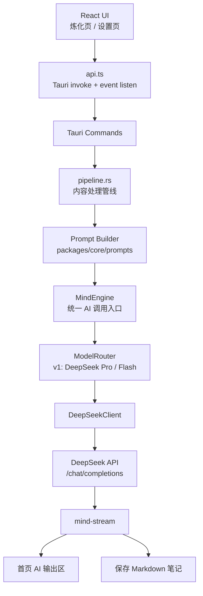
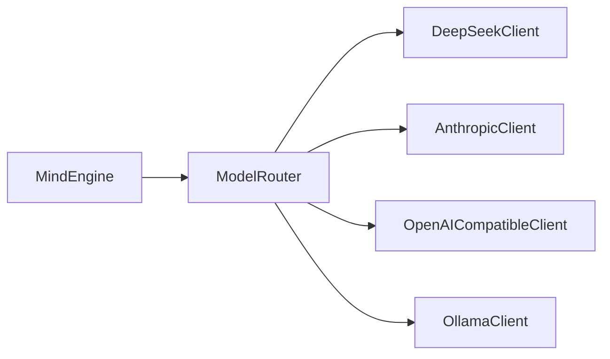

# AI 多模型接入架构设计

> 参考：`D:\Project\MyClaude\大衍决残卷\CodeWhale代码分析\CodeWhale-完整深度分析.md`  
> DeepSeek 官方文档：https://api-docs.deepseek.com/zh-cn/  
> 设计原则：轻量借鉴 CodeWhale 的模型注册、Provider 抽象、错误分类和路由思想，不引入完整 Agent Loop。

## 一、设计结论

大衍决当前阶段先重点接入：

```text
DeepSeek V4 Pro
```

核心目标不是“尽快支持很多模型”，而是先把 DeepSeek V4 Pro 的 1M 上下文能力用好，让大衍决能处理长视频、长文章、长文档和代码项目。

一句话架构：

```text
Prompt Builder → MindEngine → DeepSeekClient → mind-stream → AI 输出区 / 保存笔记
```

后续再扩展成：

```text
Prompt Builder → MindEngine → ModelRouter → ProviderClient → mind-stream
```

## 二、哪些借鉴 CodeWhale，哪些不借鉴

借鉴：

1. `ModelRegistry`：模型注册表。
2. `ProviderClient`：不同模型服务商统一接口。
3. 配置解析优先级：请求覆盖 > 任务配置 > Provider 默认 > 全局默认。
4. SSE 流式事件：统一 delta、reasoning_delta、done、error。
5. 错误分类：鉴权、限流、网络、上下文过长、模型不存在。
6. Auto Router：第一版只做简单规则。

不引入：

1. Agent Loop。
2. 工具调用循环。
3. 子智能体。
4. MCP 工具体系。
5. LSP 反馈闭环。
6. 复杂审批策略。
7. SQLite 会话系统。
8. 大型上下文压缩框架。

大衍决要做的是“任务型长上下文炼化引擎”，不是通用编程 Agent。

---

# 三、DeepSeek V4 Pro 优先接入方案

## 3.1 主模型

默认主模型：

```text
deepseek-v4-pro
```

快速模型：

```text
deepseek-v4-flash
```

设计用途：

| 模型 | 用途 |
|------|------|
| `deepseek-v4-pro` | 视频笔记、长文档、代码分析、深度炼化 |
| `deepseek-v4-flash` | 快速摘要、预估说明、修为页下一步建议 |

## 3.2 官方能力约束

按照 DeepSeek 官方文档设计：

| 能力 | 设计取值 |
|------|----------|
| Base URL | `https://api.deepseek.com` |
| Chat endpoint | `/chat/completions` |
| API 格式 | OpenAI Chat Completions |
| 主模型 | `deepseek-v4-pro` |
| 快速模型 | `deepseek-v4-flash` |
| 上下文长度 | 1M tokens |
| 最大输出 | 384K tokens |
| 鉴权 | `Authorization: Bearer {DEEPSEEK_API_KEY}` |
| 思考模式 | `thinking: { type: "enabled" }` |
| 思考强度 | `reasoning_effort: "high" | "max"` |

重要约束：

- thinking mode 下，`temperature`、`top_p` 等采样参数不会生效。
- 大衍决 v1 不做工具调用，因此不处理 tool call + reasoning_content 回传的复杂流程。
- `reasoning_content` 默认不展示给普通用户，避免污染最终笔记正文。

## 3.3 1M 上下文使用策略

1M 上下文是大衍决的核心能力之一，但不能粗暴地把所有内容拼成一坨。

推荐输入结构：

```text
<source>
  <metadata>
    标题、来源、平台、时长、语言、生成时间
  </metadata>

  <transcript>
    完整转写文本，尽量保留时间戳
  </transcript>

  <keyframes>
    关键帧时间点、文件名、OCR 或简短说明
  </keyframes>

  <comments>
    评论区精华
  </comments>

  <user_preferences>
    Mermaid、术语表、扩展资源、阅读难度等开关
  </user_preferences>
</source>
```

不要默认把图片本体送入模型。第一版先用关键帧路径、时间点和说明。

## 3.4 Token 预算

即使支持 1M，也要保留输出空间。

建议预算：

```text
总上下文：1,000,000 tokens
系统提示：5,000 - 15,000
任务说明：2,000 - 5,000
输入正文：最多 850,000
输出预留：80,000 - 120,000
安全余量：30,000 - 50,000
```

默认输出：

```text
max_tokens: 65536
```

深度炼化：

```text
max_tokens: 131072
```

极限深度模式可以更高，但不建议默认开到 384K，否则成本、等待时间和 UI 渲染压力都会明显上升。

## 3.5 输入规模分级

| 输入规模 | 策略 |
|----------|------|
| `< 100K tokens` | 直接炼化 |
| `100K - 500K tokens` | 长上下文模式 |
| `500K - 850K tokens` | 深度炼化模式，提示耗时和费用 |
| `850K - 1M tokens` | 极限模式，强制保留输出余量 |
| `> 1M tokens` | 分段压缩后再炼化 |

产品文案：

```text
使用 DeepSeek V4 Pro 的 1M 上下文，尽量保留完整材料，而不是过早摘要丢信息。
```

---

# 四、任务模式设计

## 4.1 标准笔记模式

适合：

- 普通文章。
- 30-60 分钟视频。
- 中等长度资料。

请求参数：

```json
{
  "model": "deepseek-v4-pro",
  "thinking": { "type": "enabled" },
  "reasoning_effort": "high",
  "stream": true,
  "max_tokens": 65536
}
```

## 4.2 深度炼化模式

适合：

- 长视频。
- 课程合集。
- 大型技术文档。
- 代码项目分析。

请求参数：

```json
{
  "model": "deepseek-v4-pro",
  "thinking": { "type": "enabled" },
  "reasoning_effort": "max",
  "stream": true,
  "max_tokens": 131072
}
```

## 4.3 快速摘要模式

适合：

- 首页预览。
- 生成前摘要。
- 修为页下一步建议。

请求参数：

```json
{
  "model": "deepseek-v4-flash",
  "thinking": { "type": "disabled" },
  "stream": true,
  "max_tokens": 8192
}
```

---

# 五、整体架构



后续扩展 Provider：



---

# 六、核心模块设计

## 6.1 `packages/core`

`packages/core` 只放纯类型、schema、prompt、模型元数据，不做真实网络请求。

建议新增：

```text
packages/core/src/ai/
├── types.ts
├── models.ts
├── routing.ts
├── schema.ts
└── index.ts
```

核心类型：

```ts
export type AiProvider =
  | "deepseek"
  | "anthropic"
  | "openai-compatible"
  | "ollama";

export type AiTask =
  | "note_generation"
  | "summary"
  | "translation"
  | "code_analysis"
  | "compare"
  | "resource_recommend"
  | "next_step_suggestion";

export interface ModelInfo {
  id: string;
  provider: AiProvider;
  displayName: string;
  aliases: string[];
  contextWindow: number;
  maxOutputTokens: number;
  supportsStreaming: boolean;
  supportsReasoning: boolean;
  supportsVision: boolean;
  supportsJsonMode: boolean;
  costTier: "free" | "low" | "medium" | "high";
  recommendedFor: AiTask[];
}
```

DeepSeek 默认模型注册：

```ts
export const DEEPSEEK_MODELS: ModelInfo[] = [
  {
    id: "deepseek-v4-pro",
    provider: "deepseek",
    displayName: "DeepSeek V4 Pro",
    aliases: ["deepseek-pro", "v4-pro"],
    contextWindow: 1_000_000,
    maxOutputTokens: 384_000,
    supportsStreaming: true,
    supportsReasoning: true,
    supportsVision: false,
    supportsJsonMode: true,
    costTier: "medium",
    recommendedFor: ["note_generation", "code_analysis", "compare"],
  },
  {
    id: "deepseek-v4-flash",
    provider: "deepseek",
    displayName: "DeepSeek V4 Flash",
    aliases: ["deepseek-flash", "v4-flash"],
    contextWindow: 1_000_000,
    maxOutputTokens: 384_000,
    supportsStreaming: true,
    supportsReasoning: false,
    supportsVision: false,
    supportsJsonMode: true,
    costTier: "low",
    recommendedFor: ["summary", "translation", "next_step_suggestion"],
  },
];
```

## 6.2 Tauri 后端

建议新增：

```text
apps/desktop/src-tauri/src/commands/ai/
├── mod.rs
├── types.rs
├── engine.rs
├── deepseek.rs
├── router.rs
└── errors.rs
```

第一版只实现：

```text
DeepSeekClient
MindEngine
mind-stream event
```

后续再拆成：

```text
providers/deepseek.rs
providers/anthropic.rs
providers/openai_compatible.rs
providers/ollama.rs
```

---

# 七、MindEngine 设计

## 7.1 职责

`MindEngine` 负责：

1. 接收任务类型和 prompt。
2. 根据任务选择 DeepSeek Pro / Flash。
3. 从密钥链读取 API Key。
4. 调用 DeepSeekClient。
5. 标准化流式事件。
6. 返回完整文本和 usage。

它不负责：

- 视频下载。
- ASR。
- 文件扫描。
- Markdown 渲染。
- UI 状态。

## 7.2 请求结构

```rust
pub struct MindRequest {
    pub task: AiTask,
    pub messages: Vec<AiMessage>,
    pub system_prompt: String,
    pub model_override: Option<String>,
    pub stream: bool,
    pub max_tokens: Option<u32>,
    pub thinking: Option<ThinkingConfig>,
}

pub struct ThinkingConfig {
    pub enabled: bool,
    pub effort: ReasoningEffort,
}

pub enum ReasoningEffort {
    High,
    Max,
}

pub struct MindResponse {
    pub text: String,
    pub reasoning_text: Option<String>,
    pub provider: String,
    pub model: String,
    pub usage: Option<TokenUsage>,
    pub finish_reason: Option<String>,
}
```

Tauri 命令：

```rust
#[tauri::command]
pub async fn run_mind_task(
    app: AppHandle,
    request: MindRequest,
) -> Result<MindResponse, AppError>
```

---

# 八、DeepSeekClient 设计

## 8.1 请求格式

DeepSeek 使用 OpenAI-compatible 请求：

```json
{
  "model": "deepseek-v4-pro",
  "messages": [
    {
      "role": "system",
      "content": "..."
    },
    {
      "role": "user",
      "content": "..."
    }
  ],
  "thinking": {
    "type": "enabled"
  },
  "reasoning_effort": "high",
  "stream": true,
  "max_tokens": 65536
}
```

Header：

```text
Content-Type: application/json
Authorization: Bearer ${DEEPSEEK_API_KEY}
```

## 8.2 流式解析

DeepSeek SSE：

```text
data: {...}
data: {...}
data: [DONE]
```

需要解析：

```text
choices[0].delta.content
choices[0].delta.reasoning_content
usage
finish_reason
```

处理规则：

- `content` 进入最终 Markdown。
- `reasoning_content` 单独累计，不混入正文。
- 默认 UI 不展示 reasoning。
- 调试模式可折叠显示 reasoning。

## 8.3 统一事件

建议替换当前 `claude-stream-delta` 为：

```text
mind-stream
```

事件结构：

```ts
export type MindStreamEvent =
  | {
      type: "start";
      task: AiTask;
      provider: "deepseek";
      model: string;
    }
  | {
      type: "reasoning_delta";
      delta: string;
    }
  | {
      type: "delta";
      delta: string;
    }
  | {
      type: "usage";
      inputTokens?: number;
      outputTokens?: number;
      reasoningTokens?: number;
      totalTokens?: number;
    }
  | {
      type: "done";
      text: string;
      finishReason?: string;
    }
  | {
      type: "error";
      code: string;
      message: string;
      retryable: boolean;
    };
```

前端首页 AI 输出区只监听 `mind-stream`。

---

# 九、配置设计

## 9.1 配置字段

建议在 `MyriadMindConfig` 中新增：

```ts
ai: {
  default_provider: "deepseek";
  default_model: "deepseek-v4-pro";
  fast_model: "deepseek-v4-flash";

  task_models: Partial<Record<AiTask, string>>;

  deepseek: {
    enabled: boolean;
    api_key_id: "deepseek-api-key";
    base_url: "https://api.deepseek.com";
    default_model: "deepseek-v4-pro";
    fast_model: "deepseek-v4-flash";
    thinking: {
      enabled: boolean;
      effort: "high" | "max";
    };
    long_context: {
      enabled: boolean;
      max_context_tokens: 1000000;
      default_output_tokens: 65536;
      deep_output_tokens: 131072;
    };
  };

  generation: {
    stream: boolean;
    max_tokens: number;
  };
}
```

注意：thinking mode 下不展示 `temperature` 为主要设置项。

## 9.2 密钥链

密钥链条目：

```text
myriad-mind/deepseek-api-key
```

环境变量兜底：

```text
MYRIAD_DEEPSEEK_API_KEY
DEEPSEEK_API_KEY
```

密钥永远不写入 `config.json`。

## 9.3 配置解析优先级

模型选择：

```text
1. 当前请求 model_override
2. task_models[task]
3. deepseek.default_model / deepseek.fast_model
4. ai.default_model
5. 内置默认 deepseek-v4-pro
```

API Key：

```text
1. OS 密钥链
2. 环境变量
3. 未配置，返回可行动错误
```

---

# 十、模型路由设计

第一版不做复杂 Auto Router，只做 DeepSeek Pro / Flash 路由。

```text
if task == summary:
  use deepseek-v4-flash

if task == translation:
  use deepseek-v4-flash

if task == next_step_suggestion:
  use deepseek-v4-flash

if task == code_analysis:
  use deepseek-v4-pro + reasoning_effort=max

if estimated_tokens > 100K:
  use deepseek-v4-pro long-context mode

else:
  use deepseek-v4-pro + reasoning_effort=high
```

路由结果：

```ts
interface ModelResolution {
  requested?: string;
  resolved: "deepseek-v4-pro" | "deepseek-v4-flash";
  provider: "deepseek";
  reason: string;
  fallbackChain: string[];
}
```

UI 显示：

```text
本次使用：DeepSeek V4 Pro
原因：长视频笔记生成，使用 1M 上下文保留完整转写。
```

---

# 十一、错误分类

```rust
pub enum AiErrorKind {
    Authentication,
    RateLimited,
    Network,
    Timeout,
    Server,
    ContextLength,
    ContentPolicy,
    ModelNotFound,
    ProviderNotConfigured,
    UnsupportedFeature,
    InvalidResponse,
}
```

错误展示：

| 错误 | 用户提示 | 是否重试 |
|------|----------|----------|
| Authentication | DeepSeek API Key 无效，请重新配置 | 否 |
| RateLimited | 请求过于频繁，稍后自动重试 | 是 |
| Network | 网络连接失败，请检查代理或网络 | 是 |
| ContextLength | 内容超过 1M 上下文，请分段处理 | 否 |
| ModelNotFound | 模型不存在，请检查模型名称 | 否 |
| ProviderNotConfigured | 未配置 DeepSeek API Key | 否 |
| Server | DeepSeek 服务临时错误 | 是 |

重试策略：

```text
最多 3 次
500ms → 1500ms → 4000ms
仅在没有产生正文 delta 前透明重试
如果已经输出内容，不自动重试，避免重复正文
```

---

# 十二、Prompt 体系设计

当前 prompt 位于：

```text
packages/core/src/prompts/
```

建议保留，但输出统一结构：

```ts
export interface BuiltPrompt {
  task: AiTask;
  systemPrompt: string;
  messages: AiMessage[];
  expectedFormat: "markdown" | "json";
  recommendedMaxTokens: number;
  estimatedInputTokens: number;
}
```

DeepSeek V4 Pro 适配重点：

1. system prompt 放入 `messages[0]`。
2. 长上下文内容要分区，避免纯拼接。
3. 明确要求最终输出 Markdown。
4. thinking mode 的思考不等于正文，最终正文必须完整、自洽。
5. 对 1M 输入，尽量保留原始转写，不要过早摘要。

---

# 十三、设置界面设计

设置页新增“AI 模型”分区，第一版只展示 DeepSeek。

```text
AI 模型

默认模型：DeepSeek V4 Pro
快速模型：DeepSeek V4 Flash
长上下文：已开启，最大 1M tokens
思考模式：已开启
默认思考强度：high
深度炼化强度：max
```

Provider 配置：

```text
DeepSeek
v1 主力模型，支持 1M 上下文

[API Key 已配置] [编辑] [测试连接]
Base URL: https://api.deepseek.com
默认模型: deepseek-v4-pro
快速模型: deepseek-v4-flash

思考模式      [开启]
标准强度      [high]
深度炼化强度  [max]
```

任务模型：

```text
生成学习笔记      DeepSeek V4 Pro
代码项目分析      DeepSeek V4 Pro · max thinking
摘要              DeepSeek V4 Flash
翻译              DeepSeek V4 Flash
下一步学习建议    DeepSeek V4 Flash
```

---

# 十四、与现有管线结合

当前 `pipeline.rs` 中 AI 生成还是 TODO：

```text
emit_progress(app, "generate_note", "AI 生成笔记", ...)
// TODO: Claude API
```

后续改为：

```text
run_video_pipeline
  → 收集 transcript / keyframes / metadata
  → buildVideoNotePrompt(context)
  → run_mind_task(task = note_generation, model = deepseek-v4-pro)
  → 前端接收 mind-stream delta
  → 保存 note.md
```

文章：

```text
run_text_pipeline
  → 抓取正文
  → buildArticleNotePrompt(context)
  → run_mind_task(task = note_generation)
```

代码分析：

```text
run_code_pipeline
  → 扫描项目结构
  → buildCodeAnalysisPrompt(context)
  → run_mind_task(task = code_analysis, reasoning_effort = max)
```

---

# 十五、迁移计划

## P0：DeepSeek V4 Pro 基础接入

- 新增 `DeepSeekClient`。
- 新增 `MindEngine`。
- 新增 `deepseek-api-key` 密钥管理。
- 默认模型设为 `deepseek-v4-pro`。
- 首页 AI 输出区监听 `mind-stream`。
- 支持 OpenAI Chat Completions SSE。
- 支持 `reasoning_content` 与 `content` 分流。

## P1：1M 上下文利用

- 灵力预估加入 1M token 预算。
- 视频转写全文进入 prompt。
- 长文档不再过早摘要。
- 超过 850K tokens 时提示极限模式。
- 超过 1M tokens 时走分段压缩。

## P2：DeepSeek V4 Flash 降级路径

- 摘要、翻译、下一步建议默认走 `deepseek-v4-flash`。
- V4 Pro 不可用时提示降级。
- 降级时说明质量和上下文影响。

## P3：OpenAI Compatible 扩展

- 支持自定义 endpoint。
- 支持多个 endpoint。
- 用户可命名 provider，如 `硅基流动`、`OpenRouter`、`火山方舟`。

## P4：Anthropic / Ollama

- Anthropic 作为高质量备用 Provider。
- Ollama 作为本地隐私模式。

## P5：轻量 Auto Router

- 根据任务、上下文长度、成本偏好自动选 Pro / Flash / 备用模型。
- 显示选择原因。
- 失败时 fallback 到备用模型。

---

# 十六、验收标准

- 设置页可以配置 DeepSeek API Key。
- DeepSeek API Key 只进入 OS 密钥链，不进入 `config.json`。
- 管线调用 AI 时不直接依赖具体 API 格式，只调用 MindEngine。
- 首页 AI 输出区只监听统一 `mind-stream`。
- DeepSeek V4 Pro 能流式输出 Markdown。
- `reasoning_content` 不污染最终笔记正文。
- 长视频 / 长文档优先进入 1M 上下文，而不是立即摘要截断。
- 输入超过 1M 时有明确分段策略。
- Provider 错误能被分类并给出可行动提示。
- V4 Pro 不可用时可以提示切换到 V4 Flash 或备用模型。

---

# 十七、最终建议

当前不要追求“多模型大全”。

最优路线是：

```text
先把 DeepSeek V4 Pro 的 1M 上下文吃透。
```

大衍决最有差异化的地方不是接很多 API，而是能把长视频、长文章、长代码资料完整炼化成可读、可复用的学习笔记。

所以第一阶段只需要：

- `DeepSeekClient`
- `MindEngine`
- `mind-stream`
- `deepseek-v4-pro`
- `deepseek-v4-flash`
- 1M 上下文预算
- reasoning/content 分流

等这条链路稳定，再扩展 Claude、OpenAI Compatible、Ollama，会更稳也更容易维护。

