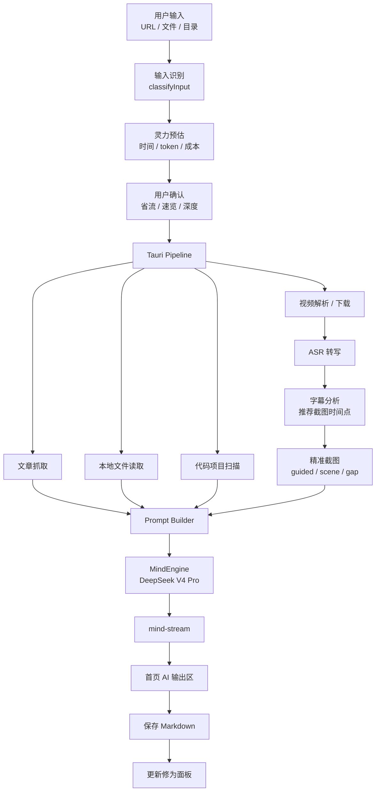

# Skill 功能迁移到 App 开发设计

> 原型来源：`D:\Project\MyClaude\myriad-mind`  
> 迁移目标：把 Claude Skill 中已经验证过的内容处理流程，迁移成大衍决桌面 App 的稳定功能。  
> 设计原则：Skill 负责验证流程，App 负责产品化、状态管理、配置、可视化和可重复执行。

## 一、迁移结论

`myriad-mind` Skill 已经验证了完整功能原型：

```text
输入识别 → 配置读取 → 灵力预估 → 内容获取 → ASR → 字幕引导截图 → AI 笔记 → 修为面板 → 搜索 / 对比
```

App 不应该照搬 Skill 的“长提示词驱动流程”，而应该把它拆成可维护模块：

```text
React UI
  → Tauri Pipeline
  → Python Scripts
  → MindEngine / DeepSeek V4 Pro
  → Markdown Note
  → Dashboard / Search / Compare
```

Skill 中的规则、步骤、提示词和脚本都可以复用，但要迁移成：

- 可配置项
- 类型化数据结构
- 可恢复的管线步骤
- 前端可视化状态
- 统一错误处理
- 可测试的模块

---

# 二、Skill 已验证能力清单

## 2.1 输入模式

Skill 支持 9 类模式：

| Skill 模式 | App 迁移状态 | App 目标 |
|------------|--------------|----------|
| 在线视频：B 站 / YouTube / 抖音 / 小红书 | 部分已有 | v1 核心 |
| 在线文章：知乎 / CSDN / 掘金 / Wiki / 公众号 | 未完整实现 | v1 核心 |
| 本地视频 / 音频 | 部分已有 | v1 核心 |
| 本地文档：md / txt / pdf / rst | 部分已有 | v1 |
| 本地目录 | 未实现 | v1.1 |
| 代码项目：GitHub / 本地目录 | prompt 有，管线未实现 | v1.1 |
| 修为面板 | UI 有 mock，真实扫描未实现 | v1 |
| 搜索模式 | 未实现 | v1.1 |
| 对比模式 | prompt 有，UI / 管线未实现 | v1.1 |

## 2.2 输出板块

Skill 输出 8 大板块：

| 输出板块 | App 迁移方式 |
|----------|--------------|
| AI 摘要 | DeepSeek V4 Pro 生成 Markdown |
| 详细笔记 | 作为主输出正文 |
| 关键帧截图 | 迁移为“字幕引导截图模块” |
| Mermaid 图表 | prompt 控制 + Markdown 渲染 |
| 关键术语表 | prompt 固定章节 |
| 评论区精华 | 独立获取模块，v1 可先开关控制 |
| 知识关系图 | 笔记末尾 Mermaid |
| 扩展学习资源 | prompt 固定章节 |

## 2.3 智能特性

| Skill 特性 | App 开发模块 |
|------------|--------------|
| 字幕引导截图 | `GuidedKeyframePlanner` + `extract_keyframes.py` |
| 结构化截图审查 | `KeyframeReview` prompt + 审计表 |
| 评论萃取 | `CommentFetcher` + `CommentDigestPrompt` |
| 教程检测 | `TutorialDetector` |
| 灵力预估 | `estimator.ts` 扩展到 DeepSeek 1M 上下文 |
| 标签提取 | `note-parser.ts` / front matter |
| 可靠性评级 | prompt + metadata |
| 阅读元信息 | prompt + metadata |
| 调试追踪 | pipeline event + note footer |

---

# 三、迁移后的 App 功能架构



---

# 四、模块迁移设计

## 4.1 输入识别模块

Skill 当前通过自然语言规则识别：

- 视频 URL
- 文章 URL
- 本地文件
- 本地目录
- GitHub URL
- 搜索 / 对比 / 修为面板命令

App 需要迁移为确定性逻辑：

```ts
type AppInputMode =
  | "video_url"
  | "article_url"
  | "local_video"
  | "local_audio"
  | "local_text"
  | "local_directory"
  | "code_project"
  | "search"
  | "compare"
  | "dashboard";
```

开发功能：

- URL 平台识别。
- 文件扩展名识别。
- 目录内容扫描：代码文件占比 > 50% 判定代码项目。
- 多输入识别：换行 / 逗号 / 空格触发批量模式。
- 搜索、对比、修为面板保留为独立 UI，不建议依赖命令文本触发。

优先级：

- P0：视频、文章、本地文件。
- P1：目录、代码项目。
- P2：批量、搜索、对比。

## 4.2 配置迁移

Skill 使用 `.env`，App 使用 `config.json` + OS 密钥链。

迁移映射：

| Skill `.env` | App 配置 / 密钥链 |
|--------------|------------------|
| `ASR_BACKEND` | `config.asr.backend` |
| `VIDEO_INFO_PROVIDER` | `config.video.provider` |
| `AI_DOUYIN_API_BASE` | `config.video.ai_douyin_base` 或内置默认 |
| `AI_DOUYIN_API_KEY` | `myriad-mind/ai-douyin-api-key` |
| `TIKHUB_TOKEN` | `myriad-mind/tikhub-token` |
| `FW_MODEL_SIZE` | `config.asr.faster_whisper.model_size` |
| `FW_DEVICE` | `config.asr.faster_whisper.device` |
| `FW_COMPUTE_TYPE` | `config.asr.faster_whisper.compute_type` |
| `FW_PYTHON` | `config.python_path` |
| `BYTEDANCE_VC_TOKEN` | `myriad-mind/volcengine-token` |
| `BYTEDANCE_VC_APPID` | `config.asr.volcengine.appid` |
| `NOTE_OUTPUT_DIR` | `config.output.note_dir` |
| `CLEANUP_TEMP` | `config.output.cleanup_temp` |
| `NOTE_METADATA` | `config.output.note_metadata` |
| `DEBUG_METADATA` | `config.output.debug_metadata` |
| `ENABLE_KEYFRAMES` | `config.features.keyframes` |
| `ENABLE_MERMAID` | `config.features.mermaid` |
| `ENABLE_RESOURCES` | `config.features.resources` |
| `ENABLE_COMMENTS` | `config.features.comments` |
| `ENABLE_READING_INFO` | `config.features.reading_info` |
| `ENABLE_ESTIMATION` | `config.features.estimation` |
| `AUTO_UPDATE_PANEL` | `config.post_process.auto_update_panel` |
| `AUTO_SUGGEST_NEXT` | `config.post_process.auto_suggest_next` |

v2.1 截图配置需要更新当前 App schema：

| Skill v2.1 配置 | App 新字段 |
|-----------------|------------|
| `KF_MAX_FRAMES` | `keyframes.max_frames` |
| `KF_SCENE_THRESHOLD` | `keyframes.scene_threshold` |
| `KF_MAX_GAP` | `keyframes.max_gap_seconds` |
| `KF_MIN_GAP` | `keyframes.min_gap_seconds` |
| guided timestamps | pipeline 中间产物，不进入配置 |

建议废弃旧的：

```text
KF_INTERVAL
KF_MODE
```

App 当前仍有 `interval / scene / both`，需要迁移为 `smart` 模式。

## 4.3 灵力预估模块

Skill 的预估规则：

- 视频按时长估算。
- 文章按字数估算。
- 目录按文件数估算。
- 评论区、截图、翻译会增加 token。
- 超过阈值要求用户确认。

App 需要开发：

1. 首页输入后实时预估。
2. 输出：
   - 输入类型
   - 预估耗时
   - 预估 token
   - 主要消耗来源
   - 启用功能
   - DeepSeek 1M 上下文占用比例
3. 提供快速调整：
   - 省流模式：关闭截图和评论区。
   - 速览模式：只生成摘要、核心概念、术语表。
   - 深度炼化：开启 max thinking 和更高输出 token。

DeepSeek V4 Pro 后的新阈值：

| 预估 token | 行为 |
|------------|------|
| `< 100K` | 直接处理 |
| `100K - 500K` | 长上下文模式 |
| `500K - 850K` | 要求确认，提示耗时和费用 |
| `850K - 1M` | 极限模式，必须确认 |
| `> 1M` | 分段处理 |

## 4.4 视频解析与下载模块

Skill 已验证：

- AI Douyin 解析抖音 / 小红书 / B 站。
- TikHub 作为备用。
- YouTube 优先 `yt-dlp` 抓字幕。
- 下载候选 URL 自动重试。

App 需要开发：

### 视频信息 Provider

```rust
trait VideoInfoProvider {
    async fn resolve(&self, url: &str) -> Result<VideoInfo>;
}
```

Provider：

- `AiDouyinProvider`
- `TikHubProvider`
- `YtdlpProvider`

### 下载器

复用脚本：

```text
scripts/download_video_candidates.py
scripts/download_youtube_subtitles.py
scripts/list_ai_douyin_tasks.py
```

App 功能：

- 显示解析状态。
- 显示候选 URL 下载重试。
- AI Douyin 402 余额不足时给出可行动提示。
- 支持查询 AI Douyin 历史任务。

## 4.5 ASR 模块

Skill 已验证：

- faster-whisper 本地转写。
- 火山引擎 VC 可选。
- YouTube 有字幕时跳过 ASR。

App 当前已有部分：

- Python 路径检测。
- faster-whisper 安装脚本。
- ASR 配置 UI。

还需开发：

- ASR 结果结构化：`subtitle.srt`、`text.txt`、语言、置信度、段落数。
- YouTube 字幕优先策略。
- 火山引擎 VC 任务提交与轮询。
- 转写进度展示。
- 缓存复用：`text.txt` 已存在时跳过 ASR。

## 4.6 字幕引导截图模块

> ✅ **已实现**：见 `apps/desktop/src-tauri/src/commands/ai/vision.rs`（`analyze_subtitle` 字幕分析 + `review_keyframes` 截图审查）+ `pipeline.rs` 全链路接入。字幕分析→guided 截图→审查→教程检测已在 `pipeline.rs:606/654/697/766` 接入。

这是 Skill v2.1 最值得迁移的功能。

Skill 流程：

```text
步骤 4：ASR 转写
步骤 4.5：AI 分析字幕 → 推荐截图时间点 JSON
步骤 4.7：精准截图 → guided / scene / gap
步骤 7.1：截图审查与选择
```

App 迁移后模块：

```text
GuidedKeyframePlanner
  输入：subtitle.srt / text.txt
  输出：recommended_keyframes.json

KeyframeExtractor
  输入：video.mp4 + recommended_keyframes.json
  输出：frames/*.png + keyframes.json

KeyframeReviewer
  输入：keyframes.json + subtitle.srt + 图片路径
  输出：review_table + selected frames
```

### 推荐截图时间点格式

```json
[
  {
    "timestamp_seconds": 183,
    "reason": "讲师提到架构图",
    "visual_type": "architecture_diagram",
    "priority": 5
  }
]
```

### keyframes.json 格式

```json
[
  {
    "file": "frame_0001_00h03m03s.png",
    "timestamp_seconds": 183,
    "timestamp_label": "03:03",
    "trigger": "guided",
    "scene_score": 0.81
  }
]
```

### 审查表字段

```text
截图
时间点
触发来源：guided / scene / gap
对应字幕
画面类型
质量评分
是否采用
跳过原因
嵌入位置
```

App 开发重点：

- 首页进度中显示“AI 正在规划截图时间点”。
- 输出笔记时保留截图审计追踪。
- 设置页暴露 `max_frames / scene_threshold / min_gap / max_gap`。
- 关键帧不再是简单 interval 截图，而是 smart 截图。

## 4.7 AI 笔记生成模块

> ✅ **已实现**：MindEngine（`ai/engine.rs`）已接入 DeepSeek V4 Pro / Flash 流式生成；`pipeline.rs` 通过 `ai::generate_note`（`pipeline.rs:874/1173`）调用，截图审查/教程检测结果已注入 prompt。

Skill 原型中由 Claude 负责：

- 摘要。
- 英译中。
- 截图审查。
- 结构化笔记。
- Mermaid。
- 术语表。
- 评论精华。
- 扩展资源。
- 可靠性评级。

App 迁移后由 DeepSeek V4 Pro 承担主生成。

开发模块：

```text
Prompt Builder
MindEngine
DeepSeekClient
Markdown Assembler
Note Writer
```

输出笔记结构建议固定：

```markdown
# {标题} — 学习笔记

> 来源 / 时长 / 阅读时长 / 难度 / 可靠性
> 标签

## 一、AI 摘要
## 二、核心概念
## 三、详细笔记
## 四、关键帧与画面说明
## 五、术语表
## 六、评论区精华
## 七、知识关系图
## 八、扩展学习资源
## 附录：生成元信息
```

App 需要避免 Skill 的一个问题：

- Skill 靠长提示词保证格式。
- App 应该用 `BuiltPrompt` + 固定 Markdown 模板约束输出。

## 4.8 文章模式

Skill 文章模式特点：

- 跳过视频相关步骤。
- 无截图。
- 无评论区。
- 可靠性评级参考来源权威性和时效。

App 需要开发：

- Web 抓取：`reqwest` + HTML 正文提取。
- 反爬失败降级：提示用户粘贴正文或保存 HTML。
- 文章元信息：标题、作者、发布时间、来源域名。
- 文章笔记 prompt。

优先级：P0。

## 4.9 代码项目分析模式

> ⚠️ **部分实现**：本地代码目录扫描 + 项目规模识别**已实现**（`commands/code_project.rs`）；**GitHub URL clone 未实现**。

Skill 已设计：

- GitHub URL clone 到临时目录。
- 本地代码目录扫描。
- 判断项目规模。
- 生成架构分析、Mermaid 图、阅读路线。

App 当前实现状态：

- ✅ **本地代码目录扫描**：`code_project.rs` 实现文件树扫描、忽略规则（`node_modules`/`target`/`.git`/`dist` 等）、语言统计、项目规模评估。
- ✅ **代码项目识别**：代码文件占比 > 50% 判定代码项目。
- ❌ **GitHub clone**：未实现，需后续补 `git` 子进程 clone 到临时目录。

待开发：

- GitHub clone。
- 忽略规则：`node_modules`、`target`、`.git`、`dist` 等。
- 项目规模评估：
  - 概览模式。
  - 核心模块模式。
  - 完整分析模式。
- DeepSeek V4 Pro 1M 上下文用于大型项目。

## 4.10 批量模式

Skill 支持：

- 多个输入排队。
- 下载 / ASR 串行。
- AI 步骤可并发。
- 批量结束后只更新一次修为面板。

App 迁移建议 v1.1。

开发功能：

- 任务队列 UI。
- 每个任务独立状态。
- 失败不阻塞后续任务。
- 资源密集步骤串行。
- 批量汇总报告。

## 4.11 搜索模式

Skill 使用 grep 搜索 Markdown。

App 迁移：

- v1：扫描 `.md` 文件 + 简单全文搜索。
- v1.1：SQLite FTS5。
- 搜索结果展示上下文。
- 支持标签搜索。
- 支持中英文近义词后续扩展。

## 4.12 对比模式

Skill 支持：

- 对比两篇已有笔记。
- 对比两个 URL。
- 按关键词搜索后对比。

App 迁移：

- v1.1 新增“对比”入口。
- 左右双栏选择对象。
- 复用 `buildComparePrompt`。
- 输出结构：
  - 覆盖范围。
  - 核心观点。
  - 讲解深度。
  - 适合人群。
  - 推荐阅读顺序。

## 4.13 修为面板

Skill 修为面板：

- 扫描所有笔记。
- 生成知识地图。
- 修炼等级。
- 成就。
- 技能矩阵。
- 标签云。
- 学习路线建议。

App 当前：

- 有 Dashboard UI mock。
- core 已有 `calculateCultivation`、`checkAchievements`。

还需开发：

- 扫描 `note_dir` 下 Markdown。
- 解析 front matter / 元信息。
- 生成真实 `DashboardData`。
- 更新 `修为面板.md`。
- 最近笔记列表可打开文件。
- 标签分布、学习时长、连续天数。
- 学习路线建议调用 DeepSeek V4 Flash。

---

# 五、开发优先级

## 5.1 阶段提示词 Hook

Skill 的优势之一是用户可以通过自然语言临时改变处理方式，例如：

```text
跳过评论区
只看核心模块
重点分析源码架构
截图只保留代码画面
术语表要中英对照
最后给我一条学习路线
```

迁移到 App 后，不建议做 CodeWhale 那种完整生命周期 Hook 系统。第一版只需要做“阶段提示词 Hook”，让用户能在指定阶段追加自己的定制提示词。

### Hook 定位

这里的 Hook 本质是“用户自定义 Prompt Overlay”。

它不执行代码，不调用外部工具，只参与 prompt 构建。

```text
内置阶段 Prompt
  + 用户全局偏好
  + 当前任务偏好
  + 阶段 Hook
  → BuiltPrompt
  → MindEngine
```

### 支持的 Hook 阶段

建议第一版支持这些阶段：

| 阶段 | Hook ID | 作用 |
|------|---------|------|
| 输入预处理 | `input_prepare` | 指定处理重点、跳过范围、语言偏好 |
| 灵力预估 | `estimation` | 自定义省流策略、深度策略 |
| 字幕分析 | `transcript_analysis` | 指定关注的知识点、教程步骤、代码讲解 |
| 截图规划 | `keyframe_planning` | 指定截图偏好，如只截代码、图表、操作步骤 |
| 截图审查 | `keyframe_review` | 指定保留 / 跳过截图标准 |
| 笔记生成 | `note_generation` | 定制笔记结构、语气、深度、章节 |
| 术语表 | `glossary` | 指定术语格式，如中英对照、类比解释 |
| 资源推荐 | `resources` | 指定资源类型，如官方文档优先、不要视频 |
| 评论萃取 | `comments_digest` | 指定评论筛选标准 |
| 代码分析 | `code_analysis` | 指定关注架构、性能、模块边界、阅读路线 |
| 修为建议 | `next_step_suggestion` | 指定学习方向、推荐粒度 |

### Hook 类型

#### 全局 Hook

长期生效，保存在设置里。

示例：

```text
所有笔记都用中文输出。
术语首次出现时保留英文原文。
Mermaid 图尽量简洁，不要超过 12 个节点。
扩展资源优先官方文档。
```

#### 阶段 Hook

只对某个阶段生效。

示例：

```text
keyframe_planning:
只推荐出现代码、架构图、操作界面的时间点。
不要推荐纯人物讲话画面。
```

#### 单次任务 Hook

只对当前输入生效。

示例：

```text
这次重点分析 Bevy ECS 的调度机制，弱化入门解释。
```

### 配置结构建议

```ts
prompt_hooks: {
  global: string;

  stages: Partial<Record<
    | "input_prepare"
    | "estimation"
    | "transcript_analysis"
    | "keyframe_planning"
    | "keyframe_review"
    | "note_generation"
    | "glossary"
    | "resources"
    | "comments_digest"
    | "code_analysis"
    | "next_step_suggestion",
    {
      enabled: boolean;
      prompt: string;
    }
  >>;
}
```

单次任务 Hook 不进入配置文件，放在当前任务 state：

```ts
task_prompt_overlay?: string;
stage_overrides?: Partial<Record<HookStage, string>>;
```

### Prompt 合并顺序

Hook 合并需要有优先级，避免用户自定义覆盖安全规则。

```text
1. 系统安全规则 / 输出格式硬约束
2. 阶段内置 Prompt
3. 功能开关产生的约束
4. 用户全局 Hook
5. 用户阶段 Hook
6. 单次任务 Hook
```

用户 Hook 可以改变风格、关注点、筛选标准，但不能覆盖：

- 不泄露 API Key。
- 不伪造来源。
- 不把 reasoning_content 当正文。
- 不跳过必要错误提示。
- 不绕过用户确认。

### UI 设计

设置页新增：

```text
提示词定制

[ 全局偏好 ]
所有笔记通用的写作偏好。

[ 阶段定制 ]
输入预处理
字幕分析
截图规划
截图审查
笔记生成
代码分析
修为建议
```

炼化页在输入区增加一个“本次要求”折叠区：

```text
本次要求（可选）
[ 这次重点分析源码架构，截图只保留代码画面…… ]
```

高级用户可以展开“阶段定制”：

```text
截图规划：
[ 只截代码、架构图和参数面板，不截人物讲话。 ]

笔记生成：
[ 详细解释设计取舍，并在每节末尾加实践建议。 ]
```

### 示例

#### 示例 1：教程视频

用户输入：

```text
本次要求：这是操作教程，请重点保留每一步操作画面。
```

生成 Hook：

```text
transcript_analysis:
优先识别“点击、选择、打开、配置、运行、报错、修复”等操作步骤。

keyframe_planning:
优先推荐操作步骤发生后的 1-3 秒截图。

note_generation:
输出一个“操作流程”章节，每一步带时间戳和截图。
```

#### 示例 2：代码项目分析

用户输入：

```text
重点讲架构，不要逐文件流水账。
```

生成 Hook：

```text
code_analysis:
优先说明模块边界、核心数据流、关键抽象和扩展点。
弱化普通文件列表。
```

#### 示例 3：省流模式

用户输入：

```text
只要速览，跳过评论区和截图。
```

转换为：

```text
features.comments = false
features.keyframes = false
note_generation hook:
只输出摘要、核心概念、术语表和推荐阅读顺序。
```

### 开发优先级

P0：

- 炼化页“本次要求”文本框。
- `note_generation` Hook。
- Prompt Builder 合并 Hook。

P1：

- 设置页“全局偏好”。
- `keyframe_planning`、`keyframe_review` Hook。
- `code_analysis` Hook。

P2：

- 阶段 Hook 管理 UI。
- Hook 模板库。
- 按输入类型自动推荐 Hook。

### 验收标准

- 用户可以在炼化前填写“本次要求”。
- 本次要求会进入最终 AI prompt。
- 用户可以配置全局写作偏好。
- 阶段 Hook 不会覆盖系统硬约束。
- 生成笔记的元信息中可以记录使用了哪些 Hook。

---

## P0：把核心炼化闭环跑通

目标：

```text
视频 / 文章 / 本地文件 → DeepSeek V4 Pro → Markdown 笔记 → 首页输出 → 保存
```

功能：

- DeepSeek V4 Pro 接入。
- `mind-stream`。
- DeepSeek API Key 配置。
- 文章抓取。
- 本地文件读取。
- 视频基础管线。
- faster-whisper 转写结果接入。
- Markdown 保存。
- 输出目录管理。

## P1：迁移 Skill v2.1 核心亮点

目标：

```text
字幕引导截图 + 结构化截图审查 + 调试追踪
```

功能：

- ASR 后移截图。
- 字幕推荐截图时间点。
- smart keyframes。
- keyframes 审计表。
- 笔记中嵌入截图。
- 调试元信息。

## P2：修为面板真实化

目标：

```text
真实扫描笔记目录，生成学习成果中心
```

功能：

- Markdown 元信息解析。
- 真实 DashboardData。
- 修为面板刷新。
- 最近笔记打开。
- 标签云。
- 学习路线建议。

## P3：代码项目 / 搜索 / 对比 / 批量

目标：

```text
从单篇炼化扩展到知识库能力
```

功能：

- 代码项目分析。
- 简单搜索。
- 笔记对比。
- 批量队列。
- AI Douyin 历史任务。

---

# 六、当前 App 与 Skill 差距

| 功能 | Skill | 当前 App | 差距 |
|------|-------|----------|------|
| 配置引导 | `.env` 文档 | 有 UI | 需补 AI / smart keyframes |
| 视频管线 | 完整规则 | Rust 管线雏形 | 下载和 AI 生成未打通 |
| ASR | 脚本成熟 | 已封装部分脚本 | 结果结构化和缓存复用不足 |
| 关键帧 | v2.1 smart | ✅ 字幕引导截图已迁移（`ai/vision.rs` + `pipeline.rs` guided 截图 + 审查） | 已实现 smart 截图 |
| AI 生成 | Claude Skill 原型 | ✅ MindEngine 已实现（`ai/engine.rs`，Pro/Flash 流式生成） | 已接入，pipeline.rs 调用 ai::generate_note |
| 修为面板 | 完整规则 | mock UI | 需真实扫描 |
| 搜索 | grep 原型 | 无 | 需新增 |
| 对比 | prompt 原型 | core 有 compare prompt | 需 UI / 管线 |
| 代码项目 | 规则完整 | ✅ 本地扫描+识别已实现（`code_project.rs`） | GitHub clone 未实现 |
| 批量 | 规则完整 | 无 | 需任务队列 |

---

# 七、建议的迁移顺序

1. 先接 DeepSeek V4 Pro，让 AI 输出区真正流式生成。
2. 打通文章 / 本地文本，因为不依赖下载和 ASR，最快验证 MindEngine。
3. 打通本地视频 / 音频，因为不依赖 AI Douyin。
4. 打通在线视频解析和下载。
5. 迁移 v2.1 字幕引导截图。
6. 让修为面板读取真实笔记。
7. 做搜索、对比、代码项目、批量。

这样顺序风险最低：

```text
先让 AI 笔记真的生成 → 再补视频能力 → 再补知识库能力
```

---

# 八、验收标准

## 核心闭环

- 用户输入文章 URL，可以生成并保存 Markdown 笔记。
- 用户输入本地文本，可以生成并保存 Markdown 笔记。
- 用户输入本地音视频，可以完成 ASR 并生成笔记。
- 首页 AI 输出区能实时显示生成内容。
- DeepSeek API Key 不写入配置文件。

## Skill v2.1 迁移

- 截图发生在 ASR 之后。
- AI 能根据字幕推荐截图时间点。
- `keyframes.json` 包含 `trigger` 字段。
- 笔记中包含截图审查表。
- guided 帧被跳过时必须记录原因。

## 修为面板

- 扫描真实笔记目录。
- 统计笔记数、标签、难度、学习时长。
- 生成真实最近笔记列表。
- 可更新 `修为面板.md`。

## 可维护性

- Skill 的长流程被拆成明确模块。
- 每个管线步骤有事件、输入、输出、错误。
- Python 脚本作为黑盒复用，但 Rust 层做类型化封装。
- Prompt 在 `packages/core/src/prompts` 统一维护。
