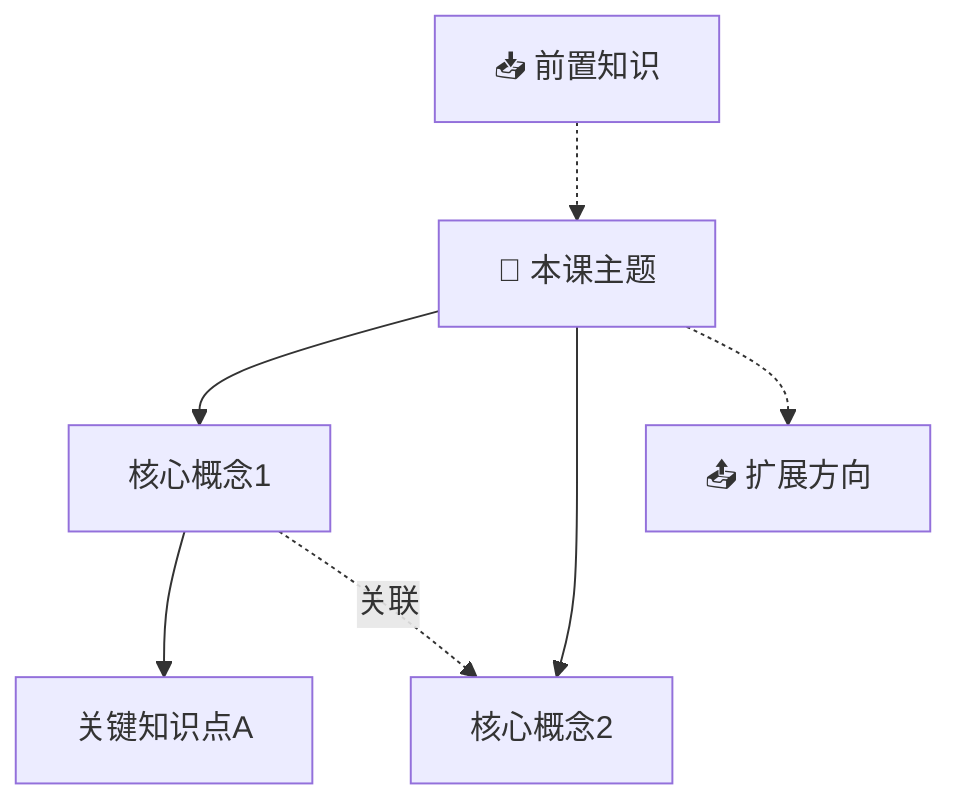

# Skill 原型 · 视频模式处理流程

> 来源：`D:\Project\MyClaude\myriad-mind\SKILL.md`  
> 提取日期：2026-05-31  
> 用途：为 App 管线实现提供参考，确保不遗漏上游关键步骤

---

## 总览：10 步管线

```
输入 URL → 0.识别平台 → 0.5读配置 → 0.6环境检查 → 0.7灵力预估
  → 1.获取下载直链 → 2.下载视频 → 3.提取音频
  → 4.ASR 转写 → 4.5字幕分析(推荐截图点) → 4.7精准截图
  → 5.AI 摘要 → 6.翻译(如需) → 7.生成笔记 → 8.清理 → 9.收尾
```

## 步骤 0：判断输入类型

按 URL 域名识别平台：

| 平台 | 域名特征 |
|------|----------|
| 抖音/TikTok | `douyin.com`、`v.douyin.com`、`tiktok.com` |
| 小红书 | `xiaohongshu.com`、`xhslink.com` |
| B 站 | `bilibili.com`、`b23.tv` |
| YouTube | `youtube.com`、`youtu.be` |

本地视频文件（`.mp4/.mov/.avi/.mkv`）跳过步骤 1-2，直接从步骤 3 开始。

## 步骤 0.5：读取后端配置

读取 `.env` 或环境变量中的关键配置：

```
ASR_BACKEND=faster-whisper          # 默认，可选 volcengine
VIDEO_INFO_PROVIDER=ai-douyin       # 默认，可选 tikhub
AI_DOUYIN_API_KEY=...
FW_MODEL_SIZE=small                 # tiny/base/small/medium/large-v3
FW_DEVICE=auto                      # auto/cpu/cuda
CLEANUP_TEMP=true
ENABLE_KEYFRAMES=true
ENABLE_MERMAID=true
ENABLE_RESOURCES=true
ENABLE_COMMENTS=true
ENABLE_READING_INFO=true
DEBUG_METADATA=false
NOTE_METADATA=true
NOTE_OUTPUT_DIR=
```

## 步骤 0.6：环境检查

按模式按需检查依赖：

| 依赖 | 何时需要 | 检查方式 |
|------|----------|----------|
| `AI_DOUYIN_API_KEY` | 抖音/小红书/B 站 | 检查非空 |
| `TIKHUB_TOKEN` | VIDEO_INFO_PROVIDER=tikhub | 检查非空 |
| `jq` | 在线视频模式 | `command -v jq` |
| `yt-dlp` | B 站 / YouTube | `command -v yt-dlp` |
| `ffmpeg` | 有视频文件（非 YouTube） | `command -v ffmpeg` |
| `FW_PYTHON` + `faster-whisper` | ASR_BACKEND=faster-whisper | `python -c "import faster_whisper"` |
| `BYTEDANCE_VC_TOKEN` | ASR_BACKEND=volcengine | 检查非空 |

任一依赖缺失 → 输出 `ERROR: 缺少必需依赖或配置: {MISSING}`，不继续。

## 步骤 0.7：灵力预估（必须在处理前执行）

根据输入类型和长度估算 Token/时间消耗：

| 输入类型 | 时间 | Token |
|----------|------|-------|
| 🎬 视频 < 10 分钟 | ~3 分钟 | 20K-40K |
| 🎬 视频 10-30 分钟 | ~6 分钟 | 30K-60K |
| 🎬 视频 30-60 分钟 | ~10 分钟 | 50K-80K |
| 🎬 视频 > 60 分钟 | ~15 分钟 | 80K-150K |

**额外消耗：**
- 需要 ASR：+ 视频时长 × 0.5
- 需要下载：+ 1-3 分钟
- 需要关键帧：+ 30 秒
- 英文需翻译：+ Token × 1.3
- 启用评论区：+ 5K-10K tokens

**确认阈值：**
- < 30K tokens → 🟢 直接执行
- 30K-80K → 🟡 提示后执行
- \> 80K → 🔴 必须用户确认

## 步骤 1：获取视频信息/下载直链

### 抖音/小红书/B 站：AI Douyin 代理（默认）

```bash
curl -X POST "$AI_DOUYIN_API_BASE/api/v1/video/download-url" \
  -H "X-API-Key: $AI_DOUYIN_API_KEY" \
  -H "Content-Type: application/json" \
  -d '{"url": "{ORIGINAL_URL}"}'
```

返回关键字段：
- `download_url` / `download_urls[]` — 视频下载直链
- `extracted_url` — 解析后的真实 URL
- `cost` — 消耗积分（成功=1，失败=0）
- HTTP 401 → API Key 无效；402 → 余额不足

### 可选：自有 TikHub Token

`VIDEO_INFO_PROVIDER=tikhub` 时，直接调 TikHub API 解析。

### YouTube：不调用解析 API

直接进入步骤 2，优先用 yt-dlp 抓字幕。

## 步骤 2：下载视频

### YouTube — 优先字幕，不下载视频

```bash
python3 download_youtube_subtitles.py \
  "https://www.youtube.com/watch?v={VIDEO_ID}" \
  --output-dir /tmp/video_analysis/{VIDEO_ID} \
  --languages zh-Hans,zh-Hant,zh,en
```

输出：`subtitle.srt` + `text.txt`。**如果有字幕 → 直接跳到步骤 5**，不用下载视频/ASR。  
没有字幕 → yt-dlp 下载音频 → 走步骤 3-4。

### 抖音/TikTok/小红书/B 站（有下载直链）

```bash
python3 download_video_candidates.py \
  --response-json /tmp/video_analysis/download_url.json \
  --output /tmp/video_analysis/{VIDEO_ID}/video.mp4
```

### B 站（无直链回退）

```bash
yt-dlp -o /tmp/video_analysis/{BVID}/video.mp4 "https://www.bilibili.com/video/{BVID}/"
```

## 步骤 3：提取音频

```bash
ffmpeg -i /tmp/video_analysis/{VIDEO_ID}/video.mp4 \
  -q:a 0 -map a -y /tmp/video_analysis/{VIDEO_ID}/audio.mp3
```

本地音频文件（`.mp3/.wav/.m4a/.flac`）跳过此步骤。

## 步骤 4：ASR 语音转写

### 方案 A：faster-whisper（默认）

```bash
python3 transcribe_faster_whisper.py \
  /tmp/video_analysis/{VIDEO_ID}/audio.mp3 \
  --output-dir /tmp/video_analysis/{VIDEO_ID}
```

自动读取 `FW_MODEL_SIZE` / `FW_DEVICE` / `FW_COMPUTE_TYPE`。输出固定为 `subtitle.srt` + `text.txt`。

### 方案 B：volcengine（云端付费）

提交任务 → 轮询结果 → 解析 JSON → 生成 `text.txt` + `subtitle.srt`。

## 步骤 4.5：字幕分析 → 推荐截图时间点

> 仅当 `ENABLE_KEYFRAMES=true` 且存在视频文件时执行。

**Claude 分析字幕文本**，识别画面价值高的时刻：

| 信号类型 | 典型表述 | 说明 |
|----------|----------|------|
| 画面展示 | "看这段代码"、"如图所示"、"注意这个表格" | 讲师指向视觉内容 |
| 操作演示 | "点击这里"、"打开终端"、"运行一下" | 教程操作步骤 |
| 代码相关 | "这段代码的作用是"、"函数定义" | 需要截代码画面 |
| PPT 翻页 | "下一页"、"第一个要点"、"这一章" | 章节过渡 |
| 对比切换 | "对比一下"、"切换到"、"前后的区别" | 画面变化 |
| 运行效果 | "运行结果"、"输出是"、"报错了" | 终端输出 |

输出 `guided_timestamps.json`：
```json
[
  {"ts": 32.0, "reason": "PPT标题页：ECS三大核心概念"},
  {"ts": 95.0, "reason": "代码展示：Entity结构体定义"}
]
```

要求 8-25 个推荐时间点，与字幕时间轴对齐。纯谈话内容输出空数组 `[]`。

## 步骤 4.7：精准截图提取

结合**字幕引导**（最高优先级）+ **场景变化检测** + **间隔保底**，三级策略：

```bash
python3 extract_keyframes.py \
  --video /tmp/video_analysis/{VIDEO_ID}/video.mp4 \
  --output-dir /tmp/video_analysis/{VIDEO_ID} \
  --timestamps /tmp/video_analysis/{VIDEO_ID}/guided_timestamps.json \
  --max-frames 40 --scene-threshold 0.25 --max-gap 120 --min-gap 3
```

| 参数 | 默认 | 说明 |
|------|------|------|
| `KF_MAX_FRAMES` | 40 | 最大截图数 |
| `KF_SCENE_THRESHOLD` | 0.25 | 场景检测灵敏度（0.15=极敏感, 0.4=大变化） |
| `KF_MAX_GAP` | 120 | 最长静态间隔，超时强制补截 |
| `KF_MIN_GAP` | 3 | 最短帧间距，去重 |

输出：`frames/frame_0001_01m30s.png` + `frames/keyframes.json`

**keyframes.json 格式：**
```json
[
  {
    "file": "frame_0001_00m32s.png",
    "timestamp_seconds": 32.0,
    "timestamp_label": "00m32s",
    "trigger": "guided",
    "scene_score": 1.0
  }
]
```

trigger 三种：
- `guided` — 字幕引导（最高优先级，score=1.0）
- `scene` — 场景变化（score>0）
- `gap` — 间隔保底（score=0.0）

去重优先级：`guided > scene > gap`

## 步骤 5：AI 生成摘要

Claude 读取 `text.txt`，生成：
1. **标题**：≤30 字，参考原视频标题但不照抄
2. **摘要**：200-300 字
3. **核心要点**：3-5 条结构化

提供上下文：原视频标题、平台、作者。字幕文本可能含同音字/断句/专有名词错误，AI 需酌情修正。

## 步骤 6：语言检测与翻译

统计中文字符占比。若中文字符 < 30% → 判定英文，翻译为中文：

- 格式：`[EN]` 原文 / `[CN]` 译文
- 技术术语保留英文原文（括号标注）
- 长句适当拆分
- 保存到 `translated_text.txt`

中文视频跳过此步骤。

## 步骤 7：生成学习笔记

这是最复杂的步骤，包含多个子步骤：

### 7.0 — 时间戳可点击链接

所有时间戳必须生成平台对应的可点击跳转链接：

| 平台 | 格式 |
|------|------|
| B 站 | `{原始链接}?t={总秒数}` |
| YouTube | `https://www.youtube.com/watch?v={ID}&t={秒数}` |
| 抖音/小红书 | 原始链接（短视频无需时间戳） |
| 本地文件 | `[HH:MM:SS](file:///绝对路径?t={秒数})` |

### 7.1 — 截图审查与选择（三阶段）

**第一阶段：逐张审查**
- 前置校验：字幕-画面交叉对照 → 判断"画面+字幕"信息增量
- 评分公式：`最终得分 = 基础分 × 上下文加成`
  - 基础分：PPT_TITLE=3, CODE_BLOCK=3, ARCH_DIAGRAM=3, RUN_RESULT=3, TOOL_UI=3, DATA_TABLE=2, SIMPLE_CHART=2, SPLIT_SCREEN=2, TALKING_HEAD=0, PLAIN_TEXT=0, BLACK_SCREEN=0
  - 上下文加成：实质性+信息画面=1.0, 实质性+静态人脸=0（跳过）, 闲聊=0.3, 无字幕=0（跳过）

**第二阶段：输出审查表**
```
| # | 时间 | 来源 | 字幕摘要 | 类型标签 | 分数 | 决策 | 嵌入位置 |
```
来源标记：🎯引导 / 🔍场景 / ⏱️保底
决策：✅（≥3分）/ ⚖️（=2分）/ ❌（≤1分）

**第三阶段：自检清单**
- 审查表行数 = keyframes.json 截图总数
- 每张 ❌ 有明确理由
- 每张 ✅ 标注嵌入位置
- 相似截图去重
- 选中 5-15 张（不超过总数 50%）

**嵌入规则：**
1. 截图放在对应知识点旁边（不是集中一章）
2. 配时间戳链接：`> 📸 [截图于 M:SS](链接?t=秒数)`
3. 截图与 Mermaid 互补（截图=画面，Mermaid=抽象关系）
4. 选中截图复制到 `{OUTPUT_DIR}/assets/{VIDEO_ID}/`
5. 未选中截图删除

### 7.2 — 评论区精华提取

**获取：**
- B 站：`curl "api.bilibili.com/x/v2/reply/main?oid={AID}&type=1&ps=30&sort=1"`
- YouTube：`yt-dlp --write-comments --skip-download`
- 抖音/小红书：跳过（受限）

**筛选标准（宁缺毋滥）：**
- ✅ 必选：作者勘误/补充
- ✅ 优先：补充技术细节、高质问答
- ✅ 保留：额外资源/链接、实战踩坑
- ❌ 跳过：感谢/三连、纯提问无人答、灌水、偏题争论

输出 3-6 条精选评论，附跳转链接。

### 7.3 — 知识关系图（Mermaid）



### 7.4 — 教程操作模式（自动检测）

当命中 ≥2 项时启用：
- 标题含教程关键词（`教程`/`入门`/`实战`/`配置`...）
- 内容大量操作动词
- 字幕短句密集

额外输出：**操作流程总览**（Mermaid flowchart）+ 点击跳转 + 操作截图增强（临时调低场景阈值到 0.15、间隔到 60s）。

### 笔记完整章节

```
一、AI 摘要
二、核心概念（3-5 个）
三、详细笔记（按内容分段，每段 [▶ MM:SS](链接) - MM:SS | 标题）
四、关键术语表（英文→中文→说明）
五、总结与思考
六、扩展学习资源（5-8 个，搜官方文档/相关视频/GitHub/文章）
七、评论区精华讨论（精选 3-6 条）
八、知识关系图（Mermaid）
```

### 阅读信息计算

```
阅读时长 = (基础分钟 + 图表分钟 + 代码分钟) × 难度系数
```

- 中文基准 400 字/分钟
- Mermaid 图 +15s、截图 +10s、代码行 × 2s
- 🌱 入门 ×1.0 / 🌿 进阶 ×1.3 / 🌳 深入 ×1.6

### 可靠性评级

- 🟢 ⭐⭐⭐ 可信 — 与官方文档一致
- 🟡 ⭐⭐ 参考 — 有少量过时/歧义
- 🟠 ⭐ 谨慎 — 有争议/明显过时
- 🔴 ⚠ 仅作了解 — 有已知错误

### 元信息（`NOTE_METADATA=true`）

```markdown
---
> 📋 **文档元信息**
> | 文档版本 | 生成时间 | 生成模型 | Token 消耗 | 原始资源 |
```

### 调试信息（`DEBUG_METADATA=true`）

四大块：
- **A. 流水线耗时** — 每步墙钟 + Token
- **B. 截图来源追踪** — trigger → reason → 审查 → 嵌入
- **C. 内容来源标注** — 每章信息来自字幕/截图/评论/Claude
- **D. 决策链路** — 完整处理路径 ASCII 图

## 步骤 8：清理临时文件

```bash
if [ "$CLEANUP_TEMP" = "true" ]; then
  rm -rf /tmp/video_analysis/{VIDEO_ID}
else
  echo "保留临时文件: /tmp/video_analysis/{VIDEO_ID}"
fi
```

## 步骤 9：收尾

- **9.1 更新修为面板**（`AUTO_UPDATE_PANEL=true`）：刷新成就/统计/仪表盘
- **9.2 学习路线推荐**（`AUTO_SUGGEST_NEXT=true`）：分析知识结构 → 推荐 Top 3-5 方向

---

## ⚠️ App 管线未覆盖的能力（待迁移）

以下 Skill 原型的能力在 App 中尚未实现，需要后续版本补上：

| 步骤 | Skill 能力 | App 当前状态 |
|------|-----------|-------------|
| 0.7 | 灵力预估 + 确认阈值 | ✅ 已实现 `estimateCost()` |
| 4.5 | **字幕分析 → 推荐截图时间点** | ✅ 已实现 — `ai/vision.rs:analyze_subtitle`，`pipeline.rs:606` 调用 |
| 4.7 | **guided + scene + gap 三级截图** | ✅ 已实现 — `pipeline.rs:extract_keyframes_guided`（`:654/2107`），传入 guided timestamps |
| 7.0 | **时间戳可点击链接（平台特定）** | ❌ 未实现 — 笔记生成逻辑在 AI prompt 中，非代码层 |
| 7.1 | **截图审查三阶段** | ✅ 已实现 — `ai/vision.rs:review_keyframes`（DeepSeek Vision 视觉审查），`pipeline.rs:697` 调用 |
| 7.2 | **评论区精华提取** | ❌ 未实现 — 需要 B 站 API + YouTube yt-dlp |
| 7.3 | **知识关系图（Mermaid）** | ⚠️ 依赖 AI prompt 生成，非代码 |
| 7.4 | **教程操作模式自动检测** | ✅ 已实现 — `ai/vision.rs:detect_tutorial_mode`，`pipeline.rs:766` 调用 |
| 6 | **语言检测与翻译** | ❌ 未实现 |
| 步骤 7 | **可靠性评级** + **版本差异标注** | ❌ 未实现 |
| 步骤 9 | 修为面板 / 学习路线推荐 | ❌ 未实现 |

核心差异：Skill 原型靠 Claude 的推理能力 + 多模态视觉做截图审查/字幕分析，App 已用 DeepSeek Vision 视觉模式替代（见 [DeepSeek视觉-截图审查方案](./DeepSeek视觉-截图审查方案.md)），字幕分析/guided 截图/截图审查/教程检测均已上线；评论区精华、自动翻译、修为面板仍待开发。
