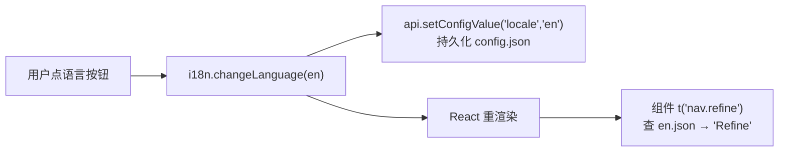
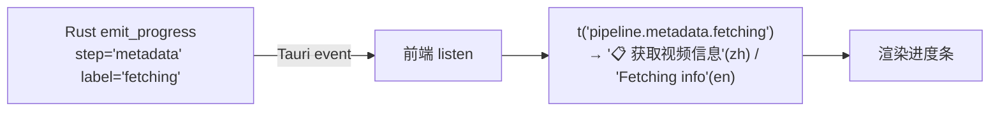

# 多语言支持设计（i18n）

> 编写日期：2026-06-21
> 状态：**设计阶段，待批准**（批准后按 §十 分阶段实施）
> 目标语言：中文 `zh`（默认） + 英文 `en`
> 架构权威：[`../../架构与结构.md`](../../架构与结构.md)
> 参考实现：`D:\Project\Learn\cc-switch`（i18next + react-i18next，前端 i18n 成熟范本）

---

## 一、设计目标

1. 界面支持 **中文 / 英文** 切换，中文为默认与回退语言。
2. **前端 UI 文案全量本地化**（组件 JSX 文本、props、提示）。
3. **后端可见文案**（管线进度、错误消息）**分阶段**本地化——先不阻塞前端，后端逐步迁。
4. 语言选择**持久化**到 `config.json`，首次启动按**系统语言探测**。
5. **界面语言 与 AI 笔记输出语言 解耦**——两套独立配置（界面是 zh/en，笔记可单独选输出语言）。
6. 不破坏现有**浏览器 mock 模式**（`api.ts` 的降级路径）。

---

## 二、现状分析

### 2.1 硬编码中文分布

| 位置 | 含中文行数 | 主要文件 | 说明 |
|------|-----------|---------|------|
| 前端 `apps/desktop/src/` | 204 | InputView(70)、usePipeline(51)、DashboardView(22) | 多为 JSX 文本 |
| Rust 后端 `src-tauri/src/` | 755 | pipeline.rs(278)、code_project(65)、python(59) | **大量是注释**，可见文案主要在 `emit_progress` 的 `label`/`detail` |
| 共享 UI `packages/ui/` | 413 | SettingsPage(154)、ConfigWizard(138) | JSX 文本 |

> ⚠️ 上述是「含中文的行数」，其中**代码注释占大头（开发者看，不翻译）**。真正需要 i18n 的**用户可见字符串**估算几百处。

### 2.2 三类中文（处理方式不同）

| 类型 | 例子 | 处理 |
|------|------|------|
| **① UI 文案** | `label="炼化"`、`<h1>大衍决</h1>` | ✅ i18n 主战场 |
| **② AI 提示词** | `prompts/*.md` | ❌ 不按界面语言切，走「笔记输出语言」配置（§六） |
| **③ 代码注释** | `// 配置 Zod Schema` | ❌ 开发者看，不动 |

### 2.3 参考项目 cc-switch 的启示

cc-switch（同为本项目参考的 Tauri + React 项目）的 i18n 实践：

- **前端做透**：`i18next` + `react-i18next`，`src/i18n/locales/{zh,zh-TW,en,ja}.json` 直接 import 打包，按模块分顶层 key（~40 组），`localStorage` 持久化 + `navigator.language` 探测，`fallbackLng: "en"`。
- **后端没做透**：`AppError` 仍中文硬编码（`#[error("配置错误: {0}")]`），个别错误用 `Localized { zh, en }` 双语 hack，`log_codes.rs` 只是开发者日志码（非用户 i18n）。

**结论**：前端有成熟范本可照抄；后端可见文案 i18n 是 Tauri + React 项目的**普遍薄弱环节**，我们采取分阶段策略，不追求一步到位。

---

## 三、技术选型

### 3.1 前端：i18next + react-i18next

| 候选 | 选/弃 | 理由 |
|------|------|------|
| **i18next + react-i18next** | ✅ 选 | 行业事实标准，cc-switch/大量 Tauri 项目验证，学习曲线平缓，生态最大 |
| FormatJS (react-intl) | 弃 | ICU MessageFormat 复数/性别更强，但本项目无复杂复数需求，过重 |
| lingui | 弃 | 编译时方案，宏侵入性强，对新手不友好 |

> 🎮 **UE 类比**：`t("nav.refine")` ≈ UE 的 `LOCTEXT`/`FText` + `FStringTable`；`locales/zh.json` ≈ UE 的 `Game.loc` 本地化文件；切语言 ≈ 切 `FCulture`。React 没有 FText 这种天生可本地化类型，靠这个库包一层。

### 3.2 后端：step code + error code（分阶段）

见 §五，先「后端暂留中文」（阶段 C 起步），再「step code / error code 化」（阶段 A 彻底）。

---

## 四、前端方案

### 4.1 文件组织

```
apps/desktop/src/i18n/
├── index.ts          # i18next 初始化
└── locales/
    ├── zh.json       # 中文（默认 + 回退）
    └── en.json       # 英文
```

翻译表按模块分顶层 key（参考 cc-switch 命名）：

```jsonc
// locales/zh.json
{
  "nav":     { "refine": "炼化", "dashboard": "修为", "settings": "设置" },
  "app":     { "name": "大衍决", "tagline": "Myriad Mind" },
  "input":   { "placeholder": "丢入视频链接 / 文章 URL / 本地文件", ... },
  "settings":{ "language": "界面语言", "languageHint": "切换后立即生效", ... },
  "pipeline":{ "metadata": { "fetching": "📋 获取视频信息", ... } },
  "errors":  { "python_failed": "Python 脚本执行失败", ... },
  "common":  { "confirm": "确认", "cancel": "取消", "save": "保存", ... }
}
```

### 4.2 初始化（`i18n/index.ts`）

```ts
import i18n from "i18next";
import { initReactI18next } from "react-i18next";
import zh from "./locales/zh.json";
import en from "./locales/en.json";

export type Locale = "zh" | "en";

// 从 config.json 读 locale（api.readConfig），缺失则按系统语言探测
async function resolveInitialLocale(): Promise<Locale> {
  // 1. config.json 的 locale 字段（优先）
  // 2. navigator.language 探测（zh* → zh，其余 → en）
  // 3. 默认 zh
}

i18n.use(initReactI18next).init({
  resources: { zh: { translation: zh }, en: { translation: en } },
  lng: await resolveInitialLocale(),
  fallbackLng: "zh",            // 缺英文翻译时回退中文（开发期友好）
  interpolation: { escapeValue: false }, // React 已转义
});
export default i18n;
```

> 与 cc-switch 的差异：cc-switch 用 `localStorage`，本项目用 **`config.json` 的 `locale` 字段**（已有配置体系，且 v2 移动端可共享）。

### 4.3 使用模式

```tsx
// Sidebar.tsx 改造
import { useTranslation } from "react-i18next";
function Sidebar() {
  const { t } = useTranslation();
  return (
    <NavButton label={t("nav.refine")} />   // 原: label="炼化"
    <h1>{t("app.name")}</h1>                 // 原: <h1>大衍决</h1>
  );
}
```

带变量的文案用 interpolation：`t("input.estimated_minutes", { n: 5 })` → `"预计 {{n}} 分钟"`。

### 4.4 语言切换 UI

新增 `LanguageSettings` 组件（参考 cc-switch），接入设置页。切换时：

```ts
i18n.changeLanguage(nextLocale);          // 即时切换
api.setConfigValue("locale", nextLocale); // 持久化到 config.json
```

---

## 五、后端方案（分阶段）

### 5.1 阶段 C（起步）：后端可见文案暂留中文

- **零后端改动**。英文版界面里，管线进度 / 错误消息仍是中文。
- 目的：让前端英文 UI 先跑通见效，后端 i18n 后补。
- 代价：英文版进度条 / 错误弹窗出现中文（可接受，cc-switch 也是这状态）。

### 5.2 阶段 A（彻底）：step code + error code

#### 5.2.1 管线进度 step code 化

当前 `emit_progress`（`pipeline.rs:1300`）签名：

```rust
fn emit_progress(app, step: &str, label: &str, percent: f64, status: &str, detail: Option<&str>)
//                                                       ^^^^^ 中文文案         ^^^^^ 中文文案
```

`step` 已是英文 key（`metadata`/`deps`/`cleanup`/…），**只有 `label`/`detail` 是中文**。改造：

```rust
// 改造后：label 传 message key，不传文案
emit_progress(app, "metadata", "fetching", 8.0, "running", None);
//                                  ^^^^^^ key，前端翻译
```

`PipelineProgressEvent`（`pipeline.rs:58`）语义不变，前端收到 `label="fetching"` 后：

```ts
listen("pipeline-progress", (e) => {
  const { step, label, percent, status } = e.payload;
  setText(t(`pipeline.${step}.${label}`));  // t("pipeline.metadata.fetching") → "📋 获取视频信息"
});
```

> 改造量：pipeline.rs 的 278 处中文里，需要改的是 `emit_progress(...)` 调用的 `label` 实参（多为固定步骤文案，可系统性映射成 key），注释不动。

#### 5.2.2 错误 code 化

当前 `AppError`（`error.rs`）的 `Serialize` 实现：

```rust
impl Serialize for AppError {
    fn serialize<S>(&self, s: S) -> ... {
        s.serialize_str(&self.to_string())  // ⚠️ 前端拿到的是中文字符串
    }
}
```

改造为结构化输出，带 `code`：

```rust
// 改造后：序列化为 { code, message }
impl Serialize for AppError {
    fn serialize<S>(&self, s: S) -> ... {
        let code = self.code();  // 每个 variant 映射一个稳定 code，如 "python_failed"
        s.serialize_struct("AppError", 2)?
            .serialize_field("code", &code)?
            .serialize_field("message", &self.to_string())?  // 保留中文 message 作兜底
            .end()
    }
}
```

前端错误处理同步改为按 `code` 翻译，缺 key 时回退到 `message`：

```ts
try { await api.runMindTask(...) }
catch (err) {
  const { code, message } = parseErr(err);
  showToast(t(`errors.${code}`, { defaultValue: message }));
}
```

> ⚠️ 兼容性：此改动会让前端所有 `catch` 拿到的错误从「字符串」变成「对象」，**阶段 4 需同步改前端错误处理**。

---

## 六、提示词输出语言（与界面语言解耦）

- AI 提示词 `prompts/*.md` 的语言由「**笔记输出语言**」决定，与界面 `locale` 独立。
- config 加 `output_language` 字段（`zh`/`en`/`ja`…，可多于界面语言），PromptManager 渲染时注入。
- 用户可设「界面英文，但笔记用中文写」——两套配置互不干扰。

> 本设计文档聚焦界面 i18n；`output_language` 的完整方案另立（涉及提示词模板分支），属后续工作。

---

## 七、packages/ui 的 i18n

`packages/ui`（ConfigWizard/SettingsPage/Dashboard/NoteRenderer，占 413 处）被 desktop 消费，v2 移动端也会用。

- **方案**：ui 包**自带 i18next 实例**（或共享 desktop 的实例 + 独立 namespace `ui`），组件内直接 `useTranslation()`。
- ui 包 `package.json` 加 `i18next` + `react-i18next` 依赖，自带 `locales/{zh,en}.json`。
- 阶段 2 处理（前端 UI 之后）。

---

## 八、数据结构

### 8.1 config schema 变更（`packages/core/src/schema.ts`）

```ts
export const ConfigSchema = z.object({
  version: z.literal(1),
  locale: z.enum(["zh", "en"]).default("zh"),   // ⭐ 新增：界面语言
  // output_language: z.enum(["zh","en"]).optional(),  // 预留：笔记输出语言（§六）
  python_path: z.string().optional().default(""),
  // ...其余不变
});
```

`DEFAULT_CONFIG` 同步加 `locale: "zh"`。已有配置（`version: 1`，无 `locale`）由 zod `.default("zh")` 自动补全，**无需迁移**。

### 8.2 翻译表结构

见 §4.1。顶层分组：`nav` / `app` / `input` / `dashboard` / `settings` / `pipeline` / `errors` / `common`。

### 8.3 key 命名规范

| 场景 | 约定 | 示例 |
|------|------|------|
| UI 文案 | `{模块}.{语义}` | `nav.refine`、`settings.language` |
| 管线进度 | `pipeline.{step}.{labelKey}` | `pipeline.metadata.fetching` |
| 错误 | `errors.{errorCode}` | `errors.python_failed` |
| 带变量 | interpolation `{{var}}` | `input.estimated_minutes: "预计 {{n}} 分钟"` |

---

## 九、数据流

### 9.1 语言切换 + 渲染流



### 9.2 后端事件翻译流（阶段 A）



---

## 十、实施步骤（分阶段，每阶段可独立验收）

### 阶段 0：i18n 骨架

- [ ] `apps/desktop` 加依赖 `i18next` + `react-i18next`
- [ ] 新建 `src/i18n/index.ts` + `locales/{zh,en}.json`（先放少量 key）
- [ ] `main.tsx` 引入 `i18n/index.ts`
- [ ] `ConfigSchema` 加 `locale` 字段 + `DEFAULT_CONFIG`
- [ ] 新增 `LanguageSettings` 组件 + 接入设置页
- **验收**：能切语言，`config.json` 记录 `locale`，重启保留选择（此时 UI 仍是中文，因 key 还没铺开）

### 阶段 1：前端 UI 文案

- [ ] 逐组件抽 `t()`：Sidebar → InputView → DashboardView → SettingsView → LogPanel → hooks（useConfig/usePipeline）
- [ ] 补全 `zh.json` / `en.json`
- **验收**：切换中英，所有前端 UI 文案跟随切换

### 阶段 2：packages/ui 共享组件

- [ ] ui 包接入 i18next + 自带 locales
- [ ] ConfigWizard / SettingsPage / Dashboard / NoteRenderer 抽 `t()`
- **验收**：配置向导、设置页、修为面板、笔记渲染文案切换

### 阶段 3：后端管线 step code

- [ ] `pipeline.rs` 的 `emit_progress` label 实参改为 message key
- [ ] 前端 `listenPipelineProgress` 用 `t()` 翻译
- [ ] 补 `pipeline.*` 翻译
- **验收**：英文版进度条 / 状态文案为英文

### 阶段 4：错误 i18n

- [ ] `AppError::Serialize` 改为 `{ code, message }` 结构
- [ ] 每个 variant 加 `code()` 映射
- [ ] 前端错误处理改为按 `code` 翻译（同步改所有 `catch`）
- [ ] 补 `errors.*` 翻译
- **验收**：英文版错误提示为英文

---

## 十一、风险与兼容性

| 风险 | 应对 |
|------|------|
| key 命名不一致 / 拼写 | §8.3 约定 + code review；可用 `i18next-parser` 自动扫描提取 key |
| 缺翻译 | `fallbackLng: "zh"`；英文缺 key 回退中文（开发期），上线前用脚本比对两表 key 集合 |
| packages/ui 跨包 i18next 实例 | ui 包自带实例 + namespace，避免与 desktop 实例冲突 |
| AppError 序列化结构变更 | 阶段 4 必须**前后端同步改**，否则前端 catch 崩；放一个阶段集中做 |
| 浏览器 mock 模式 | `api.ts` mock 返回的文案也走 `t()`，不硬编码中文 |
| 动态文案（变量/复数） | 用 interpolation `{{var}}`；英文复数用 i18next `_one/_other` 后缀（本项目场景少） |

---

## 十二、验收标准

**功能：**
- 设置页可切换 中文 / 英文，切换后全界面即时生效。
- `config.json` 记录 `locale`，重启保留。
- 首次启动按系统语言自动选择（中文系统 → zh，其他 → en）。
- 阶段 3 后：英文版管线进度文案为英文。
- 阶段 4 后：英文版错误提示为英文。

**质量：**
- `zh.json` 与 `en.json` 的 key 集合一致（脚本校验）。
- 浏览器 mock 模式下语言切换正常。
- 界面语言与笔记输出语言互不影响。

---

## 十三、参考

- **cc-switch**（本地参考）：`D:\Project\Learn\cc-switch\src\i18n\index.ts`、`src/i18n\locales\`、`src/components/settings/LanguageSettings.tsx`
- i18next：https://www.i18next.com/
- react-i18next：https://react.i18next.com/
- i18next-parser（key 提取工具）：https://github.com/i18next/i18next-parser
