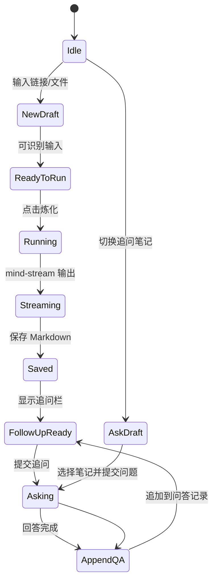

# 炼化页追问模式与操作逻辑设计

> 参考：`D:\Project\MyClaude\myriad-mind\CHANGELOG.md` v2.2.0 问答模式。  
> 目标：在当前炼化页 UI 基础上，补齐“本次要求”和“追问已有笔记”能力，让用户不只是一键炼化，也能在炼化前定制提示词、炼化后继续追问。

---

## 一、当前问题

当前炼化页结构比较清晰：

```text
标题 / 副标题
输入框 + 炼化按钮
支持类型标签
炼化日志大面板
```

但有三个缺口：

1. 用户只能提交 URL / 文件路径，不能追加“本次要求”。
2. AI 输出区和日志区混在“炼化日志”里，后续追问没有承载位置。
3. Skill v2.2.0 已有“问答模式”，App 里还没有“对已有笔记提问并追加回原文”的入口。

---

## 二、设计目标

炼化页要从“一次性生成工具”升级为“学习材料工作台”：

```text
输入材料 → 设置本次要求 → 炼化生成笔记 → 继续追问 → 追加问答记录
```

用户应该能完成三类任务：

| 任务 | 用户意图 | UI 入口 |
|------|----------|---------|
| 新炼化 | 把链接 / 文件 / 代码仓库变成笔记 | 默认模式 |
| 本次要求 | 本次生成想偏重什么、跳过什么、用什么风格 | 输入框下方的可展开区域 |
| 追问笔记 | 对已有笔记提问，答案追加到原文 | 追问模式 |

---

## 三、页面结构

建议把炼化页分成上下两块，而不是另起新页面。

```text
┌────────────────────────────────────────────────────────────┐
│ 神识一扫，万物皆可为笔记                                   │
│ [ 新炼化 ] [ 追问笔记 ]                                    │
│                                                            │
│ 新炼化模式：                                               │
│ ┌──────────────────────────────────────┐ [炼化]            │
│ │ 粘贴链接 / 本地文件路径 / 代码仓库   │                    │
│ └──────────────────────────────────────┘                    │
│ [ 本次要求 ▾ ]                                              │
│   例如：只要速览；重点保留操作步骤；用教程风格输出          │
│                                                            │
│ 支持识别：B站 / YouTube / 抖音 / 小红书 / 文章 / 本地文件   │
├────────────────────────────────────────────────────────────┤
│ AI 输出                                                     │
│ [生成内容] [过程日志] [问答记录]                            │
│                                                            │
│ 生成中的 Markdown / 追问回答 / 保存结果                     │
│                                                            │
│ 追问输入栏：                                                │
│ ┌──────────────────────────────────────┐ [追问] [追加到笔记]│
│ │ 继续问：这个视频最重要的三个操作是什么？ │                 │
│ └──────────────────────────────────────┘                    │
└────────────────────────────────────────────────────────────┘
```

关键变化：

- 顶部增加模式切换：`新炼化` / `追问笔记`。
- 输入框下方增加“本次要求”。
- 大面板从“炼化日志”改为“AI 输出”，日志变成其中一个 Tab。
- 生成完成后，在输出面板底部出现追问输入栏。

---

## 四、模式一：新炼化

### 4.1 默认状态

用户进入炼化页时，默认是“新炼化”。

保留当前主输入框：

```text
粘贴链接... 如 https://www.bilibili.com/video/BVxxx/
```

按钮：

```text
炼化
```

支持类型标签继续展示，但建议只作为识别能力说明，不作为主要操作控件。

### 4.2 本次要求

在输入框下方增加一个可展开区域：

```text
本次要求（可选）  ▾
```

展开后：

```text
你希望这次怎么炼化？
┌────────────────────────────────────────────────────────┐
│ 例如：只要速览，跳过评论区；重点保留每一步操作画面；      │
│ 用教程风格输出；重点分析源码架构。                       │
└────────────────────────────────────────────────────────┘

[省流速览] [教程步骤] [源码分析] [考试复习] [只要结论]
```

行为：

- 文本框内容作为单次任务 Hook，只对本次炼化生效。
- 不写入全局设置。
- 提交时进入 `note_generation` Prompt Hook。
- 如果为空，不影响默认炼化。

建议字段：

```ts
interface InputDraft {
  source: string;
  oneShotPrompt?: string;
  mode: "new_note" | "ask_note";
}
```

### 4.3 快捷提示模板

快捷按钮点击后，把文本追加到“本次要求”里，而不是覆盖用户已写内容。

| 按钮 | 追加文案 |
|------|----------|
| 省流速览 | 只输出重点摘要和结论，跳过细枝末节。 |
| 教程步骤 | 这是操作教程，请按步骤保留关键操作和注意事项。 |
| 源码分析 | 重点分析架构、模块职责、关键调用链和可复用设计。 |
| 考试复习 | 输出适合复习的提纲、术语表和自测题。 |
| 只要结论 | 优先给结论，再列必要依据。 |

---

## 五、模式二：追问笔记

### 5.1 入口

顶部模式切换：

```text
[ 新炼化 ] [ 追问笔记 ]
```

切到“追问笔记”后，主输入区变成：

```text
选择或粘贴已有笔记路径
┌──────────────────────────────────────────────┐ [选择笔记]
│ D:/Notes/MyriadMind/xxx.md                    │
└──────────────────────────────────────────────┘

你想追问什么？
┌──────────────────────────────────────────────┐
│ 这个视频里最值得复用的方法是什么？             │
└──────────────────────────────────────────────┘

[追问] [只回答不写入] [回答后追加到笔记]
```

默认行为：`回答后追加到笔记`。

### 5.2 追问上下文

追问模式要读取：

- 当前 Markdown 笔记正文。
- 文件末尾 `## 大衍决心得` 二级标题下的元信息块（YAML，`MYRIAD_MIND_METADATA_START/END` 标记包裹）——本项目的笔记不使用 front matter。
- 关联素材路径，例如 ASR 文本、截图索引、原始链接。
- 已有「问答记录」章节，避免重复回答。

如果关联素材不存在，也应能基于当前笔记回答。

### 5.3 输出格式

回答完成后，追加到原文末尾：

```markdown
## 问答记录

### 2026-05-31 22:30 — 问题摘要

> **问：** 用户问题全文

> **答：** 基于笔记的回答

📍 参考章节：引用的笔记位置
```

如果原文已有 `## 问答记录`，追加到该章节末尾；如果没有，则新建章节。

---

## 六、生成完成后的追问

新炼化完成后，AI 输出区底部显示追问栏：

```text
继续追问这篇笔记...
┌──────────────────────────────────────────────┐ [追问]
│ 这篇内容有没有可执行的行动清单？               │
└──────────────────────────────────────────────┘

[追加到笔记] 默认开启
```

行为：

1. 如果本次笔记已保存，追问直接绑定该 `.md` 文件。
2. 如果还没保存，先提示保存笔记，再允许追加。
3. 追问答案显示在 AI 输出区，并追加到 Markdown 的「问答记录」。

这能让用户从：

```text
生成笔记
```

自然进入：

```text
围绕这篇笔记继续学习
```

---

## 七、AI 输出区重新定义

当前叫“炼化日志”的大面板建议改名为“AI 输出”。

内部使用 Tab：

| Tab | 内容 |
|-----|------|
| 生成内容 | 流式 Markdown、最终笔记、追问回答 |
| 过程日志 | 下载、ASR、截图、AI 调用、保存等状态 |
| 问答记录 | 当前笔记的追问历史 |

空态：

```text
等待炼化...
AI 输出会在这里实时展示。
```

生成中：

```text
正在炼化...
当前阶段：DeepSeek 正在生成结构化笔记
```

生成完成：

```text
炼化完成
[打开笔记] [打开目录] [继续追问] [重新炼化]
```

---

## 八、操作状态机



---

## 九、与 Prompt Hooks 的关系

P0 只做两个入口：

| UI 入口 | Hook 阶段 | 生效范围 |
|---------|-----------|----------|
| 本次要求 | `note_generation` | 当前新炼化任务 |
| 追问问题 | `note_qa` | 当前笔记问答任务 |

合并顺序：

```text
系统基础 Prompt
→ 输入类型 Prompt
→ 全局写作偏好
→ 本次要求 / 追问问题
→ 输出格式约束
```

追问模式不应该复用完整新炼化 Prompt，而应该使用单独的 `note_qa` Prompt，避免重新生成整篇笔记。

---

## 十、当前代码改造点

只列 UI 和接口层，不展开后端实现。

### 10.1 `InputView.tsx`

新增状态：

```ts
const [mode, setMode] = useState<"new_note" | "ask_note">("new_note");
const [oneShotPrompt, setOneShotPrompt] = useState("");
const [notePath, setNotePath] = useState("");
const [question, setQuestion] = useState("");
const [appendAnswer, setAppendAnswer] = useState(true);
const [outputTab, setOutputTab] = useState<"content" | "logs" | "qa">("content");
```

需要拆分组件：

```text
InputView
├── ModeSwitch
├── NewNoteForm
├── OneShotPromptBox
├── AskNoteForm
└── AiOutputPanel
```

### 10.2 `usePipeline.ts`

新炼化提交参数增加：

```ts
submit({
  source,
  oneShotPrompt,
  intensity,
});
```

追问新增方法：

```ts
askNote({
  notePath,
  question,
  appendToNote: true,
});
```

### 10.3 `api.ts`

新增命令封装：

```ts
askNote(params: {
  notePath: string;
  question: string;
  appendToNote: boolean;
}): Promise<AskNoteResult>
```

监听同一套 `mind-stream`，但事件里带 `taskType`：

```ts
type MindTaskType = "note_generation" | "note_qa";
```

### 10.4 Rust / MindEngine

后端新增轻量命令：

```text
commands/ai/qa.rs
```

职责：

1. 读取 Markdown 笔记。
2. 解析或创建「问答记录」章节。
3. 调用 MindEngine 的 `note_qa`。
4. 流式返回回答。
5. 根据 `appendToNote` 决定是否写回 Markdown。

---

## 十一、交互细节

### 11.1 禁用条件

| 场景 | 按钮状态 |
|------|----------|
| 新炼化输入为空 | `炼化` 禁用 |
| 追问模式未选择笔记 | `追问` 禁用 |
| 追问问题为空 | `追问` 禁用 |
| 正在炼化 | 禁用模式切换，允许复制输出 |
| 正在追问 | 禁用追问按钮，允许取消 |

### 11.2 错误提示

| 错误 | 文案 |
|------|------|
| 笔记不存在 | 找不到这篇笔记，请重新选择 Markdown 文件。 |
| 笔记无法读取 | 笔记读取失败，请检查文件权限。 |
| 没有 DeepSeek Key | 还没有配置 DeepSeek API Key，无法追问。 |
| 写回失败 | 回答已生成，但追加到笔记失败，请手动保存。 |

### 11.3 快捷入口

生成完成后，按钮顺序：

```text
[继续追问] [打开笔记] [打开目录] [重新炼化]
```

不要把“继续追问”藏到设置或修为页，它应该贴着刚生成的内容。

---

## 十二、验收标准

- 用户可以在新炼化前填写“本次要求”。
- 本次要求只影响当前任务，不进入全局设置。
- 用户可以切换到“追问笔记”模式。
- 用户可以选择已有 `.md` 笔记并输入问题。
- 追问回答能在 AI 输出区流式展示。
- 默认把问答追加到原笔记的「问答记录」章节。
- 如果用户关闭“追加到笔记”，只显示回答，不写文件。
- 新炼化完成后，可以直接继续追问本次生成的笔记。
- 日志和 AI 正文分离，用户不会在日志里找最终答案。

