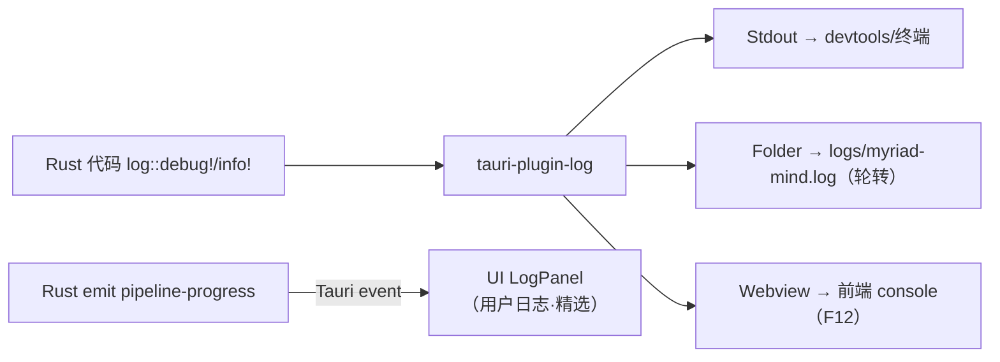

# 日志与调试脚手架设计

> 编写日期：2026-06-21
> 状态：**设计阶段，待批准**
> 动机：为 Agent 工作流重构（[`Agent架构设计`](../AI与模型/Agent架构设计.md)）铺路——agent loop 调试没有好的日志手段会非常痛苦
> 参考：`D:\Project\Learn\cc-switch`（`tauri-plugin-log` 范本，`src-tauri/src/lib.rs:303-338`）

---

## 一、背景与目标

### 1.1 现状

- **Rust 侧**：`simple_logging::log_to_file`（`main.rs:15`）→ 单文件 `~/.myriad-mind-app/app.log`
- **前端侧**：炼化页 `LogPanel`（用户向，由 `pipeline-progress` 事件驱动）
- **问题**：`simple_logging` 无轮转（app.log 无限增长）、无前端转发（开发者看不到 Rust 日志）、无分级动态控制、无结构化约定

### 1.2 动机

未来要重构为 Agent 工作流（目标驱动 + tool use loop）。Agent 调试需要看到：每次 LLM 请求/响应、AI 选了哪个工具及参数/结果、loop 每轮、路由决策、护栏触发。**当前日志系统撑不住**。

### 1.3 目标

1. 升级到 `tauri-plugin-log`（多 Target + 轮转 + 分级 + 动态调级）
2. **区分双通道**：用户日志（LogPanel，精选）≠ 开发者日志（全量详细）
3. 为 Agent 调试预埋结构化日志点
4. 开发者能**实时**（devtools console）+ **事后**（日志文件）查看

---

## 二、现状差距

| 维度 | 现状（simple_logging） | 目标（tauri-plugin-log） |
|------|----------------------|------------------------|
| 输出目标 | 单文件 | 多 Target（控制台 + 文件 + 前端 console） |
| 轮转 | ❌ 无限增长 | ✅ 按大小轮转 |
| 分级控制 | 固定 Debug | 动态（dev Trace / release Info） |
| 前端可见 | ❌ | ✅ Webview target（F12 看 Rust 日志） |
| 结构化 | 纯文本 | key=value 约定 |
| Tauri 集成 | 手动拼路径 | 自动 app_config_dir |

---

## 三、参考：cc-switch 日志方案

cc-switch 用 `tauri-plugin-log`（官方插件，底层 fern），在 `app.setup()` 初始化：

```rust
tauri_plugin_log::Builder::default()
    .level(log::LevelFilter::Trace)
    .targets([
        Target::new(TargetKind::Stdout),
        Target::new(TargetKind::Folder { path: log_dir, file_name: Some("cc-switch".into()) }),
    ])
    .rotation_strategy(RotationStrategy::KeepSome(2))
    .max_file_size(1024 * 1024 * 1024)
    .timezone_strategy(TimezoneStrategy::UseLocal)
    .build()
```

输出到 `~/.cc-switch/logs/cc-switch.log`。**我们在此基础上多加一个 `Webview` target**（前端 console，Agent 调试利器——cc-switch 没用这个）。

---

## 四、日志架构

### 4.1 换库

`Cargo.toml`：加 `tauri-plugin-log = "2"`，删 `simple-logging`。`main.rs` 删 `simple_logging::log_to_file`。`lib.rs` `run()` 注册插件。

### 4.2 三 Target

| Target | 作用 | 价值 |
|--------|------|------|
| `Stdout` | devtools 控制台 / 终端 | 开发实时看 |
| `Folder` | `~/.myriad-mind-app/logs/myriad-mind.log`（轮转） | 持久化、事后排查 |
| **`Webview`** | Rust 日志转发到前端 console | **F12 直接看 Rust 内部**（比 cc-switch 进一步） |

### 4.3 双通道（严格区分，不混淆）

| 通道 | 受众 | 内容 | 实现 |
|------|------|------|------|
| **用户日志** | 用户 | 精选进度（"下载中""ASR 完成"） | UI `LogPanel` + `pipeline-progress` 事件（**不变**） |
| **开发者日志** | 开发者 | 全量详细（含内部决策） | `tauri-plugin-log` + `log::debug!/trace!`（**新增**） |

两者独立：用户日志是"产品体验"，开发者日志是"诊断手段"。**不要用 `log::info!` 往用户 LogPanel 塞东西**——LogPanel 只由 `pipeline-progress` 事件驱动。

### 4.4 分级策略

- **dev 构建**：`Trace`（全量，含 tool use / loop 每轮）
- **release 构建**：`Info`（用户级）
- **运行时动态调**：`log::set_max_level()` + 设置页"日志级别"开关

### 4.5 轮转与文件

- 目录：`~/.myriad-mind-app/logs/`
- `RotationStrategy::KeepSome(2)`（cc-switch 同款，最小安全值）
- `max_file_size`：50MB（比 cc-switch 的 1GB 保守——开发 Trace 日志涨得快）
- 启动清旧文件（单文件覆盖，cc-switch 做法）

---

## 五、Agent 调试埋点（核心，为重构铺路）

未来 agent loop 时，这些必须 `log::debug!` 记下（现在先在 `pipeline.rs` / `engine.rs` / `deepseek.rs` 预埋）：

| 事件 | 级别 | 记什么 |
|------|------|--------|
| LLM 请求 | debug | task、模型、prompt 摘要（前 200 字）、token 预算 |
| LLM 响应 | debug | finish_reason、token 用量、耗时 |
| **tool_use 选择** | debug | **工具名、参数、AI 选它的理由** |
| tool 执行结果 | debug | 成功/失败、结果摘要、耗时 |
| loop 每轮 | trace | step N、剩余预算 |
| 模型路由 | debug | 选 Pro/Flash 的 reason |
| 护栏触发 | warn | 超步数 / 超时 / 拒绝的工具 |

**结构化约定**：`[模块] key=value key=value`，便于 grep/过滤：

```rust
log::debug!(
    target: "agent",
    "[tool] name=transcribe_asr status=ok duration_ms=3200 chars=1245"
);
```

> ⚠️ **敏感信息红线**：日志**绝不**记录 API Key、Authorization header、完整 prompt 中的私密内容。prompt 只记摘要 + 长度，不记原文。

---

## 六、日志查看

- **开发时**：F12 devtools console（`Webview` target）+ 终端 stdout（`Stdout` target）
- **事后排查**：`tail -f ~/.myriad-mind-app/logs/myriad-mind.log`，或设置页"打开日志目录"按钮（复用 `tauri-plugin-opener`，与现有 `open_cache_dir` 同款）
- **设置页**：日志级别下拉（Trace / Debug / Info / Warn）+ 打开日志目录
- **（后续 P2）app 内日志查看器**：可选，在 app 里直接看/过滤日志文件

---

## 七、数据流



---

## 八、实施步骤

1. `Cargo.toml`：加 `tauri-plugin-log`，删 `simple-logging`
2. `main.rs`：删 `simple_logging::log_to_file` 及 log_path 逻辑
3. `lib.rs` `run()`：注册 `tauri_plugin_log`（三 Target + 轮转 + 分级，照抄 cc-switch + Webview）
4. 关键模块补埋点：`pipeline.rs` / `engine.rs` / `deepseek.rs` / `python.rs`（子进程调度）
5. 设置页：日志级别开关（`log::set_max_level`）+ 打开日志目录按钮
6. 验证：F12 能看 Rust 日志、日志文件轮转正常、级别切换即时生效

---

## 九、风险

| 风险 | 应对 |
|------|------|
| 日志量大（Trace 全开） | 轮转 + release 默认 Info + 设置页可关 |
| Webview target 高频日志卡前端 | 高频埋点用 trace（默认关）；关键事件用 debug |
| **敏感信息泄漏** | 红线规范（§五）；prompt 只记摘要；API key 绝不入日志 |
| 与 UI LogPanel 内容混淆 | 双通道严格区分（§4.3）：用户日志走事件，开发者日志走 log 宏 |
| `app.log` 旧文件残留 | 迁移时清理旧 `~/.myriad-mind-app/app.log`（或保留作历史） |

---

## 十、验收标准

- `simple_logging` 移除，`tauri-plugin-log` 接入
- F12 devtools console 能看到 Rust 的 `log::debug!` 输出
- 日志文件写入 `~/.myriad-mind-app/logs/`，按大小轮转
- 设置页可切换日志级别（Trace/Debug/Info/Warn），即时生效
- 关键路径（启动、炼化、DeepSeek 调用）有 debug 级埋点
- 日志中无 API Key / Authorization 等敏感信息

---

## 十一、参考

- **cc-switch**（本地）：`D:\Project\Learn\cc-switch\src-tauri\src\lib.rs:303-338`（初始化）、`Cargo.toml`（依赖）
- tauri-plugin-log：https://v2.tauri.app/plugin/logging/
- fern（底层后端）：https://github.com/daboross/fern
- 关联：[`Agent架构设计`](../AI与模型/Agent架构设计.md)（本脚手架服务于 agent 调试）
