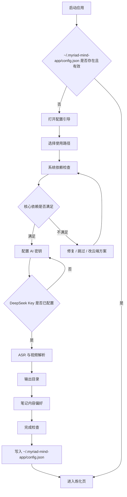

# 配置引导流程设计

> 适用范围：Windows 桌面端 v1.0。目标是在应用发现本机尚未完成有效配置时，引导用户完成“能炼化第一条内容”的最小配置，同时把高级选项留到设置页继续调整。

## 一、设计目标

配置引导不应该像一张完整设置表，而应该像一次上手检查。用户只需要回答三件事：

1. 本机环境能不能跑：Python、FFmpeg、yt-dlp、GPU。
2. AI 和视频解析凭据是否可用：DeepSeek v1 必填，视频解析按输入来源可选。
3. 笔记要输出到哪里，以及默认生成哪些内容。

完成引导后，应用应该能直接回到“炼化”页，并允许用户粘贴一个链接开始处理。

## 二、触发规则

### 配置目录检查

不要只依赖“首次启动”标记。应用启动时应先检查统一配置目录：

```text
~/.myriad-mind-app/
```

只要发现该目录下没有可用配置，就进入配置引导。

判断依据：

- `~/.myriad-mind-app/` 不存在。
- `~/.myriad-mind-app/config.json` 不存在。
- 或配置文件存在但 `version` 缺失 / 无法通过 `ConfigSchema` 校验。
- 或配置文件可读但缺少 v1 必需字段，例如输出目录、AI 模型配置等。

说明：`~` 按平台解析为当前用户 Home 目录，所有平台统一使用这一套路径。Windows 上也不要再使用 `%APPDATA%/myriad-mind/` 作为主配置目录。

### 运行时配置状态

前端不要继续只用 `firstLaunch: boolean` 表达引导状态。建议改成更准确的状态：

```ts
type SetupStatus =
  | "checking"
  | "ready"
  | "needs_config"
  | "invalid_config"
  | "backend_unavailable";
```

对应行为：

| 状态 | 触发条件 | 默认页面 | 用户能否炼化 |
|------|----------|----------|--------------|
| `checking` | 正在读取配置目录和密钥链 | 设置页骨架 / loading | 否 |
| `ready` | `config.json` 存在、Schema 通过、DeepSeek Key 可用 | 炼化页 | 是 |
| `needs_config` | 配置目录或 `config.json` 不存在 | 设置页，自动打开配置向导 | 否 |
| `invalid_config` | 配置存在但 Schema 失败 / 必填项缺失 | 设置页，显示修复提示 | 否 |
| `backend_unavailable` | Tauri invoke 不可用或后端命令失败 | 设置页，显示开发模式 / 后端异常 | 浏览器 mock 可继续预览，真实炼化不可用 |

当前代码中 `useConfig()` 仍通过 `api.isFirstLaunch()` 决定 `firstLaunch`。后续应改为：

1. 调用 `get_config_info()` 获取 `~/.myriad-mind-app/config.json` 路径和存在状态。
2. 若文件不存在，设置 `setupStatus = "needs_config"`。
3. 若文件存在，调用 `read_config()` 并用 `ConfigSchema` 校验。
4. 校验通过后，再检查 `deepseek-api-key` 是否存在。
5. 只有配置和 DeepSeek Key 都可用时，进入 `ready`。

### 后续进入

设置页保留两个入口：

- “快速检查”：重新打开配置引导，只走依赖、密钥、输出目录三步。
- “完整设置”：进入现有 `SettingsPage`，展示全部配置项。

当前 UI 中“打开配置向导”按钮已经存在，但 `onOpenWizard={() => { /* TBD */ }}` 仍为空。建议实现为：

- 设置 `wizardOpen = true`，在设置页内联展示 `ConfigWizard`。
- 不改变当前 `view`，用户关闭向导后仍回到设置页。
- 从“缺配置”自动进入时，取消按钮文案改为“稍后配置”，点击后仍留在设置页并显示不可炼化提示。

### 中断恢复

引导过程中不写入半成品配置文件，只把临时状态放在 React state。只有最后一步点击“完成并保存”才调用 `write_config`。

API Key 例外：用户在密钥步骤点击保存时立即写入 OS 密钥链，因为密钥不进入 JSON 配置。

如果用户中途关闭向导：

- 已保存到密钥链的 Key 保留。
- `config.json` 不写入半成品。
- 设置页健康卡继续显示“缺少配置 / 未完成引导”。
- 首页炼化按钮继续禁用或点击后跳转设置页。

## 三、推荐流程

### Step 0：欢迎与使用路径

目的：降低用户选择成本，先问“你主要想处理什么”。

可选项：

- 在线视频：B 站 / YouTube / 抖音 / 小红书。
- 本地媒体：本地视频 / 音频文件。
- 网页文章：知乎 / CSDN / 掘金 / 普通网页。
- 代码项目：GitHub / 本地目录，v1 可标记为“稍后支持”。

输出：

- `setupIntent`: `"video" | "local_media" | "article" | "code"`
- 后续步骤根据 intent 展示不同必需项。

交互建议：

- 默认选“在线视频”。
- 文案说明：选择只是为了优化默认配置，之后仍可处理其他类型。

### Step 1：系统依赖检查

目的：先检查本机能否跑完整管线。

检查项：

- Python >= 3.9：视频 ASR、脚本调度必需。
- FFmpeg：本地媒体和视频处理必需。
- yt-dlp：YouTube / 部分视频下载需要。
- GPU / CUDA：可选，只影响 faster-whisper 速度。

对应能力：

- 前端：复用 `DepsPanel` 的展示逻辑。
- 后端：调用 `detect_all_deps(pythonPath)`。

状态分级：

| 状态 | 条件 | 允许继续 |
|------|------|----------|
| 就绪 | Python、FFmpeg、yt-dlp 均可用 | 是 |
| 可继续但降级 | GPU 缺失 | 是 |
| 需要处理 | Python 缺失或版本过低 | 否，除非用户选择云端 ASR |
| 部分功能不可用 | FFmpeg / yt-dlp 缺失 | 是，但视频能力标黄 |

本步操作：

- “重新检测”
- “手动指定 Python 路径”
- “安装 faster-whisper 环境”，调用 `install_faster_whisper`
- “跳过，稍后配置”

### Step 2：AI 密钥

目的：确保核心笔记生成可用。

v1 必填：

- DeepSeek API Key：写入 `myriad-mind/deepseek-api-key`

后续可扩展：

- Claude / Anthropic API Key
- OpenAI compatible endpoint + key

验证规则：

- 非空。
- DeepSeek Key 仅做“非空 + 可选连通性测试”校验，不强制绑定固定前缀，避免未来 key 格式变化。
- 保存后只显示脱敏值：前 8 位 + 后 4 位。

安全规则：

- 不写入 `config.json`。
- 不在日志、错误信息、进度事件中回显原文。
- 浏览器 dev 模式可落 localStorage，但 UI 必须标注“开发模式模拟密钥链”。

### Step 3：转写与视频解析策略

目的：让用户选择“本地免费但依赖多”还是“云端省事但可能付费”。

ASR 选项：

- 本地 faster-whisper：默认推荐，免费，本机运行。
- 火山引擎：可选，缺 Python 或机器性能弱时推荐。

本地 ASR 子项：

- 模型：`small` 默认推荐，`medium` 可标为“更准但更慢”。
- 设备：默认 `auto`，检测到 GPU 时可提示选择 `cuda`。

云端 ASR 子项：

- 火山引擎 App ID：写入 `config.asr.volcengine.appid`
- 火山引擎 Token：写入 `myriad-mind/volcengine-token`

视频解析选项：

- AI Douyin：默认，适合 B 站 / 抖音 / 小红书。
- TikHub：备用。
- YouTube：提示优先使用 yt-dlp，不需要额外 API Key。

根据 Step 0 的 intent 控制展示：

- 如果用户只选“文章”，本步可以折叠为“稍后配置视频能力”。
- 如果用户选“在线视频”，本步默认展开并提示配置 AI Douyin Key。

### Step 4：输出目录与文件策略

目的：让用户知道笔记在哪里，并避免“生成了但找不到”。

字段：

- `output.note_dir`
- `output.cleanup_temp`
- `output.note_metadata`
- `output.debug_metadata`

默认策略：

- 如果留空，显示实际默认目录说明。
- 推荐用户选择一个固定目录，例如 `D:/Notes/MyriadMind`。
- 后续移动端同步时可提示选择云盘目录，但 v1 不强制。

必要操作：

- “选择目录”：后续可接 Tauri dialog。
- “打开目录”：如果目录存在，可直接打开。
- “生成测试文件”：可选，用来验证目录可写。

校验规则：

- 留空允许继续。
- 非空路径应在保存前验证可创建 / 可写。
- 不允许选择系统敏感目录，如 Windows 根目录、`C:/Windows`。

### Step 5：笔记内容偏好

目的：把“高级功能”变成几个明确偏好，而不是一堆开关。

推荐分组：

- 视觉辅助：关键帧截图。
- 结构化理解：Mermaid 图表、术语表。
- 延展学习：扩展资源、评论区精华。
- 阅读体验：阅读时长、难度评级。
- 处理前提示：灵力预估。

默认：

- 全部开启。
- 如果依赖缺失导致关键帧不可用，关键帧开关标黄，并说明需要 FFmpeg。

关键帧高级项可折叠：

- 截图间隔：默认 30 秒。
- 最大截图数：默认 50。
- 截图模式：默认 `interval`，后续稳定后可推荐 `both`。

### Step 6：完成检查与试运行

目的：让用户在保存前看到“一眼可懂”的配置结果。

展示内容：

- 系统依赖：就绪 / 有降级项。
- AI Key：DeepSeek 已配置 / 未配置。
- ASR：本地 faster-whisper 或火山引擎。
- 视频解析：AI Douyin / TikHub / 稍后配置。
- 输出目录：具体路径或默认路径。
- 功能偏好：开启项数量。

主按钮：

- “完成并开始炼化”

次按钮：

- “保存后留在设置”
- “返回修改”

保存动作：

1. 用 `ConfigSchema` 校验。
2. 调用 `write_config(JSON.stringify(config))`。
3. 确保 `~/.myriad-mind-app/` 存在。
4. 写入 `~/.myriad-mind-app/config.json`。
5. 跳转 `view = "input"`。

可选增强：

- 提供“用示例链接试运行”按钮，先走一次依赖检查和灵力预估，不真正调用付费模型。

## 四、状态机



## 五、数据映射

| 引导步骤 | 配置字段 / 密钥链 | 当前代码位置 |
|----------|-------------------|--------------|
| 配置目录 | `~/.myriad-mind-app/config.json` | `apps/desktop/src-tauri/src/commands/config.rs` |
| 系统依赖 | `python_path` | `packages/core/src/schema.ts`, `apps/desktop/src-tauri/src/commands/deps.rs` |
| DeepSeek Key | `myriad-mind/deepseek-api-key` | `apps/desktop/src-tauri/src/commands/config.rs` |
| ASR | `asr.backend`, `asr.faster_whisper`, `asr.volcengine` | `packages/ui/src/ConfigWizard.tsx` |
| 视频解析 | `video.provider`, `ai-douyin-api-key`, `tikhub-token` | `packages/ui/src/ConfigWizard.tsx` |
| 关键帧 | `features.keyframes`, `keyframes.*` | `packages/core/src/schema.ts` |
| 输出 | `output.*` | `packages/core/src/schema.ts` |
| 收尾 | `post_process.*` | `packages/core/src/schema.ts` |

## 六、与现有实现的调整建议

当前 `ConfigWizard` 已有配置项，但顺序更像“设置表单”。建议改成“上手路径”：

1. 新增 `welcome` 步骤，记录 `setupIntent`，不进入最终配置文件。
2. 新增 `deps` 步骤，把 `DepsPanel` 能力内嵌到向导第一屏。
3. 将 `api_keys` 提前到依赖之后，并在“下一步”前检查 DeepSeek Key 是否存在。
4. 将 `video` 和 `asr` 合并成“处理策略”，根据用户 intent 展开必要项。
5. 将 `keyframes` 并入“笔记内容偏好”，高级项折叠。
6. 新增 `review` 步骤，在保存前统一校验并给出摘要。

推荐步骤顺序：

```ts
type StepId =
  | "welcome"
  | "deps"
  | "keys"
  | "processing"
  | "output"
  | "features"
  | "review";
```

## 七、关键交互文案

### 依赖检查

标题：检查本机处理环境

说明：大衍决会在本机完成下载、转写和截图。缺少工具时，文章处理仍可继续，视频处理可能需要补装依赖。

按钮：

- 重新检测
- 指定 Python 路径
- 安装本地转写环境
- 稍后处理

### 密钥配置

标题：配置 AI 生成能力

说明：DeepSeek API Key 只会存入系统密钥链，不会写入配置文件。

错误：

- 还没有配置 DeepSeek API Key，无法生成笔记。
- 密钥链写入失败，请检查系统凭据管理器权限。

### 完成页

标题：配置完成，可以开始炼化了

说明：之后你可以在“设置”页随时调整模型、截图、输出目录和 API Key。

按钮：

- 完成并开始炼化
- 保存后留在设置

## 八、验收标准

- 启动时发现 `~/.myriad-mind-app/` 不存在，自动进入配置引导。
- 启动时发现 `~/.myriad-mind-app/config.json` 不存在或校验失败，自动进入配置引导。
- 用户配置 DeepSeek Key 后，密钥不出现在 `config.json` 中。
- 用户点击完成后，`config.json` 通过 `ConfigSchema` 校验。
- Python / FFmpeg / yt-dlp / GPU 检测结果能在引导里显示。
- 缺 GPU 不阻断继续，缺 Python 时给出本地安装和云端 ASR 两种路径。
- 完成后自动进入炼化页。
- 从设置页可以再次打开引导，并保留已有配置状态。
